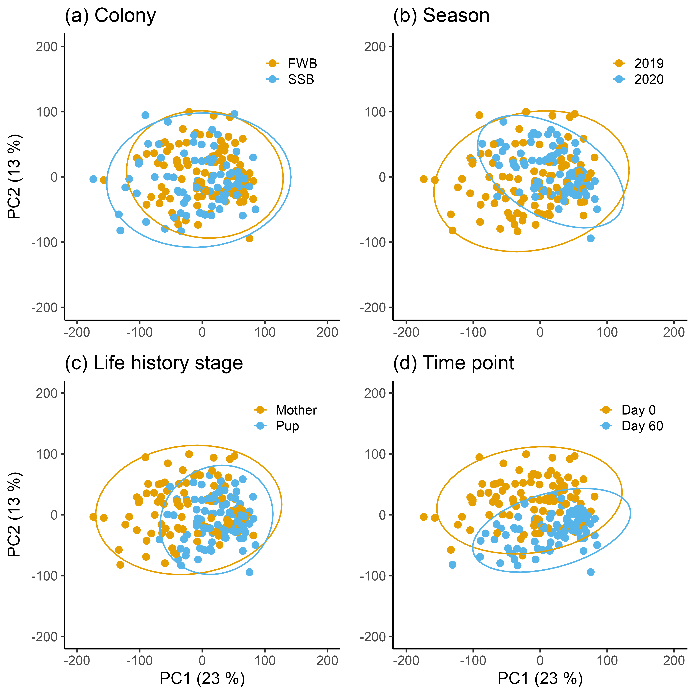

```{r}
#install.packages("here")
#install.packages("pacman")
library(here)
here::here()
```

```{r}
#| label: packages
#| echo: FALSE
#here::here()
invisible(pacman::p_load(dplyr, readxl, tidyverse, cowplot, edgeR, DESeq2, RColorBrewer, ggplot2, reshape2, ggpubr, extrafont, pheatmap))

#font_import()
#fonts()
#cowplot for toggling with plots
#edgeR  loads limma as a dependency, limma for analysing microassay and RNA seq data
#DESeq2 needed for rowCounts
#reshape2 needed for the first plot
#ggpubr need to bind plots together
#extrafont for arial font
#pheatmap needed for heatmaps
```

# Data

```{r}
#| label: load_data
#| echo: FALSE
#Load in the filtered data
#Mutate all needed predictors into factors
d_n<-readRDS("rnaseq_filtered_Liv.Rdata")  
#dim(d_n) 12639 rows
## White blood counts
WBC <- read_excel("WBCcounts_GEP.xlsx")

##Combined
d_n$samples <- left_join(d_n$samples, WBC, by = "Sample")
head(d_n$samples)
d_n$samples$Diff_Neutro <- as.numeric(d_n$samples$Diff_Neutro)
d_n$samples$Diff_Eo <- as.numeric(d_n$samples$Diff_Eo)
d_n$samples$Diff_Baso <- as.numeric(d_n$samples$Diff_Baso)
d_n$samples$Diff_Mono <- as.numeric(d_n$samples$Diff_Mono)
d_n$samples$Diff_Lympho <- as.numeric(d_n$samples$Diff_Lympho)
rm(WBC)

d_n$samples$WBC_ratio <- ((d_n$samples$Diff_Neutro + d_n$samples$Diff_Eo + d_n$samples$Diff_Baso + d_n$samples$Diff_Mono)/d_n$samples$Diff_Lympho)
d_n$samples$WBC_ratio_log <- log(d_n$samples$WBC_ratio)

#Remove incomplete 
complete <- complete.cases(d_n$samples[, "WBC_ratio_log"])
d_n_WBC <- d_n[, complete]
rm(complete)

d_n_WBC$samples$life_history_stage <- as.factor(d_n_WBC$samples$life_history_stage)
d_n_WBC$samples$colony <- as.factor(d_n_WBC$samples$colony)
d_n_WBC$samples$ID <- as.factor(d_n_WBC$samples$ID)
d_n_WBC$samples$year <- as.factor(d_n_WBC$samples$year)
d_n_WBC$samples$group <- as.factor(d_n_WBC$samples$group)
d_n_WBC$samples$pair <- as.factor(d_n_WBC$samples$pair)
rm(d_n)
dim(d_n_WBC)
table(d_n_WBC$samples$pair)
```

# PCA

Create a PCA plot to identify outliers.

```{r}
#| label: PCA_outlier
#| echo: FALSE
#| message: false
#Use PCA to identify outliers. F24_FWB_mum_start_2018B was already removed at an earlier state
cpm_mat <- cpm(d_n_WBC, log=TRUE)  #we need the log values
exprs_mat <- cpm_mat
exprs_t <- t(exprs_mat) #transpose
pca_result <- prcomp(exprs_t, center = TRUE, scale. = TRUE)

pca_var <- pca_result$sdev^2                  
pca_var_explained <- pca_var / sum(pca_var)   
round(pca_var_explained[1:2] * 100, 2)

pc_scores <- as.data.frame(pca_result$x[, 1:2])  #keep PC1 and PC2
pc_scores$Sample <- rownames(pc_scores)
pc_scores <- left_join(pc_scores, d_n_WBC$samples, by = "Sample")

PCA_LHS <- ggplot(pc_scores, aes(x = PC1, y = PC2, color = life_history_stage)) +
  geom_point(size = 2) +
  theme_classic() +
  stat_ellipse(type = "norm", size = 0.5) +
  xlim(-400, 150) +
  ylim(-150, 150) +
  labs(title = "(c) Life-history stage", x = "PC1 (23 %)", y = "PC2 (13 %)", color = NULL)

#levels(pc_scores$year)
levels(pc_scores$year) <- c("2019", "2020")
PCA_Y <- ggplot(pc_scores, aes(x = PC1, y = PC2, color = year)) +
  geom_point(size = 2) +
  theme_classic() +
  stat_ellipse(type = "norm", size = 0.5) +
  xlim(-400, 150) +
  ylim(-150, 150) +
  labs(title = "(b) Season", x = "PC1 (23 %)", y = "PC2 (13 %)", color = NULL)

#levels(pc_scores$group)
levels(pc_scores$group) <- c("Day 0", "Day 60")
PCA_TP <- ggplot(pc_scores, aes(x = PC1, y = PC2, color = group)) +
  geom_point(size = 2) +
  theme_classic() +
  stat_ellipse(type = "norm", size = 0.5) +
  xlim(-400, 150) +
  ylim(-150, 150) +
  labs(title = "(d) Developmental time point", x = "PC1 (23 %)", y = "PC2 (13 %)", color = NULL)

PCA_C <- ggplot(pc_scores, aes(x = PC1, y = PC2, color = colony)) +
  geom_point(size = 2) +
  theme_classic() +
  stat_ellipse(type = "norm", size = 0.5) +
  xlim(-400, 150) +
  ylim(-150, 150) +
  labs(title = "(a) Density", x = "PC1 (23 %)", y = "PC2 (13 %)", color = NULL)

legend_theme_outlier <- theme(
    legend.position = c(0.05, 0.95), 
    legend.justification = c("left", "top"),  
    legend.background = element_rect(fill = alpha('white', 0.7), color = NA),  
    legend.key.size = unit(0.8, "lines"),
    text = element_text(family = "Arial", size = 12))

PCA_plots_outlier <- plot_grid(PCA_C + legend_theme_outlier + theme(axis.title.x = element_blank()), 
                               PCA_Y + legend_theme_outlier + theme(axis.title.x = element_blank(),
                                                                      axis.title.y = element_blank()), 
                               PCA_LHS + legend_theme_outlier, 
                               PCA_TP + legend_theme_outlier + theme(axis.title.y = element_blank()), 
                               ncol = 2)
ggsave(here::here("Plots","PCA_plots_outlier_adj.png"), plot = PCA_plots_outlier, dpi = 600)

write.csv(pc_scores, file = here::here("GenesGO", "pc_scores_adj.csv"))
rm(exprs_mat, exprs_t, cpm_mat)
```

 The PCA identified **one** outlier, which was removed from the dataset for further analysis.

```{r}
#| label: PCA
#| echo: FALSE
#| message: false
#Plot in accordance to LHS and TP
PCA_LHS <- ggplot(pc_scores, aes(x = PC1, y = PC2, color = life_history_stage, shape = life_history_stage)) +
  geom_point(size = 2) +
  theme_classic() +
  stat_ellipse(type = "norm", size = 0.5) +
  scale_color_manual(values = c("#E69F00", "#56B4E9")) +
  scale_shape_manual(values = c(16,17)) +
  xlim(-200, 200) +
  ylim(-200, 200) +
  labs(title = "(c) Life-history stage", x = "PC1 (23 %)", y = "PC2 (13 %)", color = NULL, shape = NULL)

#levels(pc_scores$group)
levels(pc_scores$group) <- c("Day zero", "Day 60")
PCA_TP <- ggplot(pc_scores, aes(x = PC1, y = PC2, color = group, shape = group)) +
  geom_point(size = 2) +
  theme_classic() +
  stat_ellipse(type = "norm", size = 0.5) +
  scale_color_manual(values = c("#E69F00", "#56B4E9")) +
  scale_shape_manual(values = c(16,17)) +
  xlim(-200, 200) +
  ylim(-200, 200) +
  labs(title = "(d) Developmental time point", x = "PC1 (23 %)", y = "PC2 (13 %)", color = NULL, shape = NULL)

#levels(pc_scores$year)
levels(pc_scores$year) <- c("2019", "2020")
PCA_Y <- ggplot(pc_scores, aes(x = PC1, y = PC2, color = year, shape = year)) +
  geom_point(size = 2) +
  theme_classic() +
  stat_ellipse(type = "norm", size = 0.5) +
  scale_color_manual(values = c("#E69F00", "#56B4E9")) +
  scale_shape_manual(values = c(16,17)) +
  xlim(-200, 200) +
  ylim(-200, 200) +
  labs(title = "(b) Food availability", x = "PC1 (23 %)", y = "PC2 (13 %)", color = NULL, shape = NULL)

PCA_C <- ggplot(pc_scores, aes(x = PC1, y = PC2, color = colony, shape = colony)) +
  geom_point(size = 2) +
  theme_classic() +
  stat_ellipse(type = "norm", size = 0.5) +
  scale_color_manual(values = c("#E69F00", "#56B4E9")) +
  scale_shape_manual(values = c(16,17)) +
  xlim(-200, 200) +
  ylim(-200, 200) +  
  labs(title = "(a) Density", x = "PC1 (23 %)", y = "PC2 (13 %)", color = NULL, shape = NULL)

legend_theme <- theme(
    legend.position = c(0.95, 0.95), 
    legend.justification = c("right", "top"), 
    legend.background = element_rect(fill = alpha('white', 0.7), color = NA), 
    legend.key.size = unit(0.8, "lines"), 
    text = element_text(family = "Arial", size = 12))

PCA_plots <- plot_grid(PCA_C + legend_theme + theme(axis.title.x = element_blank()),
                       PCA_Y + legend_theme + theme(axis.title.x = element_blank(),
                                                      axis.title.y = element_blank()), 
                       PCA_LHS + legend_theme, 
   
                       
                                           PCA_TP + legend_theme + theme(axis.title.y = element_blank()),
                       ncol = 2)

ggsave(here::here("Plots","PCA_plots_adj.png"), plot = PCA_plots, dpi = 600)
rm(PCA_LHS, PCA_TP, PCA_Y, PCA_C)
```



# Differential gene expression analysis

In this section, we will perform differential gene expression analysis to identify genes that are differentially expressed between the four main contrasts: Time point, Life history stage, Colony and Season. Compared to previous analysis, in this section, we combined the four contrasts in one model, thus identifying differentially expressed genes while correcting for the other contrasts.

```{r}
#| label: color_scheme
#| echo: FALSE
clrs <- c("Upregulated" = "#FDA172", "Downregulated" = "#9867B5", "Not significant" = "grey20")
lfc <- 1 
adj.P.value <- 0.05
fig_theme <- theme(text = element_text(family = "Arial", size = 12),
                   legend.title = element_blank(),
                   legend.text=element_text(size=10),
                   axis.text.x = element_text(size =10),
                   axis.text.y = element_text(size = 10))

ann_colors <- list(
  TP = c("Day 0" = "#8B9E58", "Day 60" = "#638B9B"),
  LHS = c(Mother = "#C44B4E", Pup = "#C46A00")
)
```

## Combined analysis

Differential gene expression analysis combined for all contrasts.

```{r}
#| label: DEG_Combined
#| echo: FALSE

#You need to explicitly set the reference levels
#Time point = group will have both but for the rest
d_n_WBC$samples$life_history_stage <- relevel(d_n_WBC$samples$life_history_stage, ref = "Pup")
d_n_WBC$samples$colony <- relevel(d_n_WBC$samples$colony, ref = "FWB")
d_n_WBC$samples$year <- relevel(d_n_WBC$samples$year, ref = "2019_2020")

design_combined <- model.matrix(~ 0 + group + life_history_stage + colony + year, data = d_n_WBC$samples) #setting up model contrasts is more straight forward in the absence of an intercept 
colnames(design_combined)
contr.matrix.combined <- makeContrasts(
 end_vs_start = group2-group1,
 adult_vs_pup = life_history_stageMother,
 high_vs_low = colonySSB,
 Season1vsSeason2 = year2018_2019,
 levels = design_combined) #create matrix for contrasts
# Use voom to remove variance dependency on mean
vobj_combined <- voom(d_n_WBC, design_combined, plot=TRUE)
# 
# # Fit a random effect
dupcor_combined <- duplicateCorrelation(vobj_combined, design_combined, block = d_n_WBC$samples$ID)
dupcor_combined$consensus #the estimated intra individual correlation (0.2103193)
# #the intra individual correlation will change the voom weights slightly
# #run voom again considering the duplicateCorrelation results in order to compute more accurate precision weights
vobj_combined = voom(d_n_WBC, design_combined, plot=TRUE,
            block=d_n_WBC$samples$ID, correlation=dupcor_combined$consensus)
#update the correlation for the new voom weights
dupcor_combined <- duplicateCorrelation(vobj_combined, design_combined, block = d_n_WBC$samples$ID)
dupcor_combined$consensus #the estimated intra individual correlation (0.2103055)
#Fit the model
vfit_combined <- lmFit(vobj_combined, design_combined, block=d_n_WBC$samples$ID, correlation=dupcor_combined$consensus)
vfit_combined <- contrasts.fit(vfit_combined, contrasts=contr.matrix.combined)

# Fit Empirical Bayes for moderated t-statistics, empirical Bayes moderation is carried out by borrowing information across all the genes to obtain more precise estimates of gene-wise variability
efit_combined <- eBayes(vfit_combined)
topTable(efit_combined, n=20)
plotSA(efit_combined, main="Final model: Mean-variance trend")
plotMD(efit_combined)
abline(h=0,col="darkgrey")

#adjusted p-value cutoff that is set at 5% by default.
efit_combined$F
head(efit_combined$F.p.value) #pval of the moderated F-statistics (equivalent to one-way ANOVA)
head(efit_combined$p.value) #same
summary(decideTests(efit_combined, adjust.method="fdr"))
#set log-fold-changes (log-FCs) to be above a minimum value. 

tfit_combined <- treat(vfit_combined, lfc=lfc) #lfc = 1, lfc_half = 0.5
topTreat(tfit_combined)
nrow(tfit_combined)
dt_combined <- decideTests(tfit_combined, adjust.method="fdr")
summary(dt_combined) 
```

Outcome similar to the marginal differential gene expression analyses. We will proceed with correcting for the ratio of white blood cells.

### Adjusted combined

```{r}
#| label: DEG_Combined_Adjusted
#| echo: FALSE

design_combined_adj <- model.matrix(~ 0 + group + life_history_stage + colony + year + WBC_ratio_log, data = d_n_WBC$samples) 
nrow(design_combined_adj)

contr.matrix.combined.adj <- makeContrasts(
 end_vs_start = group2-group1,
 adult_vs_pup = life_history_stageMother,
 high_vs_low = colonySSB,
 Season1vsSeason2 = year2018_2019,
 levels = design_combined_adj)

# Use voom to remove variance dependency on mean,
#voom() converts the read counts to log2-cpm, with associated weights, ready for linear modelling
vobj_combined_adj <- voom(d_n_WBC, design_combined_adj, plot=TRUE)
# 
# # Fit a random effect
dupcor_combined_adj <- duplicateCorrelation(vobj_combined_adj, design_combined_adj, block = d_n_WBC$samples$ID)
dupcor_combined_adj$consensus #the estimated intra individual correlation (0.2050061)
# #run voom again considering the duplicateCorrelation results in order to compute more accurate precision weights
vobj_combined_adj = voom(d_n_WBC, design_combined_adj, plot=TRUE,
            block=d_n_WBC$samples$ID, correlation=dupcor_combined_adj$consensus)
#update the correlation for the new voom weights
dupcor_combined_adj <- duplicateCorrelation(vobj_combined_adj, design_combined_adj, block = d_n_WBC$samples$ID)
dupcor_combined_adj$consensus #the estimated intra individual correlation (0.20502)

#Fit the model
vfit_combined_adj <- lmFit(vobj_combined_adj, design_combined_adj, block=d_n_WBC$samples$ID, correlation=dupcor_combined_adj$consensus)
vfit_combined_adj <- contrasts.fit(vfit_combined_adj, contrasts=contr.matrix.combined.adj)
# 
# Save the model to avoid recomputing everything
# save vfit_combined_adj
saveRDS(vfit_combined_adj, file = here::here("Models","vfit_combined_adj.rds"))

#Load vfit_combined_adj
vfit_combined_adj <- readRDS(here::here("Models","vfit_combined_adj.rds"))

efit_combined_adj <- eBayes(vfit_combined_adj)
topTable(efit_combined_adj, n=20)
plotSA(efit_combined_adj, main="Final model: Mean-variance trend")
plotMD(efit_combined_adj)
abline(h=0,col="darkgrey")

#adjusted p-value cutoff that is set at 5% by default.
efit_combined_adj$F
head(efit_combined_adj$F.p.value) 
head(efit_combined_adj$p.value) 
summary(decideTests(efit_combined_adj, adjust.method="fdr"))

tfit_combined_adj <- treat(vfit_combined_adj, lfc=lfc) #lfc = 1, lfc_half = 0.5
topTreat(tfit_combined_adj)
nrow(tfit_combined_adj)
dt_combined_adj <- decideTests(tfit_combined_adj, adjust.method="fdr")
summary(dt_combined_adj) 

#Test for significance
#Time point
Allgenes_end_vs_start <- as.data.frame(topTreat(tfit_combined_adj, coef = "end_vs_start", n = Inf))
Filtered_end_vs_start <- subset(Allgenes_end_vs_start, abs(logFC) >= lfc & adj.P.Val < adj.P.value)
Upregulated_end_vs_start <- subset(Filtered_end_vs_start, Filtered_end_vs_start$logFC >= lfc)
Downregulated_end_vs_start <- subset(Filtered_end_vs_start, Filtered_end_vs_start$logFC <= lfc)

#Life history stage
Allgenes_adult_vs_pup <- as.data.frame(topTreat(tfit_combined_adj, coef = "adult_vs_pup", n = Inf))
Filtered_adult_vs_pup <- subset(Allgenes_adult_vs_pup, abs(logFC) >= lfc & adj.P.Val < adj.P.value)
Upregulated_adult_vs_pup <- subset(Filtered_adult_vs_pup, Filtered_adult_vs_pup$logFC >= lfc)
Downregulated_adult_vs_pup <- subset(Filtered_adult_vs_pup, Filtered_adult_vs_pup$logFC <= lfc)

# Create a list to save the up and down regulated genes and the df containing all genes evaluated for GO analysis
Combined_list_adj <- list(Allgenes_end_vs_start = Allgenes_end_vs_start, Upregulated_end_vs_start = Upregulated_end_vs_start, Downregulated_end_vs_start = Downregulated_end_vs_start, Allgenes_adult_vs_pup = Allgenes_adult_vs_pup, Upregulated_adult_vs_pup = Upregulated_adult_vs_pup, Downregulated_adult_vs_pup = Downregulated_adult_vs_pup)

# Loop through and save each data frame using `here()`
for (name in names(Combined_list_adj)) {
  write.csv(Combined_list_adj[[name]], file = here::here("GenesGO", paste0(name, ".csv")), row.names = TRUE)
}

#Significance
Allgenes_end_vs_start$Significance <- "Not significant"
Allgenes_end_vs_start$Significance[Allgenes_end_vs_start$adj.P.Val < adj.P.value & Allgenes_end_vs_start$logFC >= lfc] <- "Upregulated"
Allgenes_end_vs_start$Significance[Allgenes_end_vs_start$adj.P.Val < adj.P.value & Allgenes_end_vs_start$logFC <= -lfc] <- "Downregulated"
Allgenes_end_vs_start

Allgenes_adult_vs_pup$Significance <- "Not significant"
Allgenes_adult_vs_pup$Significance[Allgenes_adult_vs_pup$adj.P.Val < adj.P.value & Allgenes_adult_vs_pup$logFC >= lfc] <- "Upregulated"
Allgenes_adult_vs_pup$Significance[Allgenes_adult_vs_pup$adj.P.Val < adj.P.value & Allgenes_adult_vs_pup$logFC <= -lfc] <- "Downregulated"
Allgenes_adult_vs_pup

#Plot volcano plot
combined_tp_plot_adj <- ggplot(Allgenes_end_vs_start, aes(x = logFC, y = -log10(adj.P.Val), color = Significance, size = Significance)) +
  geom_hline(yintercept = -log10(0.05), col = "gray", linetype = 'dashed') +
  geom_vline(xintercept = c(-1, 1), col = "gray", linetype = 'dashed') +
  geom_point() +
  scale_color_manual(values = clrs) +  
  scale_size_manual(values = c(1, 0.5, 1)) +
  labs(title = "(b) Developmental time point", x = expression("log"[2]*"FC"), y = expression("-log"[10]*" adjusted p-value")) +
  theme_classic() +
  ylim(0,45) +
  xlim(-4.2,4.2) +
  theme(
    legend.position = "bottom",
    plot.title.position = "plot")

combined_lhs_plot_adj <- ggplot(Allgenes_adult_vs_pup, aes(x = logFC, y = -log10(adj.P.Val), color = Significance, size = Significance)) +
  geom_hline(yintercept = -log10(0.05), col = "gray", linetype = 'dashed') +
  geom_vline(xintercept = c(-1, 1), col = "gray", linetype = 'dashed') +
  geom_point() +
  scale_color_manual(values = clrs) +  
  scale_size_manual(values = c(1, 0.5, 1)) +
  labs(title = "(a) Life-history stage", x = expression("log"[2]*"FC"), y = expression("-log"[10]*" adjusted p-value")) +
  theme_classic() +
  ylim(0,45) +
  xlim(-4.2,4.2) +
  theme(
    legend.position = "bottom",
    plot.title.position = "plot")
```

Correcting for the white blood cell ratio does slightly change the differentially expressed genes, so we'll retain both and compare them moving forward.

```{r}
#| label: Combined_Adjusted
#| echo: FALSE
#Plot for only time point and life history stage
DEG_Combined_TPLHS <- ggarrange(combined_lhs_plot_adj + fig_theme, combined_tp_plot_adj + fig_theme + theme(axis.title.y = element_blank()), common.legend = T, legend = "bottom", widths = c(1, 0.95))
ggsave(here::here("Plots","DEG_Combined_TPLHS_adj.png"), plot = DEG_Combined_TPLHS, width = 7, height = 3.5, dpi = 600)
```

### Heatmap

Creating a heatmap to visualise the differentially expressed genes between the two contrasts with significantly differentiate genes.

```{r}
#| label: Heatmap_combined
#| echo: FALSE
### Time point & Life history stage
###Adjusted
#Time point
DEG_combined_tp_adj <- rownames(Filtered_end_vs_start)

#Life history stage
DEG_combined_lhs_adj <- rownames(Filtered_adult_vs_pup)

#Extract the expression values for the differentially expressed genes
expression_combined_tp_adj <- vobj_combined_adj$E[DEG_combined_tp_adj, ]
expression_combined_lhs_adj <- vobj_combined_adj$E[DEG_combined_lhs_adj, ]

#get labels (Time point)
annotation_combined_tp_adj <- data.frame(TP = as.factor(d_n_WBC$samples$group))
rownames(annotation_combined_tp_adj) <- d_n_WBC$samples$Sample
annotation_combined_tp_adj$TP <- ifelse(annotation_combined_tp_adj$TP == 1, "Day 0", "Day 60")
annotation_combined_tp_adj$TP <- factor(annotation_combined_tp_adj$TP, levels = c("Day 0", "Day 60"))

matrix_combined_tp_adj <- expression_combined_tp_adj[, order(annotation_combined_tp_adj$TP)]
annotation_combined_tp_adj <- annotation_combined_tp_adj[order(annotation_combined_tp_adj$TP), , drop = FALSE]

#get labels (Life history stage)
annotation_combined_lhs_adj <- data.frame(LHS = as.factor(d_n_WBC$samples$life_history_stage))
rownames(annotation_combined_lhs_adj) <- d_n_WBC$samples$Sample
annotation_combined_lhs_adj$LHS <- factor(annotation_combined_lhs_adj$LHS, levels = c("Mother", "Pup"))

#order the expression values
matrix_combined_lhs_adj <- expression_combined_lhs_adj[, order(annotation_combined_lhs_adj$LHS)]
annotation_combined_lhs_adj <- annotation_combined_lhs_adj[order(annotation_combined_lhs_adj$LHS), , drop = FALSE]

heatmap_combined_tp_adj <- pheatmap(matrix_combined_tp_adj,
                       scale = "row",  # normalize rows (genes)
                       color = colorRampPalette(c("#9D00FF", "white", "#FFA500"))(100),
                       annotation_colors = ann_colors,
                       annotation_col = annotation_combined_tp_adj,
                       cluster_rows = TRUE,
                       treeheight_row = 0,
                       cluster_cols = FALSE,
                       gaps_col = cumsum(table(annotation_combined_tp_adj$TP)),
                       show_rownames = F,
                       show_colnames = FALSE,
                       annotation_legend = FALSE,
                       legend = F,
                       fontsize = 12,
                       fontsize_col = 7,
                       fontsize_row = 6,
                       main = NA)

ggsave(here::here("Plots","heatmap_combined_tp_adj.png"), plot = heatmap_combined_tp_adj, width = 3.5, height = 5, dpi = 600)

heatmap_combined_lhs_adj <- pheatmap(matrix_combined_lhs_adj,
                       scale = "row",  # normalize rows (genes)
                       color = colorRampPalette(c("#9D00FF", "white", "#FFA500"))(100),
                       annotation_colors = ann_colors,
                       annotation_col = annotation_combined_lhs_adj,
                       cluster_rows = TRUE,
                       treeheight_row = 0,
                       cluster_cols = FALSE,
                       gaps_col = cumsum(table(annotation_combined_lhs_adj$LHS)),
                       show_rownames = F,
                       show_colnames = F,
                       annotation_legend = FALSE,
                       legend = F,
                       fontsize = 12,
                       fontsize_col = 7,
                       fontsize_row = 6,
                       main = NA)


ggsave(here::here("Plots","heatmap_combined_lhs_adj.png"), plot = heatmap_combined_lhs_adj, width = 3.5, height = 6, dpi = 600)
```

#GOterms using clusterProfiler

In this section, we are conducting a gene ontology (GO) enrichment analysis using Clusterprofiler to identify biological processes significantly associated with the differentially expressed genes in the time point and life history stage contrasts.

```{r}
#| label: load_packages_for_GO_combined
#| echo: FALSE
#BiocManager::valid()

options(repos = BiocManager::repositories())
BiocManager::install(version = "3.24", ask = FALSE)
BiocManager::install(c(
  "Biobase", "BiocGenerics", "BiocIO", "BiocParallel", "Biostrings",
  "cigarillo", "cpp11", "data.table", "DelayedArray", "DESeq2", "EBImage",
  "GenomicAlignments", "GenomicRanges", "IRanges", "KEGGREST", "ks",
  "MatrixGenerics", "Rhtslib", "Rsamtools", "rtracklayer", "S4Arrays",
  "S4Vectors", "Seqinfo", "SparseArray", "spatstat.utils",
  "SummarizedExperiment", "XVector"
), update = FALSE, ask = FALSE, force = TRUE)

invisible(pacman::p_load(dplyr, clusterProfiler, org.Hs.eg.db, enrichplot, ggplot2, VennDiagram, ggrepel))
```

## Call in DEG

```{r}
#| label: load_data_for_GO_combined
#| echo: FALSE
#Call up or down regulated genes from differential expression analysis
file_paths <- list.files(path = "GenesGO", pattern = "^(Upregulated|Downregulated).*\\.csv$", full.names = TRUE)

# Loop through and create data frames
for (file in file_paths) {
  name <- tools::file_path_sans_ext(basename(file))      
  df <- read.csv(file) %>%
    mutate(X = toupper(X))
  colnames(df)[1] <- "GeneSymbol"
  assign(name, df, envir = .GlobalEnv)
}

Background_tp_combined <- read.csv("GenesGO/Allgenes_end_vs_start.csv") %>%
  mutate(X = toupper(X))
colnames(Background_tp_combined)[1] <- "GeneSymbol"

Background_lhs_combined <- read.csv("GenesGO/Allgenes_adult_vs_pup.csv") %>%
  mutate(X = toupper(X))
colnames(Background_lhs_combined)[1] <- "GeneSymbol"

rm(df, file, file_paths, name)
```

## Gene ontology: enrichment analysis

```{r}
#| label: Enrichment_analysis
#| echo: FALSE
#Go enrichment analysis for up and down regulated genes
#Time point
GO_end_vs_start_DOWN <- enrichGO(Downregulated_end_vs_start$GeneSymbol,
                       OrgDb = org.Hs.eg.db,
                       universe = Background_tp_combined$GeneSymbol,  
                       keyType = "SYMBOL",
                       ont = "BP",
                       pvalueCutoff = 0.05,
                       pAdjustMethod = "BH") 
GO_end_vs_start_DOWN <- GO_end_vs_start_DOWN %>%
  mutate(Regulation = "Downregulated") 

GO_end_vs_start_UP <- enrichGO(Upregulated_end_vs_start$GeneSymbol,
                       OrgDb = org.Hs.eg.db,
                       universe = Background_tp_combined$GeneSymbol,
                       keyType = "SYMBOL",
                       ont = "BP",
                       pvalueCutoff = 0.05,
                       pAdjustMethod = "BH") 
GO_end_vs_start_UP <- GO_end_vs_start_UP %>%
  mutate(Regulation = "Upregulated") 

#Life history stage
#Downregulated_lhs <- Downregulated_lhs[,-1]  #If the code doesn't run as it's supposed to
GO_adult_vs_pup_DOWN <- enrichGO(Downregulated_adult_vs_pup$GeneSymbol,
                       OrgDb = org.Hs.eg.db,
                       universe = Background_lhs_combined$GeneSymbol,
                       keyType = "SYMBOL",
                       ont = "BP",
                       pvalueCutoff = 0.05,
                       pAdjustMethod = "BH") 
GO_adult_vs_pup_DOWN <- GO_adult_vs_pup_DOWN %>%
  mutate(Regulation = "Downregulated") 

GO_adult_vs_pup_UP <- enrichGO(Upregulated_adult_vs_pup$GeneSymbol,
                       OrgDb = org.Hs.eg.db,
                       universe = Background_lhs_combined$GeneSymbol,
                       keyType = "SYMBOL",
                       ont = "BP",
                       pvalueCutoff = 0.05,
                       pAdjustMethod = "BH") 
GO_adult_vs_pup_UP <- GO_adult_vs_pup_UP %>%
  mutate(Regulation = "Upregulated")
```

## Top 20 enriched GOterms (biological process)

### Time point

```{r}
#| label: Top20_TP
#| echo: FALSE
#Combine
GO_end_vs_start_combined <- rbind(as.data.frame(GO_end_vs_start_DOWN), as.data.frame(GO_end_vs_start_UP)) %>%
  arrange(p.adjust) 

write.csv(GO_end_vs_start_combined, here::here("GenesGO", "GO_end_vs_start_combined.csv"), row.names = F)
#Identify top20
GO_end_vs_start_Top20 <- GO_end_vs_start_combined %>%
  arrange(p.adjust) %>%
  slice_head(n = 20) 

#Fancy smancy bubble plot
plot_end_vs_start <- ggplot(GO_end_vs_start_combined, aes(x = zScore, y = -log10(p.adjust))) +
  geom_point(aes(size = Count, shape = Regulation, fill = Regulation), color = "black", alpha = 0.5) +

  scale_shape_manual(values = c("Upregulated" = 24, "Downregulated" = 25)) +  
  scale_fill_manual(values = c("Upregulated" = "#FDA172", "Downregulated" = "#9867B5")) +
  scale_size_continuous(name = "DEG Count") +
  #Add the top terms to the plot
  geom_text_repel(
  data = GO_end_vs_start_Top20,  
  aes(label = ID),
  nudge_y = 0.03,         #moves label up
  size = 2.5,
  segment.color = NA,
  force = 2, 
  max.overlaps = Inf
) +
  labs(
    title = "(b) Developmental time point",
    x = "Z-score",
    y = expression(-log[10]("Adjusted p-value")),
    shape = "Regulation"
  ) +
  theme_classic() +
  theme(legend.position = "right",
        legend.title = element_text(size = 14),   
        legend.text = element_text(size = 12),     
        legend.key.size = unit(0.4, "cm")) +
  guides(
  size = guide_legend(
    override.aes = list(shape = 24)  # use triangle in size legend
  ),
  fill = "none" 
)

#Top 20 GO terms and description
GO_end_vs_start_Top20_table <- GO_end_vs_start_Top20[, c("ID", "Description")]
colnames(GO_end_vs_start_Top20_table) <- c("GO Term", "Description")
rownames(GO_end_vs_start_Top20_table) <- NULL

#Force line break
GO_end_vs_start_Top20_table$Description <- str_wrap(GO_end_vs_start_Top20_table$Description, width = 50)

# Create alternating row colors
row_colors <- rep(c("white", "#f0f0f0"), length.out = nrow(GO_TP_Top20_table))

#Table
p_table_end_vs_start <- ggtexttable(
  GO_end_vs_start_Top20_table,
  rows = NULL,
  theme = ttheme(
    "light",
    tbody = list(bg_params = list(fill = row_colors))))

EA_end_vs_start <- plot_grid(
 plot_end_vs_start + fig_theme + theme(legend.position = "none"),
 NULL,
 p_table_end_vs_start,
 ncol = 3,
 rel_widths = c(1.1, 0.1, 0.90))

#ggsave(here::here("Plots","EA_end_vs_start.png"), plot = EA_end_vs_start, width = 7, height = 5, dpi = 600)

ggsave(here::here("Plots","Bubble_end_vs_start.png"), plot = plot_end_vs_start + fig_theme + theme(legend.position = "none"), width = 4, height = 4, dpi = 600)
```

### Life history stage

```{r}
#| label: Top20_LHS
#| echo: FALSE
#Combine
GO_adult_vs_pup_combined <- rbind(as.data.frame(GO_adult_vs_pup_DOWN), as.data.frame(GO_adult_vs_pup_UP)) %>%
  arrange(p.adjust) 

write.csv(GO_adult_vs_pup_combined, here::here("GenesGO", "GO_adult_vs_pup_combined.csv"), row.names = F)
#Identify top20
GO_adult_vs_pup_Top20 <- GO_adult_vs_pup_combined %>%
  arrange(p.adjust) %>%
  slice_head(n = 20) 

#Fancy smancy bubble plot
plot_adult_vs_pup <- ggplot(GO_adult_vs_pup_combined, aes(x = zScore, y = -log10(p.adjust))) +
  geom_point(aes(size = Count, shape = Regulation, fill = Regulation), color = "black", alpha = 0.5) +

  scale_shape_manual(values = c("Upregulated" = 24, "Downregulated" = 25)) +  
  scale_fill_manual(values = c("Upregulated" = "#FDA172", "Downregulated" = "#9867B5")) +
  scale_size_continuous(name = "DEG Count") +
  #Add the top terms to the plot
  geom_text_repel(
  data = GO_adult_vs_pup_Top20,  
  aes(label = ID),
  nudge_y = 0.03,         #moves label up
  size = 2.5,
  segment.color = NA,
  force = 2, 
  max.overlaps = Inf
) +
  labs(
    title = "(a) Life-history stage",
    x = "Z-score",
    y = expression(-log[10]("Adjusted p-value")),
    shape = "Regulation"
  ) +
  theme_classic() +
  theme(legend.position = "right",
        legend.title = element_text(size = 14),   
        legend.text = element_text(size = 12),     
        legend.key.size = unit(0.4, "cm")) +
  guides(
  size = guide_legend(
    override.aes = list(shape = 24)  # use triangle in size legend
  ),
  fill = "none" 
)

#Top 20 GO terms and description
GO_adult_vs_pup_Top20_table <- GO_adult_vs_pup_Top20[, c("ID", "Description")]
colnames(GO_adult_vs_pup_Top20_table) <- c("GO Term", "Description")
rownames(GO_adult_vs_pup_Top20_table) <- NULL

#Force line break
GO_adult_vs_pup_Top20_table$Description <- str_wrap(GO_adult_vs_pup_Top20_table$Description, width = 50)

# Create alternating row colors
row_colors <- rep(c("white", "#f0f0f0"), length.out = nrow(GO_TP_Top20_table))

#Table
p_table_adult_vs_pup <- ggtexttable(
  GO_adult_vs_pup_Top20_table,
  rows = NULL,
  theme = ttheme(
    "light",
    tbody = list(bg_params = list(fill = row_colors))))

EA_adult_vs_pup <- plot_grid(
 plot_adult_vs_pup + fig_theme + theme(legend.position = "none"),
 NULL,
 p_table_adult_vs_pup,
 ncol = 3,
 rel_widths = c(1.1, 0.1, 0.90))

#ggsave(here::here("Plots","EA_adult_vs_pup.png"), plot = EA_adult_vs_pup, width = 7, height = 5, dpi = 600)

ggsave(here::here("Plots","Bubble_adult_vs_pup.png"), plot = plot_adult_vs_pup + fig_theme + theme(legend.position = "none"), width = 4, height = 4, dpi = 600)
```

## Revigo in R

REduce and VIsualise Gene Ontology - a tool to reduce redundant GO terms and group the terms based on semantic similarity.

```{r}
#| label: load_revigo_combined
#| echo: FALSE
remotes::install_github("ssayols/rrvgo")
library(rrvgo)
```

### Similarity matrices

```{r}
#| label: Similarity_matrices_combined
#| echo: FALSE
#calculate similarity matrices for all contrasts
SM_GO_TP_DOWN <- calculateSimMatrix(GO_end_vs_start_DOWN$ID, orgdb = "org.Hs.eg.db", ont = "BP", method = "Rel")
SM_GO_TP_UP <- calculateSimMatrix(GO_end_vs_start_UP$ID, orgdb = "org.Hs.eg.db", ont = "BP", method = "Rel")
SM_GO_LHS_DOWN <- calculateSimMatrix(GO_adult_vs_pup_DOWN$ID, orgdb = "org.Hs.eg.db", ont = "BP", method = "Rel")
SM_GO_LHS_UP <- calculateSimMatrix(GO_adult_vs_pup_UP$ID, orgdb = "org.Hs.eg.db", ont = "BP", method = "Rel")
```

### Reduce terms

```{r}
#| label: Reduce_terms
#| echo: FALSE
## Time point
# Compute scores end_vs_start_DOwn
scores_end_vs_start_DOWN <- -log10(as.numeric(GO_end_vs_start_DOWN$p.adjust))
names(scores_end_vs_start_DOWN) <- GO_end_vs_start_DOWN$ID

#Reduce terms
reduced_end_vs_start_DOWN <- reduceSimMatrix(
    simMatrix = SM_GO_end_vs_start_DOWN,
    scores = scores_end_vs_start_DOWN,
    threshold = 0.7,
    orgdb = "org.Hs.eg.db")

# Compute scores end_vs_start_UP
scores_end_vs_start_UP <- -log10(as.numeric(GO_end_vs_start_UP$p.adjust))
names(scores_end_vs_start_UP) <- GO_end_vs_start_UP$ID

#Reduce terms
reduced_end_vs_start_UP <- reduceSimMatrix(
    simMatrix = SM_GO_end_vs_start_UP,
    scores = scores_end_vs_start_UP,
    threshold = 0.7,
    orgdb = "org.Hs.eg.db")

## Life hisotry stage
# Compute scores adult_vs_pup_UP
scores_adult_vs_pup_UP <- -log10(as.numeric(GO_adult_vs_pup_UP$p.adjust))
names(scores_adult_vs_pup_UP) <- GO_adult_vs_pup_UP$ID

#Reduce terms
reduced_adult_vs_pup_UP <- reduceSimMatrix(
    simMatrix = SM_GO_adult_vs_pup_UP,
    scores = scores_adult_vs_pup_UP,
    threshold = 0.7,
    orgdb = "org.Hs.eg.db")

# Compute scores adult_vs_pup_DOWN
scores_adult_vs_pup_DOWN <- -log10(as.numeric(GO_adult_vs_pup_DOWN$p.adjust))
names(scores_adult_vs_pup_DOWN) <- GO_adult_vs_pup_DOWN$ID

#Reduce terms
reduced_adult_vs_pup_DOWN <- reduceSimMatrix(
    simMatrix = SM_GO_adult_vs_pup_DOWN,
    scores = scores_adult_vs_pup_DOWN,
    threshold = 0.7,
    orgdb = "org.Hs.eg.db")
```

## Scatterplots

```{r}
#| label: scatterplot_manual
#| echo: FALSE
parent_colors <- c(
  "#FDA172",  # orange
  "#9867B5",  # purple
  "#8B9E58",  # olive green
  "#638B9B",  # teal
  "#C44B4E",  # deep red
  "#C46A00",  # rusty orange
  "#B58E36",  # golden brown
  "#6C75A9"   # muted blue-grey
)

# Function to generate semantic similarity scatter plot
plot_semantic_similarity <- function(simMatrix, reducedTerms, title_text, 
                                     parent_colors, xlim_val = c(-1, 1), ylim_val = c(-1, 1),
                                     point_alpha = 0.5, point_range = c(0, 20), label_size = 2.45,
                                     top_n = NULL, min_score = NULL, box_padding = 0.09) {
  
  # 1. Distance matrix
  dist_mat <- as.dist(1 - simMatrix)
  
  # 2. MDS
  mds <- cmdscale(dist_mat, eig = TRUE, k = 2)
  
  # 3. Build dataframe with metadata
  df <- as.data.frame(mds$points)
  df$go <- rownames(df)
  df <- merge(df, reducedTerms[, c("go", "term", "parent", "parentTerm", "score")],
              by = "go", all.x = TRUE)
  
  # 4.select top 5 most important parent terms
top_per_parent <- df %>%
  group_by(parent) %>%
  slice_max(score, n = 1, with_ties = FALSE) %>%
  ungroup()

top_parents <- top_per_parent %>%
  arrange(desc(score)) %>%
  slice(1:5) %>%   # top 5 parents
  pull(parent) 

label_data <- df %>%
  filter(parent %in% top_parents) %>%
  group_by(parentTerm) %>%
  summarise(
    V1 = mean(V1),
    V2 = mean(V2),
    score = max(score)
  ) %>%
  ungroup()
  
  # 5. Filter top N or by minimum score if requested
  if(!is.null(top_n)) {
    label_data <- label_data %>% arrange(desc(score)) %>% slice(1:top_n)
  }
  if(!is.null(min_score)) {
    label_data <- label_data %>% filter(score >= min_score)
  }
  
  # 6. Plot
  p <- ggplot(df, aes(x = V1, y = V2, color = parentTerm)) +
    geom_point(aes(size = score), alpha = point_alpha) +
    scale_color_manual(values = parent_colors, guide = "none") +
    scale_size_continuous(range = point_range, guide = "none") +
    theme_classic() +
    xlim(xlim_val) +
    ylim(ylim_val) +
    xlab("Semantic space x") +
    ylab("Semantic space y") +
    ggtitle(title_text) +
    geom_label_repel(aes(label = parentTerm),
                     data = label_data,
                     force = 1,
                     box.padding = unit(box_padding, "lines"),
                     point.padding = unit(0.2, "lines"),
                     size = label_size,
                     max.overlaps = Inf)
  
  return(p)
}

#Make scatterplots

SP_GO_end_vs_start_UP   <- plot_semantic_similarity(SM_GO_end_vs_start_UP, reduced_end_vs_start_UP, 
                                          "(d) Upregulated on day 60", parent_colors)
SP_GO_end_vs_start_DOWN <- plot_semantic_similarity(SM_GO_end_vs_start_DOWN, reduced_end_vs_start_DOWN, 
                                          "(c) Downregulated on day 60", parent_colors)
SP_GO_adult_vs_pup_UP  <- plot_semantic_similarity(SM_GO_adult_vs_pup_UP, reduced_adult_vs_pup_UP, 
                                          "(a) Upregulated in mothers", parent_colors)

parent_colors <- c(
 "#FDA172", "#9867B5", "#8B9E58", "#4C6A92",
 "#C44B4E", "#C46A00", "#B58E36", "#6C75A9",
 "#A67C52", "#7A5E7E", "#5C8C6B", "#7289B0",
 "#D98C6D", "#8B6D92", "#B5A04C", "#587085",
 "#C4889F", "#74935E", "#9A7C5D", "#66778B", "#A37B9A")

SP_GO_adult_vs_pup_DOWN <- plot_semantic_similarity(SM_GO_adult_vs_pup_DOWN, reduced_adult_vs_pup_DOWN, 
                                        "(b) Upregulated in pups", parent_colors, box_padding = 0.42)

  
SP_adult_vs_pup_GO <- plot_grid(SP_GO_adult_vs_pup_UP + 
                        theme(axis.title.x = element_blank()) + fig_theme, 
                      SP_GO_adult_vs_pup_DOWN + fig_theme + theme(axis.title = element_blank()), rel_widths = c(1.05, 1))
SP_end_vs_start_GO <- plot_grid(SP_GO_end_vs_start_DOWN + fig_theme, 
                       SP_GO_end_vs_start_UP + fig_theme + coord_cartesian(clip = "off") + theme(axis.title.y = element_blank(),
  plot.margin = margin(5, 10, 5, 5)), ncol = 2, rel_widths = c(1.05, 1))  
  
combined_SP <- plot_grid(SP_adult_vs_pup_GO, SP_end_vs_start_GO, ncol = 1)
ggsave(here::here("Plots","combined_SP.png"), plot = combined_SP, width = 7, height = 7, dpi = 600)
```

 \#### Adjusted

```{r}
#| label: scatterplot_manual
#| echo: FALSE
parent_colors <- c(
  "#FDA172",  # orange
  "#9867B5",  # purple
  "#8B9E58",  # olive green
  "#638B9B",  # teal
  "#C44B4E",  # deep red
  "#C46A00",  # rusty orange
  "#B58E36",  # golden brown
  "#6C75A9"   # muted blue-grey
)

# Function to generate semantic similarity scatter plot
plot_semantic_similarity <- function(simMatrix, reducedTerms, title_text, 
                                     parent_colors, xlim_val = c(-1, 1), ylim_val = c(-1, 1),
                                     point_alpha = 0.5, point_range = c(0, 20), label_size = 2.5,
                                     top_n = NULL, min_score = NULL, box_padding = 0.05) {
  
  # 1. Distance matrix
  dist_mat <- as.dist(1 - simMatrix)
  
  # 2. MDS
  mds <- cmdscale(dist_mat, eig = TRUE, k = 2)
  
  # 3. Build dataframe with metadata
  df <- as.data.frame(mds$points)
  df$go <- rownames(df)
  df <- merge(df, reducedTerms[, c("go", "term", "parent", "parentTerm", "score")],
              by = "go", all.x = TRUE)
  
  # 4.select top 5 most important parent terms
top_per_parent <- df %>%
  group_by(parent) %>%
  slice_max(score, n = 1, with_ties = FALSE) %>%
  ungroup()

top_parents <- top_per_parent %>%
  arrange(desc(score)) %>%
  slice(1:5) %>%   # top 5 parents
  pull(parent) 

label_data <- df %>%
  filter(parent %in% top_parents) %>%
  group_by(parentTerm) %>%
  summarise(
    V1 = mean(V1),
    V2 = mean(V2),
    score = max(score)
  ) %>%
  ungroup()
  
  # 5. Filter top N or by minimum score if requested
  if(!is.null(top_n)) {
    label_data <- label_data %>% arrange(desc(score)) %>% slice(1:top_n)
  }
  if(!is.null(min_score)) {
    label_data <- label_data %>% filter(score >= min_score)
  }
  
  # 6. Plot
  p <- ggplot(df, aes(x = V1, y = V2, color = parentTerm)) +
    geom_point(aes(size = score), alpha = point_alpha) +
    scale_color_manual(values = parent_colors, guide = "none") +
    scale_size_continuous(range = point_range, guide = "none") +
    theme_classic() +
    xlim(xlim_val) +
    ylim(ylim_val) +
    xlab("Semantic space x") +
    ylab("Semantic space y") +
    ggtitle(title_text) +
    geom_label_repel(aes(label = parentTerm),
                     data = label_data,
                     force = 1,
                     box.padding = unit(box_padding, "lines"),
                     point.padding = unit(0.3, "lines"),
                     size = label_size,
                     max.overlaps = Inf)
  
  return(p)
}

# -------------------------------
# Example usage for your four datasets

SP_GO_end_vs_start_UP_adj   <- plot_semantic_similarity(SM_GO_end_vs_start_UP_adj, reduced_end_vs_start_UP_adj, 
                                          "(d) Upregulated on day 60", parent_colors)
SP_GO_end_vs_start_DOWN_adj <- plot_semantic_similarity(SM_GO_end_vs_start_DOWN_adj, reduced_end_vs_start_DOWN_adj, 
                                          "(c) Downregulated on day 60", parent_colors)

scores_adult_vs_pup_UP <- -log10(as.numeric(GO_adult_vs_pup_UP$p.adjust))
names(scores_adult_vs_pup_UP) <- GO_adult_vs_pup_UP$ID
SS_adult_vs_pup_adj <- as.data.frame(cbind(GO_adult_vs_pup_UP$ID, -log10(as.numeric(GO_adult_vs_pup_UP$p.adjust)), GO_adult_vs_pup_UP$Description, 0, 0))
colnames(SS_adult_vs_pup_adj) <- c("ID", "score", "Description", "V1", "V2")
SS_adult_vs_pup_adj$V1 <- as.numeric(SS_adult_vs_pup_adj$V1)
SS_adult_vs_pup_adj$V2 <- as.numeric(SS_adult_vs_pup_adj$V2)
SS_adult_vs_pup_adj$score <- as.numeric(SS_adult_vs_pup_adj$score)

xlim_val = c(-1, 1)
ylim_val = c(-1, 1)
SP_GO_adult_vs_pup_UP_adj <- ggplot(SS_adult_vs_pup_adj, aes(x = V1, y = V2, color = Description)) +
    geom_point(aes(size = score), alpha = 0.5) +
    scale_color_manual(values = parent_colors, guide = "none") +
    scale_size_continuous(range = c(0, 20), guide = "none") +
    theme_classic() +
    xlim(xlim_val) +
    ylim(ylim_val) +
    xlab("Semantic space x") +
    ylab("Semantic space y") +
    ggtitle("(a) Upregulated in mothers") +
    geom_label_repel(aes(label = Description),
                     data = SS_adult_vs_pup_adj,
                     force = 1,
                     box.padding = unit(0.09, "lines"),
                     point.padding = unit(0.2, "lines"),
                     size = 2.5,
                     max.overlaps = Inf)


parent_colors <- c(
 "#FDA172", "#9867B5", "#8B9E58", "#4C6A92",
 "#C44B4E", "#C46A00", "#B58E36", "#6C75A9",
 "#A67C52", "#7A5E7E", "#5C8C6B", "#7289B0",
 "#D98C6D", "#8B6D92", "#B5A04C", "#587085",
 "#C4889F", "#74935E", "#9A7C5D", "#66778B", "#A37B9A")

SP_GO_adult_vs_pup_DOWN_adj <- plot_semantic_similarity(SM_GO_adult_vs_pup_DOWN_adj, reduced_adult_vs_pup_DOWN_adj, 
                                        "(b) Upregulated in pups", parent_colors, box_padding = 0.27, label_size = 2.43)

  
SP_adult_vs_pup_GO_adj <- plot_grid(SP_GO_adult_vs_pup_UP_adj + 
                        theme(axis.title.x = element_blank()) + fig_theme,  
                      SP_GO_adult_vs_pup_DOWN_adj + fig_theme + theme(axis.title = element_blank()), rel_widths = c(1.05, 1))
SP_end_vs_start_GO_adj <- plot_grid(SP_GO_end_vs_start_DOWN_adj + fig_theme, 
                       SP_GO_end_vs_start_UP_adj + fig_theme + coord_cartesian(clip = "off") + theme(axis.title.y = element_blank(),
  plot.margin = margin(5, 10, 5, 5)), ncol = 2, rel_widths = c(1.05, 1))  
  
combined_SP_adj <- plot_grid(SP_adult_vs_pup_GO_adj, SP_end_vs_start_GO_adj, ncol = 1)
ggsave(here::here("Plots","combined_SP_adj.png"), plot = combined_SP_adj, width = 7, height = 7, dpi = 600)
```
