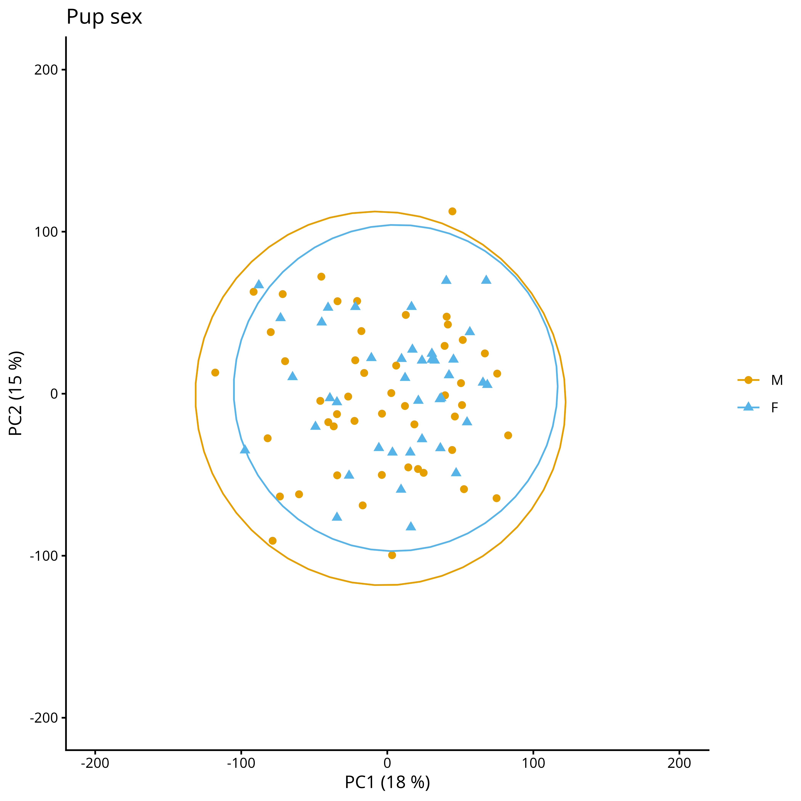

```{r}
#install.packages("here")
#install.packages("pacman")
library(here)
here::here()
```

```{r}
#| label: packages
#| echo: FALSE
#here::here()
invisible(pacman::p_load(dplyr, readxl, tidyverse, cowplot, edgeR, DESeq2, RColorBrewer, ggplot2, reshape2, ggpubr, extrafont, pheatmap, vegan, car))

#font_import()
#fonts()
#cowplot for toggling with plots
#edgeR  loads limma as a dependency, limma for analysing microassay and RNA seq data
#DESeq2 needed for rowCounts
#reshape2 needed for the first plot
#ggpubr need to bind plots together
#extrafont for arial font
#pheatmap needed for heatmaps
#vegan for PERMANOVA
#car for multicollinearity 
```

# Data for pups

```{r}
#| label: load_data
#| echo: FALSE
#Load in the filtered data
#Mutate all needed predictors into factors
d_n_pups <- readRDS("rnaseq_filtered_sex_Liv_pups.Rdata")  
#dim(d_n_pups) 12166 rows 91 individuals

#note T21 is a female
d_n_pups$samples$sex[d_n_pups$samples$ID == "T21"] <- "F"

## White blood counts
WBC <- read_excel("WBCcounts_GEP.xlsx")

##Combined
d_n_pups$samples <- left_join(d_n_pups$samples, WBC, by = "Sample")
head(d_n_pups$samples)
d_n_pups$samples$Diff_Neutro <- as.numeric(d_n_pups$samples$Diff_Neutro)
d_n_pups$samples$Diff_Eo <- as.numeric(d_n_pups$samples$Diff_Eo)
d_n_pups$samples$Diff_Baso <- as.numeric(d_n_pups$samples$Diff_Baso)
d_n_pups$samples$Diff_Mono <- as.numeric(d_n_pups$samples$Diff_Mono)
d_n_pups$samples$Diff_Lympho <- as.numeric(d_n_pups$samples$Diff_Lympho)
rm(WBC)

d_n_pups$samples$WBC_ratio <- ((d_n_pups$samples$Diff_Neutro + d_n_pups$samples$Diff_Eo + d_n_pups$samples$Diff_Baso + d_n_pups$samples$Diff_Mono)/d_n_pups$samples$Diff_Lympho)
d_n_pups$samples$WBC_ratio_log <- log(d_n_pups$samples$WBC_ratio)

#Remove incomplete 
complete <- complete.cases(d_n_pups$samples[, "WBC_ratio_log"])
d_n_pups_WBC <- d_n_pups[, complete]
rm(complete)

d_n_pups_WBC$samples$life_history_stage <- as.factor(d_n_pups_WBC$samples$life_history_stage)
d_n_pups_WBC$samples$colony <- as.factor(d_n_pups_WBC$samples$colony)
d_n_pups_WBC$samples$ID <- as.factor(d_n_pups_WBC$samples$ID)
d_n_pups_WBC$samples$year <- as.factor(d_n_pups_WBC$samples$year)
d_n_pups_WBC$samples$group <- as.factor(d_n_pups_WBC$samples$group)
d_n_pups_WBC$samples$pair <- as.factor(d_n_pups_WBC$samples$pair)
d_n_pups_WBC$samples$sex <- as.factor(d_n_pups_WBC$samples$sex)
rm(d_n_pups)
dim(d_n_pups_WBC) #12166 genes, 89 samples
table(d_n_pups_WBC$samples$ID) #individuals with only one sample: C11, C15, C16, C21, H15, H7, N17, N21, N4, T20, T21 (11 individual, 22%)
#unique(d_n_pups_WBC$samples$ID) 50 individuals

#PC scores from genomic matrix
Genomic_PCS <- read_csv("GenomicPC_scores_GEP.csv")
Genomic_PCS_pups <- Genomic_PCS[grepl("pup", Genomic_PCS$Sample), ]
Genomic_PCS_pups <- subset(Genomic_PCS_pups, select = c(PC1, PC2, PC3, PC4, PC5, ID.y, Sample))
colnames(Genomic_PCS_pups)[6] <- "ID"
Genomic_PCS_pups$ID <- as.factor(Genomic_PCS_pups$ID)
#Combine
d_n_pups_all <- d_n_pups_WBC
d_n_pups_all$samples <- left_join(d_n_pups_all$samples, Genomic_PCS_pups, by = c("Sample", "ID"))

dim(d_n_pups_all) #12166 genes, 89 samples
table(d_n_pups_all$samples$ID) #individuals with only one sample: C11, C15, C16, C21, H15, H7, N17, N21, N4, T20, T21 (11 individual, 22%)
#unique(d_n_pups_all$samples$ID) 50 individuals

rm(Genomic_PCS, Genomic_PCS_pups)
```

## Test for sex specific global patterns
## PCA

Prepare data for PCA

```{r}
#| label: PCA_data_prep_pups
#| echo: FALSE
#| message: false
#Explicitly set reference levels for the contrasts
d_n_pups_all$samples$sex <- relevel(d_n_pups_all$samples$sex, ref = "M")

cpm_mat_pups <- cpm(d_n_pups_all, log=TRUE)  #we need the log values

#test for multicollinearity among covariates
vif(lm(as.numeric(d_n_pups_all$samples$sex) ~ WBC_ratio_log + PC1 + PC2 + PC3 + PC4 + PC5, data = d_n_pups_all$samples)) #all
#all covariates are below 1.9 confirming none of them to be strongly correlated 

#Following Smyth et al. 2005: https://doi.org/10.1093/bioinformatics/bti270
#To account for repeated measures, we used removeBatchEffect from limma to correct the expression matrix
#This effectively removes inter-individual variation
exprs_corrected_pups <- removeBatchEffect(cpm_mat_pups, batch = d_n_pups_all$samples$id)

#PCA with prcomp()
pca_pups <- prcomp(t(exprs_corrected_pups), center = TRUE, scale. = TRUE)

#Extract PC1 and PC2 
pca_var_pups <- pca_pups$sdev^2                  
pca_var_explained_pups <- pca_var_pups / sum(pca_var_pups)   
round(pca_var_explained_pups[1:2] * 100, 2)

plot(pca_var_explained_pups, type="b", main="Scree Plot", xlab="Principal component", ylab="Variance Explained") #4 above 5%

pc_scores_pups <- as.data.frame(pca_pups$x[, 1:2])  #keep PC1 and PC2
pc_scores_pups$Sample <- rownames(pc_scores_pups)
colnames(pc_scores_pups) <- c("PC1_GE", "PC2_GE", "Sample")
pc_scores_pups <- left_join(pc_scores_pups, d_n_pups_all$samples, by = "Sample")

write.csv(pc_scores_pups, file = here::here("GenesGO", "pc_scores_pups.csv"))
```

Create a PCA plot to identify outliers. 

```{r}
#| label: PCA
#| echo: FALSE
#| message: false
PCA_sex <- ggplot(pc_scores_pups, aes(x = PC1_GE, y = PC2_GE, color = sex, shape = sex)) +
  geom_point(size = 2) +
  theme_classic() +
  stat_ellipse(type = "norm", size = 0.5) +
  scale_color_manual(values = c("#E69F00", "#56B4E9")) +
  scale_shape_manual(values = c(16,17)) +
  xlim(-200, 200) +
  ylim(-150, 150) +
  labs(title = "Pup sex", x = "PC1 (18 %)", y = "PC2 (15 %)", color = NULL, shape = NULL)

ggsave(here::here("Plots","PCA_plots_sex.png"), plot = PCA_sex, width = 7, height = 4, dpi = 600)
rm(PCA_sex)
```


## PERMANOVA & betadisper
```{r}
#| label: PCA_test_pups
#| echo: FALSE
#| message: false
#Test PCA
#Create distance matrix from the corrected expression values
distance_matrix_pups <- dist(t(exprs_corrected_pups), method = "euclidean")

#PERMANOVA 
adonis2(distance_matrix_pups ~ sex,
        data = d_n_pups_all$samples, permutations = 1000, by = "margin") #no effect of sex

#Test for within group variance
#https://www.rdocumentation.org/packages/vegan/versions/2.7-1/topics/permutest.betadisper
bd_sex <- betadisper(distance_matrix_pups, d_n_pups_all$samples$sex) 
anova(bd_sex)
(mod.HSD <- TukeyHSD(bd_sex))
plot(mod.HSD)
permutest(bd_sex, permutations = 1000) #no effect of sex

par(mfrow = c(1, 1))
boxplot(bd_sex, main = "Dispersion by sex")
```

# Differential gene expression analysis
## By pup sex

```{r}
#| label: DEG_Combined
#| echo: FALSE

design_sex <- model.matrix(~ 0 + sex, data = d_n_pups_all$samples) 

colnames(design_sex)
contr.matrix.sex <- makeContrasts(
 male_vs_female = sexM-sexF,
 levels = design_sex) 

vobj_sex <- voom(d_n_pups_all, design_sex, plot=TRUE)
#Fit a random effect
dupcor_sex <- duplicateCorrelation(vobj_sex, design_sex, block = d_n_pups_all$samples$ID)
dupcor_sex$consensus #the estimated intra individual correlation (0.1698555)

#run voom again considering the duplicateCorrelation results in order to compute more accurate precision weights
vobj_sex = voom(d_n_pups_all, design_sex, plot=TRUE,
            block=d_n_pups_all$samples$ID, correlation=dupcor_sex$consensus)
#update the correlation for the new voom weights
dupcor_sex <- duplicateCorrelation(vobj_sex, design_sex, block = d_n_pups_all$samples$ID)
dupcor_sex$consensus #the estimated intra individual correlation (0.1698835)
#Fit the model
vfit_sex <- lmFit(vobj_sex, design_sex, block=d_n_pups_all$samples$ID, correlation=dupcor_sex$consensus)
vfit_sex <- contrasts.fit(vfit_sex, contrasts=contr.matrix.sex)

# Fit Empirical Bayes for moderated t-statistics, empirical Bayes moderation is carried out by borrowing information across all the genes to obtain more precise estimates of gene-wise variability
efit_sex <- eBayes(vfit_sex)
topTable(efit_sex, n=20)
plotSA(efit_sex, main="Final model: Mean-variance trend")
plotMD(efit_sex)
abline(h=0,col="darkgrey")

#adjusted p-value cutoff that is set at 5% by default.
efit_sex$F
head(efit_sex$F.p.value) #pval of the moderated F-statistics (equivalent to one-way ANOVA)
head(efit_sex$p.value) #same
summary(decideTests(efit_sex, adjust.method="fdr"))
#set log-fold-changes (log-FCs) to be above a minimum value. 

hist(efit_sex$p.value, breaks=50, 
     main="P-value Distribution", xlab="Raw P-values")

tfit_sex <- treat(vfit_sex, lfc=1) 
topTreat(tfit_sex)
nrow(tfit_sex)
dt_sex <- decideTests(tfit_sex, adjust.method="fdr")
summary(dt_sex) 
```

# Interactions
```{r}
#| label: load_data
#| echo: FALSE
#Load in the filtered data
#Mutate all needed predictors into factors
d_n <- readRDS("rnaseq_filtered_Liv.Rdata")  
#dim(d_n) 12639 rows

## White blood counts
WBC <- read_excel("WBCcounts_GEP.xlsx")

##Combined
d_n$samples <- left_join(d_n$samples, WBC, by = "Sample")
head(d_n$samples)
d_n$samples$Diff_Neutro <- as.numeric(d_n$samples$Diff_Neutro)
d_n$samples$Diff_Eo <- as.numeric(d_n$samples$Diff_Eo)
d_n$samples$Diff_Baso <- as.numeric(d_n$samples$Diff_Baso)
d_n$samples$Diff_Mono <- as.numeric(d_n$samples$Diff_Mono)
d_n$samples$Diff_Lympho <- as.numeric(d_n$samples$Diff_Lympho)
rm(WBC)

d_n$samples$WBC_ratio <- ((d_n$samples$Diff_Neutro + d_n$samples$Diff_Eo + d_n$samples$Diff_Baso + d_n$samples$Diff_Mono)/d_n$samples$Diff_Lympho)
d_n$samples$WBC_ratio_log <- log(d_n$samples$WBC_ratio)

#Remove incomplete 
complete <- complete.cases(d_n$samples[, "WBC_ratio_log"])
d_n_WBC <- d_n[, complete]
rm(complete)

d_n_WBC$samples$life_history_stage <- as.factor(d_n_WBC$samples$life_history_stage)
d_n_WBC$samples$colony <- as.factor(d_n_WBC$samples$colony)
d_n_WBC$samples$ID <- as.factor(d_n_WBC$samples$ID)
d_n_WBC$samples$year <- as.factor(d_n_WBC$samples$year)
d_n_WBC$samples$group <- as.factor(d_n_WBC$samples$group)
d_n_WBC$samples$pair <- as.factor(d_n_WBC$samples$pair)

rm(d_n)
dim(d_n_WBC)
table(d_n_WBC$samples$pair)

#PC scores from genomic matrix
Genomic_PCS <- read_csv("GenomicPC_scores_GEP.csv")
Genomic_PCS <- subset(Genomic_PCS, select = c(PC1, PC2, PC3, PC4, PC5, ID.y, Sample))
colnames(Genomic_PCS)[6] <- "ID"
Genomic_PCS$ID <- as.factor(Genomic_PCS$ID)
#Combine
d_n_all <- d_n_WBC
d_n_all$samples <- left_join(d_n_all$samples, Genomic_PCS, by = c("Sample", "ID"))
```

### Remove batch effect
```{r}
#| label: removebatcheffect
#| echo: FALSE
#| message: false
d_n_all$samples$life_history_stage <- relevel(d_n_all$samples$life_history_stage, ref = "Pup")
d_n_all$samples$colony <- relevel(d_n_all$samples$colony, ref = "FWB")
d_n_all$samples$year <- relevel(d_n_all$samples$year, ref = "2019_2020")

cpm_mat <- cpm(d_n_all, log=TRUE)  #we need the log values

#test for multicollinearity among covariates
vif(lm(as.numeric(d_n_all$samples$group) ~ WBC_ratio_log + PC1 + PC2 + PC3 + PC4 + PC5, data = d_n_all$samples)) #all
#all covariates are below 1.3 confirming none of them to be strongly correlated 

#Following Smyth et al. 2005: https://doi.org/10.1093/bioinformatics/bti270
#To account for repeated measures, we used removeBatchEffect from limma to correct the expression matrix
#This effectively removes inter-individual variation
exprs_corrected_full <- removeBatchEffect(cpm_mat, batch = d_n_all$samples$id)
```


## PERMANOVA 

Here, we systematically test all interactions between our four contrasts (density, food availability, life-history stage and developmental time point). 
```{r}
#| label: PERMANOVA
#| echo: FALSE
#| message: false
#Test PCA
#Create distance matrix from the corrected expression values
distance_matrix_full <- dist(t(exprs_corrected_full), method = "euclidean")

#PERMANOVA interactions
adonis2(distance_matrix_full ~ group * year + colony + life_history_stage + WBC_ratio_log + PC1 + PC2 + PC3 + PC4 + PC5,
        data = d_n_all$samples, permutations = 5000, by = "margin")

adonis2(distance_matrix_full ~ group * colony + year + life_history_stage + WBC_ratio_log + PC1 + PC2 + PC3 + PC4 + PC5,
        data = d_n_all$samples, permutations = 5000, by = "margin")

adonis2(distance_matrix_full ~ year * colony + group + life_history_stage + WBC_ratio_log + PC1 + PC2 + PC3 + PC4 + PC5,
        data = d_n_all$samples, permutations = 5000, by = "margin") #not significant

adonis2(distance_matrix_full ~ colony * life_history_stage + group + year + WBC_ratio_log + PC1 + PC2 + PC3 + PC4 + PC5,
        data = d_n_all$samples, permutations = 5000, by = "margin") #not significant

adonis2(distance_matrix_full ~ life_history_stage * group + year + colony + WBC_ratio_log + PC1 + PC2 + PC3 + PC4 + PC5,
        data = d_n_all$samples, permutations = 5000, by = "margin")

adonis2(distance_matrix_full ~ life_history_stage * year + colony + group + WBC_ratio_log + PC1 + PC2 + PC3 + PC4 + PC5,
        strata = d_n_all$samples$pair,
        data = d_n_all$samples, permutations = 5000, by = "margin")
```
Based on the PERMANOVA, there's no significant interaction between density and food availability nor density and life-history stage. Therefore, we do not test for these interactions in the following differential gene expression analysis. 

## Differential gene expression analysis for interactions

In this section, we will perform differential gene expression analysis to identify genes that are differentially expressed in the following interactions: colony and developmental time point, season and life-history stage, season and developmental time point and finally life-history stage and developmental time point. 

```{r}
#| label: color_scheme
#| echo: FALSE
clrs <- c("Upregulated" = "#FDA172", "Downregulated" = "#9867B5", "Not significant" = "grey20")
lfc <- 1 
adj.P.value <- 0.05
fig_theme <- theme(text = element_text(family = "Arial", size = 12),
                   legend.title = element_blank(),
                   legend.text=element_text(size=10),
                   axis.text.x = element_text(size =10),
                   axis.text.y = element_text(size = 10))

ann_colors <- list(
  TP = c("Day 0" = "#8B9E58", "Day 60" = "#638B9B"),
  LHS = c(Mother = "#C44B4E", Pup = "#C46A00")
)
```

Differential gene expression analysis combined for all contrasts and adding pair to control for repeated sampling and similarity between mums and pups.

### C_TP
```{r}
#| label: DEG_interaction_C_TP
#| echo: FALSE

#Setup interaction between colony and developmental time point (C_TP)
d_n_all$samples$C_TP <- interaction(d_n_all$samples$colony, d_n_all$samples$group, sep = "_")

design_C_TP <- model.matrix(~ 0 + C_TP + life_history_stage + year + WBC_ratio_log + PC1 + PC2 + PC3 + PC4 + PC5, data = d_n_all$samples) #setting up model contrasts is more straight forward in the absence of an intercept 
colnames(design_C_TP)

contr.matrix.C_TP <- makeContrasts(
  #Main effects
  #TP effects within colony
  TP_FWB = C_TPFWB_2 - C_TPFWB_1,
  TP_SSB = C_TPSSB_2 - C_TPSSB_1,
  #Colony effect on TP
  ColonLHS_TP1 = C_TPFWB_1 - C_TPSSB_1,
  ColonLHS_TP2 = C_TPFWB_2 - C_TPSSB_2,
  #The interaction
  #Does the effect of density differ between time points
  Interaction = (C_TPFWB_2 - C_TPSSB_2)-(C_TPFWB_1 - C_TPSSB_1),
  levels = design_C_TP) #create matrix for contrasts

# Use voom to remove variance dependency on mean
vobj_C_TP <- voom(d_n_all, design_C_TP, plot=TRUE)
# 
# # Fit a random effect
dupcor_C_TP <- duplicateCorrelation(vobj_C_TP, design_C_TP, block = d_n_all$samples$pair)
dupcor_C_TP$consensus #the estimated intra individual correlation (0.134108)
# #the intra individual correlation will change the voom weights slightly
# #run voom again considering the duplicateCorrelation results in order to compute more accurate precision weights
vobj_C_TP = voom(d_n_all, design_C_TP, plot=TRUE,
            block=d_n_all$samples$pair, correlation=dupcor_C_TP$consensus)
#update the correlation for the new voom weights
dupcor_C_TP <- duplicateCorrelation(vobj_C_TP, design_C_TP, block = d_n_all$samples$pair)
dupcor_C_TP$consensus #the estimated intra individual correlation (0.1341332)
#Fit the model
vfit_C_TP <- lmFit(vobj_C_TP, design_C_TP, block=d_n_all$samples$pair, correlation=dupcor_C_TP$consensus)
vfit_C_TP <- contrasts.fit(vfit_C_TP, contrasts=contr.matrix.C_TP)

# Fit Empirical Bayes for moderated t-statistics, empirical Bayes moderation is carried out by borrowing information across all the genes to obtain more precise estimates of gene-wise variability
efit_C_TP <- eBayes(vfit_C_TP)
topTable(efit_C_TP, n=20)
plotSA(efit_C_TP, main="Final model: Mean-variance trend")
plotMD(efit_C_TP)
abline(h=0,col="darkgrey")

#adjusted p-value cutoff that is set at 5% by default.
efit_C_TP$F
head(efit_C_TP$F.p.value) #pval of the moderated F-statistics (equivalent to one-way ANOVA)
head(efit_C_TP$p.value) #same
summary(decideTests(efit_C_TP, adjust.method="fdr"))
#set log-fold-changes (log-FCs) to be above a minimum value. 

tfit_C_TP <- treat(vfit_C_TP, lfc=lfc) #lfc = 1
topTreat(tfit_C_TP)
nrow(tfit_C_TP)
dt_C_TP <- decideTests(tfit_C_TP, adjust.method="fdr")
summary(dt_C_TP) #No effect of the interaction
```

### Y_LHS
```{r}
#| label: DEG_interaction_Y_LHS
#| echo: FALSE

#Setup interaction between year and life_history stage (Y_LHS)
d_n_all$samples$Y_LHS <- interaction(d_n_all$samples$year, d_n_all$samples$life_history_stage, sep = "_")

design_Y_LHS <- model.matrix(~ 0 + Y_LHS + group + colony + WBC_ratio_log + PC1 + PC2 + PC3 + PC4 + PC5, data = d_n_all$samples) #setting up model contrasts is more straight forward in the absence of an intercept 
colnames(design_Y_LHS)

contr.matrix.Y_LHS <- makeContrasts(
  #Main effects
  #Y effects within LHS
  Y_pups = Y_LHS2019_2020_Pup - Y_LHS2018_2019_Pup,
  Y_mothers = Y_LHS2019_2020_Mother - Y_LHS2018_2019_Mother,
  #LHS within Y
  LHS_in_2019 = Y_LHS2018_2019_Mother - Y_LHS2018_2019_Pup,
  LHS_in_2020 = Y_LHS2019_2020_Mother - Y_LHS2019_2020_Pup,
  #The interaction
  #Does the effect of year differ between life history stages
  Interaction = (Y_LHS2019_2020_Mother - Y_LHS2018_2019_Mother)-(Y_LHS2019_2020_Pup - Y_LHS2018_2019_Pup),
  levels = design_Y_LHS) #create matrix for contrasts

# Use voom to remove variance dependency on mean
vobj_Y_LHS <- voom(d_n_all, design_Y_LHS, plot=TRUE)
# 
# # Fit a random effect
dupcor_Y_LHS <- duplicateCorrelation(vobj_Y_LHS, design_Y_LHS, block = d_n_all$samples$pair)
dupcor_Y_LHS$consensus #the estimated intra individual correlation (0.1408667)
# #the intra individual correlation will change the voom weights slightly
# #run voom again considering the duplicateCorrelation results in order to compute more accurate precision weights
vobj_Y_LHS = voom(d_n_all, design_Y_LHS, plot=TRUE,
            block=d_n_all$samples$pair, correlation=dupcor_Y_LHS$consensus)
#update the correlation for the new voom weights
dupcor_Y_LHS <- duplicateCorrelation(vobj_Y_LHS, design_Y_LHS, block = d_n_all$samples$pair)
dupcor_Y_LHS$consensus #the estimated intra individual correlation (0.1408459)
#Fit the model
vfit_Y_LHS <- lmFit(vobj_Y_LHS, design_Y_LHS, block=d_n_all$samples$pair, correlation=dupcor_Y_LHS$consensus)
vfit_Y_LHS <- contrasts.fit(vfit_Y_LHS, contrasts=contr.matrix.Y_LHS)

# Fit Empirical Bayes for moderated t-statistics, empirical Bayes moderation is carried out by borrowing information across all the genes to obtain more precise estimates of gene-wise variability
efit_Y_LHS <- eBayes(vfit_Y_LHS)
topTable(efit_Y_LHS, n=20)
plotSA(efit_Y_LHS, main="Final model: Mean-variance trend")
plotMD(efit_Y_LHS)
abline(h=0,col="darkgrey")

#adjusted p-value cutoff that is set at 5% by default.
efit_Y_LHS$F
head(efit_Y_LHS$F.p.value) #pval of the moderated F-statistics (equivalent to one-way ANOVA)
head(efit_Y_LHS$p.value) #same
summary(decideTests(efit_Y_LHS, adjust.method="fdr"))
#set log-fold-changes (log-FCs) to be above a minimum value. 

tfit_Y_LHS <- treat(vfit_Y_LHS, lfc=lfc) #lfc = 1
topTreat(tfit_Y_LHS)
nrow(tfit_Y_LHS)
dt_Y_LHS <- decideTests(tfit_Y_LHS, adjust.method="fdr")
summary(dt_Y_LHS) #No effect of the interaction
```

### Y_TP
```{r}
#| label: DEG_interaction_Y_TP
#| echo: FALSE

#Setup interaction between year and developmental time point (Y_TP)
d_n_all$samples$Y_TP <- interaction(d_n_all$samples$year, d_n_all$samples$group, sep = "_")

design_Y_TP <- model.matrix(~ 0 + Y_TP + life_history_stage + colony + WBC_ratio_log + PC1 + PC2 + PC3 + PC4 + PC5, data = d_n_all$samples) #setting up model contrasts is more straight forward in the absence of an intercept 
colnames(design_Y_TP)

contr.matrix.Y_TP <- makeContrasts(
  #Main effects
  #Y effects within TP
  Y_TP1 = Y_TP2019_2020_1- Y_TP2018_2019_1,
  Y_TP2 = Y_TP2019_2020_2 - Y_TP2018_2019_2,
  #TP within Y
  TP_in_2019 = Y_TP2018_2019_2 - Y_TP2018_2019_1,
  TP_in_2020 = Y_TP2019_2020_2 - Y_TP2019_2020_1,
  #The interaction
  #Does the developmental trajectories differ between years
  Interaction = (Y_TP2019_2020_2 - Y_TP2019_2020_1)-(Y_TP2018_2019_2 - Y_TP2018_2019_1),
  levels = design_Y_TP) #create matrix for contrasts

# Use voom to remove variance dependency on mean
vobj_Y_TP <- voom(d_n_all, design_Y_TP, plot=TRUE)
# 
# # Fit a random effect
dupcor_Y_TP <- duplicateCorrelation(vobj_Y_TP, design_Y_TP, block = d_n_all$samples$pair)
dupcor_Y_TP$consensus #the estimated intra individual correlation (0.1383209)
# #the intra individual correlation will change the voom weights slightly
# #run voom again considering the duplicateCorrelation results in order to compute more accurate precision weights
vobj_Y_TP = voom(d_n_all, design_Y_TP, plot=TRUE,
            block=d_n_all$samples$pair, correlation=dupcor_Y_TP$consensus)
#update the correlation for the new voom weights
dupcor_Y_TP <- duplicateCorrelation(vobj_Y_TP, design_Y_TP, block = d_n_all$samples$pair)
dupcor_Y_TP$consensus #the estimated intra individual correlation (0.1383485)
#Fit the model
vfit_Y_TP <- lmFit(vobj_Y_TP, design_Y_TP, block=d_n_all$samples$pair, correlation=dupcor_Y_TP$consensus)
vfit_Y_TP <- contrasts.fit(vfit_Y_TP, contrasts=contr.matrix.Y_TP)

# Fit Empirical Bayes for moderated t-statistics, empirical Bayes moderation is carried out by borrowing information across all the genes to obtain more precise estimates of gene-wise variability
efit_Y_TP <- eBayes(vfit_Y_TP)
topTable(efit_Y_TP, n=20)
plotSA(efit_Y_TP, main="Final model: Mean-variance trend")
plotMD(efit_Y_TP)
abline(h=0,col="darkgrey")

#adjusted p-value cutoff that is set at 5% by default.
efit_Y_TP$F
head(efit_Y_TP$F.p.value) #pval of the moderated F-statistics (equivalent to one-way ANOVA)
head(efit_Y_TP$p.value) #same
summary(decideTests(efit_Y_TP, adjust.method="fdr"))
#set log-fold-changes (log-FCs) to be above a minimum value. 

tfit_Y_TP <- treat(vfit_Y_TP, lfc=lfc) #lfc = 1
topTreat(tfit_Y_TP)
nrow(tfit_Y_TP)
dt_Y_TP <- decideTests(tfit_Y_TP, adjust.method="fdr")
summary(dt_Y_TP) #No effect of the interaction
```


### LHS_TP
```{r}
#| label: DEG_interaction_LHS_TP
#| echo: FALSE

#Setup interaction between life history stage and developmental time point (LHS_TP)
d_n_all$samples$LHS_TP <- interaction(d_n_all$samples$life_history_stage, d_n_all$samples$group, sep = "_")

design_LHS_TP <- model.matrix(~ 0 + LHS_TP + year + colony + WBC_ratio_log + PC1 + PC2 + PC3 + PC4 + PC5, data = d_n_all$samples) #setting up model contrasts is more straight forward in the absence of an intercept 
colnames(design_LHS_TP)

contr.matrix.LHS_TP <- makeContrasts(
  #Main effects
  #LHS effects within TP
  LHS_TP1 = LHS_TPMother_1- LHS_TPPup_1,
  LHS_TP2 = LHS_TPMother_2- LHS_TPPup_2,
  #TP within LHS
  TP_in_pups = LHS_TPPup_2 - LHS_TPPup_1,
  TP_in_mothers =  LHS_TPMother_2 - LHS_TPMother_1,
  #The interaction
  #Does the developmental trajectory differ between life history stages?
  Interaction = (LHS_TPMother_2 - LHS_TPMother_1) - (LHS_TPPup_2 - LHS_TPPup_1),
  levels = design_LHS_TP) #create matrix for contrasts

# Use voom to remove variance dependency on mean
vobj_LHS_TP <- voom(d_n_all, design_LHS_TP, plot=TRUE)
# 
# # Fit a random effect
dupcor_LHS_TP <- duplicateCorrelation(vobj_LHS_TP, design_LHS_TP, block = d_n_all$samples$pair)
dupcor_LHS_TP$consensus #the estimated intra individual correlation (0.1383209)
# #the intra individual correlation will change the voom weights slightly
# #run voom again considering the duplicateCorrelation results in order to compute more accurate precision weights
vobj_LHS_TP = voom(d_n_all, design_LHS_TP, plot=TRUE,
            block=d_n_all$samples$pair, correlation=dupcor_LHS_TP$consensus)
#update the correlation for the new voom weights
dupcor_LHS_TP <- duplicateCorrelation(vobj_LHS_TP, design_LHS_TP, block = d_n_all$samples$pair)
dupcor_LHS_TP$consensus #the estimated intra individual correlation (0.1383485)
#Fit the model
vfit_LHS_TP <- lmFit(vobj_LHS_TP, design_LHS_TP, block=d_n_all$samples$pair, correlation=dupcor_LHS_TP$consensus)
vfit_LHS_TP <- contrasts.fit(vfit_LHS_TP, contrasts=contr.matrix.LHS_TP)

# Fit Empirical Bayes for moderated t-statistics, empirical Bayes moderation is carried out by borrowing information across all the genes to obtain more precise estimates of gene-wise variability
efit_LHS_TP <- eBayes(vfit_LHS_TP)
topTable(efit_LHS_TP, n=20)
plotSA(efit_LHS_TP, main="Final model: Mean-variance trend")
plotMD(efit_LHS_TP)
abline(h=0,col="darkgrey")

#adjusted p-value cutoff that is set at 5% by default.
efit_LHS_TP$F
head(efit_LHS_TP$F.p.value) #pval of the moderated F-statistics (equivalent to one-way ANOVA)
head(efit_LHS_TP$p.value) #same
summary(decideTests(efit_LHS_TP, adjust.method="fdr"))
#set log-fold-changes (log-FCs) to be above a minimum value. 

tfit_LHS_TP <- treat(vfit_LHS_TP, lfc=lfc) #lfc = 1
topTreat(tfit_LHS_TP)
nrow(tfit_LHS_TP)
dt_LHS_TP <- decideTests(tfit_LHS_TP, adjust.method="fdr")
summary(dt_LHS_TP) #One gene differentially expressed in the interaction

#Test for significance
#Interaction
Allgenes_interaction_LHS_TP <- as.data.frame(topTreat(tfit_LHS_TP, coef = "Interaction", n = Inf))
Filtered_interaction_LHS_TP <- subset(Allgenes_interaction_LHS_TP, abs(logFC) >= lfc & adj.P.Val < adj.P.value)
#pi15 (https://www.ebi.ac.uk/interpro/entry/InterPro/IPR047832/)
#Evaluate how this gene is differentially expressed
data.frame(
  logFC = tfit_LHS_TP$coefficients["pi15", ],
  P.Value = tfit_LHS_TP$p.value["pi15", ],
  Adj.P.Val = p.adjust(tfit_LHS_TP$p.value["pi15", ], method = "fdr"))
#Based on this, pi15 is upregulated in mothers, because it is strongly downregulated in pups from birth to weaning, whereas there's not actually any significant change over time in mothers. 
#Interpretation: pi15 is important for tissue morphogenesis and growth. It's baseline expression in mothers points towards maintenance and homeostasis, whereas the high expression in pups at TP1 points towards early developmental growth, which downregulates, when this phase is complete. 
```