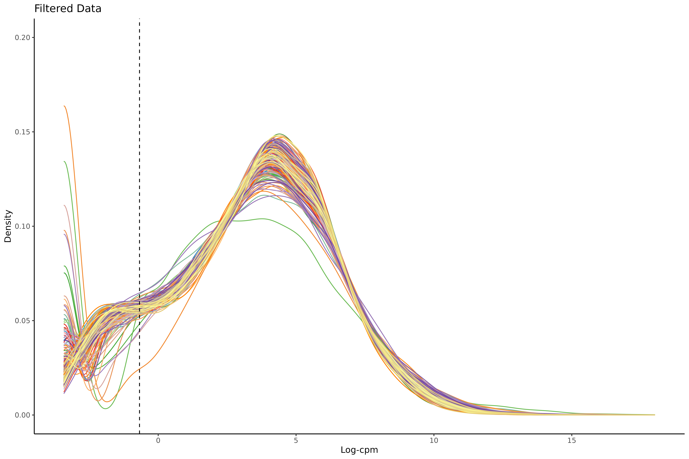
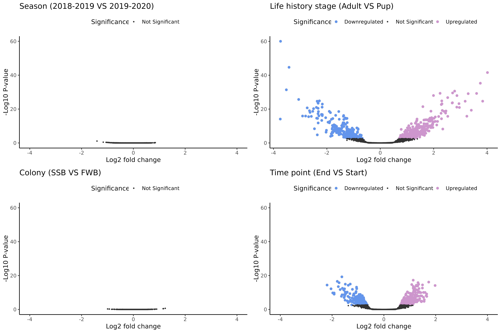
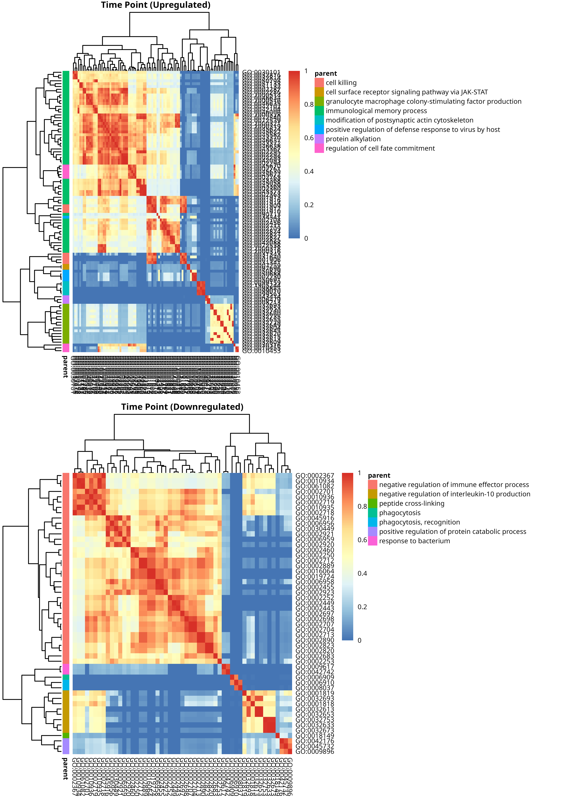
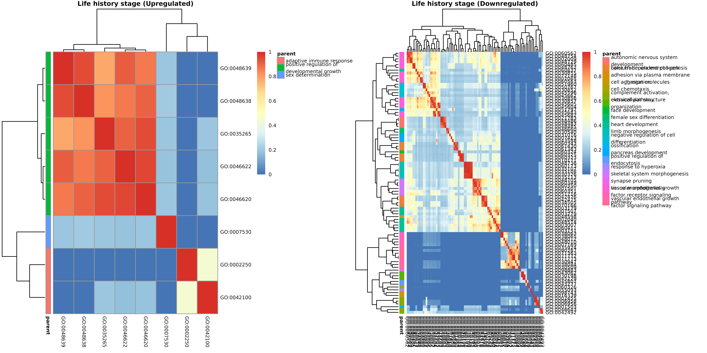
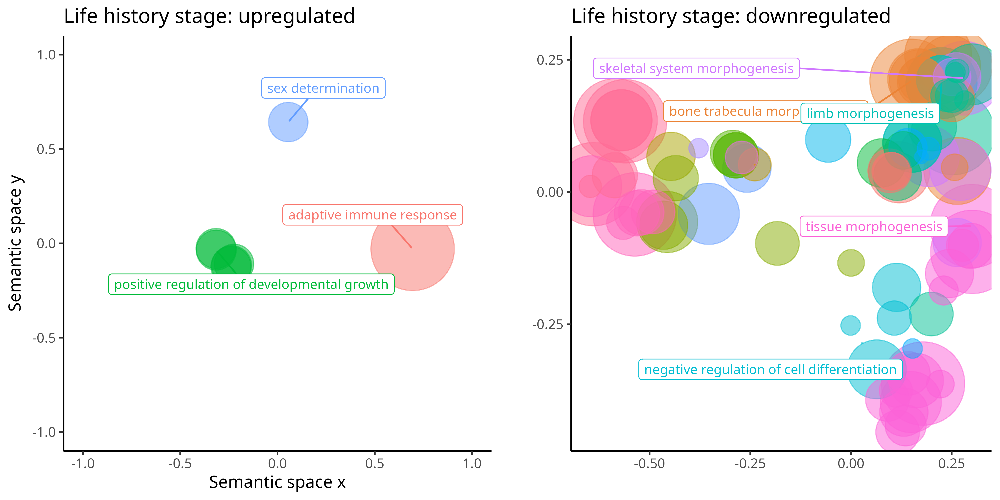

```{r}
#install.packages("here")
#install.packages("pacman")
library(here)
here::here()
```

```{r}
#| label: packages
#| echo: FALSE
#here::here()
invisible(pacman::p_load(dplyr, readxl, tidyverse, cowplot, edgeR, DESeq2, RColorBrewer, ggplot2, reshape2, ggpubr, extrafont, pheatmap))

#font_import()
#fonts()
#cowplot for toggling with plots
#edgeR  loads limma as a dependency, limma for analysing microassay and RNA seq data
#DESeq2 needed for rowCounts
#reshape2 needed for the first plot
#ggpubr need to bind plots together
#extrafont for arial font
#pheatmap needed for heatmaps
```

# Data

```{r}
#| label: load_data
#| echo: FALSE
#Load in the filtered data
#Mutate all needed predictors into factors
d_n<-readRDS("rnaseq_filtered_Liv.Rdata")  
d_n$samples$life_history_stage <- as.factor(d_n$samples$life_history_stage)
d_n$samples$colony <- as.factor(d_n$samples$colony)
d_n$samples$ID <- as.factor(d_n$samples$ID)
d_n$samples$year <- as.factor(d_n$samples$year)
d_n$samples$group <- as.factor(d_n$samples$group)
d_n$samples$pair <- as.factor(d_n$samples$pair)
#dim(d_n) 12639 rows
```

# PCA

Create a PCA plot to identify outliers.

```{r}
#| echo: FALSE
#| message: false
#Use PCA to identify outliers. F24_FWB_mum_start_2018B was already removed at an earlier state
cpm_mat <- cpm(d_n, log=TRUE)  #we need the log values
exprs_mat <- cpm_mat
exprs_t <- t(exprs_mat) #transpose
pca_result <- prcomp(exprs_t, center = TRUE, scale. = TRUE)

pca_var <- pca_result$sdev^2                  
pca_var_explained <- pca_var / sum(pca_var)   
round(pca_var_explained[1:2] * 100, 2)

pc_scores <- as.data.frame(pca_result$x[, 1:2])  #keep PC1 and PC2
pc_scores$SampleID <- rownames(pc_scores)
pc_scores <- cbind(pc_scores, d_n$samples[match(pc_scores$SampleID, rownames(d_n$samples)), ])

PCA_LHS <- ggplot(pc_scores, aes(x = PC1, y = PC2, color = life_history_stage)) +
  geom_point(size = 2) +
  theme_classic() +
  stat_ellipse(type = "norm", size = 0.5) +
  xlim(-400, 150) +
  ylim(-150, 150) +
  labs(title = "(b) Life history stage", x = "PC1 (24.15%)", y = "PC2 (12.38%)", color = NULL)

#levels(pc_scores$year)
levels(pc_scores$year) <- c("2019", "2020")
PCA_Y <- ggplot(pc_scores, aes(x = PC1, y = PC2, color = year)) +
  geom_point(size = 2) +
  theme_classic() +
  stat_ellipse(type = "norm", size = 0.5) +
  xlim(-400, 150) +
  ylim(-150, 150) +
  labs(title = "(c) Season", x = "PC1 (24.15%)", y = "PC2 (12.38%)", color = NULL)

#levels(pc_scores$group)
levels(pc_scores$group) <- c("Day 0", "Day 60")
PCA_TP <- ggplot(pc_scores, aes(x = PC1, y = PC2, color = group)) +
  geom_point(size = 2) +
  theme_classic() +
  stat_ellipse(type = "norm", size = 0.5) +
  xlim(-400, 150) +
  ylim(-150, 150) +
  labs(title = "(a) Time point", x = "PC1 (24.15%)", y = "PC2 (12.38%)", color = NULL)

PCA_C <- ggplot(pc_scores, aes(x = PC1, y = PC2, color = colony)) +
  geom_point(size = 2) +
  theme_classic() +
  stat_ellipse(type = "norm", size = 0.5) +
  xlim(-400, 150) +
  ylim(-150, 150) +
  labs(title = "(d) Colony", x = "PC1 (24.15%)", y = "PC2 (12.38%)", color = NULL)

legend_theme_outlier <- theme(
    legend.position = c(0.05, 0.95), 
    legend.justification = c("left", "top"),  
    legend.background = element_rect(fill = alpha('white', 0.7), color = NA),  
    legend.key.size = unit(0.8, "lines"),
    text = element_text(family = "Arial", size = 14))

PCA_plots_outlier <- plot_grid(PCA_TP + legend_theme_outlier + theme(axis.title.x = element_blank()), 
                               PCA_LHS + legend_theme_outlier + theme(axis.title.x = element_blank(),
                                                                      axis.title.y = element_blank()), 
                               PCA_Y + legend_theme_outlier, 
                               PCA_C + legend_theme_outlier + theme(axis.title.y = element_blank()), 
                               ncol = 2)
ggsave(here::here("Plots","PCA_plots_outlier.png"), plot = PCA_plots_outlier, dpi = 600)
#The PCA identifies F6_FWB_mum_start_2018B as an outlier

#Remove F6_FWB_mum_start_2018B and redo the PCA plots
d_n <- d_n[, d_n$samples$Sample != "F6_FWB_mum_start_2018B"]

#Re do the PCA analysis
cpm_mat <- cpm(d_n, log=TRUE)  #we need the log values
exprs_mat <- cpm_mat
exprs_t <- t(exprs_mat) #transpose
pca_result <- prcomp(exprs_t, center = TRUE, scale. = TRUE)

pca_var <- pca_result$sdev^2                  
pca_var_explained <- pca_var / sum(pca_var)   
round(pca_var_explained[1:2] * 100, 2)

pc_scores <- as.data.frame(pca_result$x[, 1:2])  #keep PC1 and PC2
pc_scores$SampleID <- rownames(pc_scores)
pc_scores <- cbind(pc_scores, d_n$samples[match(pc_scores$SampleID, rownames(d_n$samples)), ])

write.csv(pc_scores, file = here::here("GenesGO", "pc_scores.csv"))
rm(exprs_mat, exprs_t, cpm_mat)
```

The PCA identified **one** outlier, which was removed from the dataset for further analysis.

```{r}
#| echo: FALSE
#| message: false
#Plot in accordance to LHS and TP
PCA_LHS <- ggplot(pc_scores, aes(x = PC1, y = PC2, color = life_history_stage)) +
  geom_point(size = 2) +
  theme_classic() +
  stat_ellipse(type = "norm", size = 0.5) +
  scale_color_manual(values = c("#E69F00", "#56B4E9")) +
  xlim(-200, 200) +
  ylim(-200, 200) +
  labs(title = "c) Life history stage", x = "PC1 (23.12%)", y = "PC2 (13.25%)", color = NULL)

#levels(pc_scores$group)
levels(pc_scores$group) <- c("Day 0", "Day 60")
PCA_TP <- ggplot(pc_scores, aes(x = PC1, y = PC2, color = group)) +
  geom_point(size = 2) +
  theme_classic() +
  stat_ellipse(type = "norm", size = 0.5) +
  scale_color_manual(values = c("#E69F00", "#56B4E9")) +
  xlim(-200, 200) +
  ylim(-200, 200) +
  labs(title = "a) Time point", x = "PC1 (23.12%)", y = "PC2 (13.25%)", color = NULL)

#levels(pc_scores$year)
levels(pc_scores$year) <- c("2019", "2020")
PCA_Y <- ggplot(pc_scores, aes(x = PC1, y = PC2, color = year)) +
  geom_point(size = 2) +
  theme_classic() +
  stat_ellipse(type = "norm", size = 0.5) +
  scale_color_manual(values = c("#E69F00", "#56B4E9")) +
  xlim(-200, 200) +
  ylim(-200, 200) +
  labs(title = "c) Season", x = "PC1 (23.12%)", y = "PC2 (13.25%)", color = NULL)

PCA_C <- ggplot(pc_scores, aes(x = PC1, y = PC2, color = colony)) +
  geom_point(size = 2) +
  theme_classic() +
  stat_ellipse(type = "norm", size = 0.5) +
  scale_color_manual(values = c("#E69F00", "#56B4E9")) +
  xlim(-200, 200) +
  ylim(-200, 200) +  
  labs(title = "d) Colony", x = "PC1 (23.12%)", y = "PC2 (13.25%)", color = NULL)

legend_theme <- theme(
    legend.position = c(0.95, 0.95), 
    legend.justification = c("right", "top"), 
    legend.background = element_rect(fill = alpha('white', 0.7), color = NA), 
    legend.key.size = unit(0.8, "lines"), 
    text = element_text(family = "Arial", size = 14))

PCA_plots <- plot_grid(PCA_TP + legend_theme + theme(axis.title.x = element_blank()),
                       PCA_LHS + legend_theme + theme(axis.title.x = element_blank(),
                                                      axis.title.y = element_blank()), 
                       PCA_Y + legend_theme, 
                       PCA_C + legend_theme + theme(axis.title.y = element_blank()),
                       ncol = 2)

ggsave(here::here("Plots","PCA_plots.png"), plot = PCA_plots, dpi = 600)
rm(PCA_LHS, PCA_TP, PCA_Y, PCA_C)
```


# Visualize data

```{r}
#| label: visualize_data
#| echo: FALSE
counts_per_million <- cpm(d_n)
log_counts_per_million <- cpm(d_n, log = T)
#Calculate mean and median value
L <- mean(d_n$samples$lib.size) * 1e-6 #average library size in millions
M <- median(d_n$samples$lib.size) * 1e-6 
#c(L, M) #19.72712, 19.11033
lcpm.cutoff <- log2(10/M + 2/L) #-0.678856

df_long <- data.frame(log_counts_per_million)
df_long$Gene <- rownames(df_long)
df_melted <- melt(df_long, id.vars = "Gene", variable.name = "Sample", value.name = "LogCPM")

#costum color palette
palette_200 <- colorRampPalette(brewer.pal(12, "Paired"))(200)

density_plot <- ggplot(df_melted, aes(x = LogCPM, color = Sample)) +
  geom_density(size = 0.5) + 
  scale_color_manual(values = palette_200) + 
  geom_vline(xintercept = lcpm.cutoff, linetype = "dashed", color = "black") +  # Add cutoff line
  labs(title = "Filtered Data", x = "Log-cpm", y = "Density") +
  theme_classic() +
  theme(legend.position = "none") +
  ylim(0,0.20)

#density_plot

# Save the density plot as a PNG file
ggsave(here::here("Plots","density_plot.png"), plot = density_plot, width = 12, height = 8, dpi = 600)

#Remove elements not used in the rest of the script
rm(counts_per_million, density_plot, df_long, df_melted, log_counts_per_million, L, M, lcpm.cutoff, palette_200)
```



# Differential gene expression analysis
In this section, we will perform differential gene expression analysis to identify genes that are differentially expressed between the four main contasts: Time point, Life hisotry stage, Colony and Season. 
```{r}
#| label: load_data
#| echo: FALSE
clrs <- c("Upregulated" = "#FDA172", "Downregulated" = "#9867B5", "'Not significant'" = "grey20")
lfc <- 1 #log fold change of 1 is pretty standard but explore further
#a doubling in the original scaling is equal to a log2 fold change of 1
#a quadrupling is equal to a log2 fold change of 2
lfc_half <- 0.5
adj.P.value <- 0.05
fig_theme <- theme(text = element_text(family = "Arial", size = 14),
                   legend.title = element_blank(),
                   legend.text=element_text(size=12),
                   axis.text.x = element_text(size =12),
                   axis.text.y = element_text(size = 12))

ann_colors <- list(
  TP = c("Day 0" = "#8B9E58", "Day 60" = "#638B9B"),
  LHS = c(Mother = "#C44B4E", Pup = "#C46A00")
)
```

## Time point: Analysis by Bernice

BS assessed differential expression per gene between the two time points (start vs end).

```{r}
#| label: load_data
#| echo: FALSE
# #-------------- ANALYSIS OF TIME POINT --------------##
# design <- model.matrix(~ -1 + group, data = d_n$samples) #setting up model contrasts is more straight forward in the absence of an intercept for timepoint
# contr.matrix <- makeContrasts(
#  end_vs_start = group2-group1,
#  levels = colnames(design)) #create matrix for contrasts
# # Use voom to remove variance dependency on mean, see https://bioconductor.org/packages/release/workflows/vignettes/RNAseq123/inst/doc/limmaWorkflow.html
# # voom converts raw counts to log-CPM values by automatically extracting library sizes and normalisation factors from d itself.
# #  If filtering of lowly-expressed genes is insufficient, a drop in variance levels can be observed at the low end of the expression scale due to very small counts.
# #voom() converts the read counts to log2-cpm, with associated weights, ready for linear modelling
# vobj_tp <- voom(d_n, design, plot=TRUE)
# 
# # Fit a random effect
# dupcor_tp <- duplicateCorrelation(vobj_tp, design, block = d_n$samples$ID)
# dupcor_tp$consensus #the estimated intra individual correlation (0.3115568)
# #the intra individual correlation will change the voom weights slightly
# #run voom again considering the duplicateCorrelation results in order to compute more accurate precision weights
# vobj = voom(d_n, design, plot=TRUE,
#            block=d_n$samples$ID, correlation=dupcor_tp$consensus)
# #update the correlation for the new voom weights
# dupcor_tp <- duplicateCorrelation(vobj, design, block = d_n$samples$ID)
# dupcor_tp$consensus #the estimated intra individual correlation (0.3114605)
# 
# #Fit the model
# analyzing repeated measures data using duplicateCorrelation.
# The model forces the magnitude of the random effect to be the same across all genes.
# Estimate linear mixed model with a single variance component
# Fit the model for each gene
# But this step uses only the genome-wide average for the random effect
# vfit_tp <- lmFit(vobj, design, block=d_n$samples$ID, correlation=dupcor_tp$consensus)
# vfit_tp <- contrasts.fit(vfit_tp, contrasts=contr.matrix)
# 
# Save the model to avoid recomputing everything
# save vfit_tp
# saveRDS(vfit_tp, file = here::here("Models","vfit_tp.rds"))

#Load vfit_tp
vfit_tp <- readRDS(here::here("Models","vfit_tp.rds"))

# Fit Empirical Bayes for moderated t-statistics, empirical Bayes moderation is carried out by borrowing information across all the genes to obtain more precise estimates of gene-wise variability
efit <- eBayes(vfit_tp)
topTable(efit, n=20)
plotSA(efit, main="Final model: Mean-variance trend")
plotMD(efit)
abline(h=0,col="darkgrey")

#adjusted p-value cutoff that is set at 5% by default.
efit$F
head(efit$F.p.value) #pval of the moderated F-statistics (equivalent to one-way ANOVA), it combines all contrast, so in this case it is the same as the t-statistic
head(efit$p.value) #same
summary(decideTests(efit, adjust.method="fdr"))
#set log-fold-changes (log-FCs) to be above a minimum value. The treat method (McCarthy and Smyth 2009) used to calculate p-values from empirical Bayes moderated t-statistics with a minimum log-FC requirement. 
#no need to use the ebayes output for this
#lfc<-0.14 #threshold set by Bernice to differentiate between differentially expressed genes

tfit <- treat(vfit_tp, lfc=lfc) #lfc = 1, lfc_half = 0.5
topTreat(tfit)
nrow(tfit)
dt <- decideTests(tfit, adjust.method="fdr")
summary(dt) 

#Test for significance
Allgenes_tp <- as.data.frame(topTreat(tfit, n=nrow(tfit)))
Filteredgenes_tp <- subset(Allgenes_tp, abs(logFC) >= lfc & adj.P.Val < adj.P.value)
Upregulated_tp <-subset(Filteredgenes_tp, Filteredgenes_tp$logFC >= lfc)
Downregulated_tp <-subset(Filteredgenes_tp, Filteredgenes_tp$logFC <= -lfc)
nrow(subset(Filteredgenes_tp, Filteredgenes_tp$logFC > 0))
nrow(subset(Filteredgenes_tp, Filteredgenes_tp$logFC < 0))

# Create a list to save the up and down regulated genes and the df containing all genes evaluated for GO analysis
tp_list <- list(All_tp = Allgenes_tp, Upregulated_tp = Upregulated_tp, Downregulated_tp = Downregulated_tp)

# Loop through and save each data frame using `here()`
for (name in names(tp_list)) {
  write.csv(tp_list[[name]], file = here::here("GenesGO", paste0(name, ".csv")), row.names = TRUE)
}

#Significance
Allgenes_tp$Significance <- "'Not significant'"
Allgenes_tp$Significance[Allgenes_tp$adj.P.Val < adj.P.value & Allgenes_tp$logFC >= lfc] <- "Upregulated"
Allgenes_tp$Significance[Allgenes_tp$adj.P.Val < adj.P.value & Allgenes_tp$logFC <= -lfc] <- "Downregulated"

#Plot volcano plot
tp_plot <- ggplot(Allgenes_tp, aes(x = logFC, y = -log10(P.Value), color = Significance, size = Significance)) +
  geom_point() +
  scale_color_manual(values = clrs) +  
  scale_size_manual(values = c(0.5, 1, 1)) +
  labs(title = "(a) Time point", x = "Log2 fold change", y = "-Log10 P-value") +
  theme_classic() +
  ylim(0,50) +
  xlim(-4,4) +
  theme(
    legend.position = "top",
    plot.title.position = "plot")
```

### Heatmap
Creating a heatmap to visualise the differentially expressed genes between the two start points. 
```{r}
#| label: load_data
#| echo: FALSE
#Create heatmap for differentially expressed genes between time points
DEG_tp <- rownames(Filteredgenes_tp)

#Extract the expression values for the differentially expressed genes
expression_tp <- vobj$E[DEG_tp, ]

#get labels
annotation <- data.frame(TP = as.factor(d_n$samples$group))
rownames(annotation) <- d_n$samples$Sample
annotation$TP <- ifelse(annotation$TP == 1, "Day 0", "Day 60")
annotation$TP <- factor(annotation$TP, levels = c("Day 0", "Day 60"))

matrix_tp <- expression_tp[, order(annotation$TP)]
annotation_tp <- annotation[order(annotation$TP), , drop = FALSE]

heatmap_tp <- pheatmap(matrix_tp,
                       scale = "row",  # normalize rows (genes)
                       color = colorRampPalette(c("#9D00FF", "white", "#FFA500"))(100),
                       annotation_colors = ann_colors,
                       annotation_col = annotation,
                       cluster_rows = TRUE,
                       treeheight_row = 0,
                       cluster_cols = FALSE,
                       gaps_col = cumsum(table(annotation$TP)),
                       show_rownames = F,
                       show_colnames = FALSE,
                       annotation_legend = FALSE,
                       legend = F,
                       fontsize = 14,
                       fontsize_col = 7,
                       fontsize_row = 6,
                       main = "(a) Time point")

ggsave(here::here("Plots","heatmap_tp.png"), plot = heatmap_tp, width = 7, height = 2, dpi = 600)

```


## Life stages
Analysis performed by ALB using the framework outlined by BS. 
```{r}
#| label: load_data
#| echo: FALSE
#Tagged out to not run dupcor again (the saved outcome can be called from the dupcor folder)
# #Create a design matrix
# design_lhs <- model.matrix(~ -1 + life_history_stage, data = d_n$samples) #model contrasts without intercept is easier
# colnames(design_lhs) <- gsub("life_history_stage", "", colnames(design_lhs)) #clean group names
# 
# #create matrix for contrasts
# contr.matrix.lhs <- makeContrasts(
#  adultvspup = Mother-Pup,
#  levels = colnames(design_lhs))
# 
# #voom() converts the read counts to log2-cpm, with associated weights, ready for linear modelling
# vobj_lhs <- voom(d_n, design_lhs, plot=TRUE)
# 
# # Fit a random effect
# dupcor_lhs <- duplicateCorrelation(vobj_lhs, design_lhs, block = d_n$samples$ID)
# dupcor_lhs$consensus #the estimated intra individual correlation (0.1362346)
# 
# vobj_lhs = voom(d_n, design_lhs, plot=TRUE,
#          block=d_n$samples$ID, correlation=dupcor_lhs$consensus)
# #update the correlation for the new voom weights
# dupcor_lhs <- duplicateCorrelation(vobj_lhs, design_lhs, block = d_n$samples$ID)
# dupcor_lhs$consensus #the estimated intra individual correlation (0.1362741)
# #Analyzing repeated measures data using duplicateCorrelation.
# #The model forces the magnitude of the random effect to be the same across all genes.
# 
# 
# #Estimate linear mixed model with a single variance component
# vfit_lhs <- lmFit(vobj_lhs, design_lhs, block=d_n$samples$ID, correlation=dupcor_lhs$consensus)
# vfit_lhs <- contrasts.fit(vfit_lhs, contrasts=contr.matrix.lhs)
# 
# #Save the model to avoid recomputing everything
# #save vfit_lhs
# saveRDS(vfit_lhs, file = here::here("Models","vfit_lhs.rds"))

#Load vfit_lhs
vfit_lhs <- readRDS(here::here("Models","vfit_lhs.rds"))

# Fit Empirical Bayes for moderated t-statistics, empirical Bayes moderation is carried out by borrowing information across all the genes to obtain more precise estimates of gene-wise variability
efit_lhs <- eBayes(vfit_lhs)
topTable(efit_lhs, n=20)
plotSA(efit_lhs, main="Final model: Mean-variance trend")
plotMD(efit_lhs)
abline(h=0,col="darkgrey")

#adjusted p-value cutoff that is set at 5% by default.
efit_lhs$F
#head(efit_lhs$F.p.value) #pval of the moderated F-statistics (equivalent to one-way ANOVA), it combines all contrast, so in this case it is the same as the t-statistic
#head(efit_lhs$p.value) #same
summary(decideTests(efit_lhs, adjust.method="fdr"))
#set log-fold-changes (log-FCs) to be above a minimum value. The treat method (McCarthy and Smyth 2009) used to calculate p-values from empirical Bayes moderated t-statistics with a minimum log-FC requirement. 
#no need to use the ebayes output for this

#Positive values means the gene is more expressed
tfit_lhs <- treat(vfit_lhs, lfc=lfc) 
topTreat(tfit_lhs)
nrow(tfit_lhs)
dt_lhs <- decideTests(tfit_lhs, adjust.method="fdr")
summary(dt_lhs) 

#Test for significance
Allgenes_lhs <- as.data.frame(topTreat(tfit_lhs, n=nrow(tfit_lhs)))
Filteredgenes_lhs <- subset(Allgenes_lhs, abs(logFC) >= lfc & adj.P.Val < adj.P.value)
Upregulated_lhs <-subset(Filteredgenes_lhs, Filteredgenes_lhs$logFC >= lfc)
Downregulated_lhs <-subset(Filteredgenes_lhs, Filteredgenes_lhs$logFC <= -lfc)
nrow(subset(Filteredgenes_lhs, Filteredgenes_lhs$logFC > 0))
nrow(subset(Filteredgenes_lhs, Filteredgenes_lhs$logFC < 0))

# Create a list to save the up and down regulated genes and the df containing all genes evaluated for GO analysis
lhs_list <- list(All_lhs = Allgenes_lhs, Upregulated_lhs = Upregulated_lhs, Downregulated_lhs = Downregulated_lhs)

# Loop through and save each data frame using `here()`
for (name in names(lhs_list)) {
  write.csv(lhs_list[[name]], file = here::here("GenesGO", paste0(name, ".csv")), row.names = TRUE)
}


#Significance
Allgenes_lhs$Significance <- "'Not significant'"
Allgenes_lhs$Significance[Allgenes_lhs$adj.P.Val < adj.P.value & Allgenes_lhs$logFC >= lfc] <- "Upregulated"
Allgenes_lhs$Significance[Allgenes_lhs$adj.P.Val < adj.P.value & Allgenes_lhs$logFC <= -lfc] <- "Downregulated"

#Plot DEG volcano plot
lhs_plot <- ggplot(Allgenes_lhs, aes(x = logFC, y = -log10(P.Value), color = Significance, size = Significance)) +
  geom_point() +
  scale_color_manual(values = clrs) +  
  scale_size_manual(values = c(0.5, 1, 1)) +
  labs(title = "(b) Life history stage", x = "Log2 fold change", y = "-Log10 P-value") +
  theme_classic() +
  #ylim(0,60) +
  #xlim(-4,4) +
    theme(
    legend.position = "top",
    plot.title.position = "plot")
```

### Heatmap
Creating a heatmap to visualise the differentially expressed genes between the two life history stages.
```{r}
#| label: load_data
#| echo: FALSE
#Create heatmap for differentially expressed genes between time points
DEG_lhs <- rownames(Filteredgenes_lhs)

#Extract the expression values for the differentially expressed genes
expression_lhs <- vobj_lhs$E[DEG_lhs, ]

#get labels
annotation_lhs <- data.frame(LHS = as.factor(d_n$samples$life_history_stage))
rownames(annotation_lhs) <- d_n$samples$Sample
annotation_lhs$LHS <- factor(annotation_lhs$LHS, levels = c("Mother", "Pup"))

#order the expression values
matrix_lhs <- expression_lhs[, order(annotation_lhs$LHS)]
annotation_lhs <- annotation_lhs[order(annotation_lhs$LHS), , drop = FALSE]

heatmap_lhs <- pheatmap(matrix_lhs,
                       scale = "row",  # normalize rows (genes)
                       color = colorRampPalette(c("#9D00FF", "white", "#FFA500"))(100),
                       annotation_colors = ann_colors,
                       annotation_col = annotation_lhs,
                       cluster_rows = TRUE,
                       treeheight_row = 0,
                       cluster_cols = FALSE,
                       gaps_col = cumsum(table(annotation_lhs$LHS)),
                       show_rownames = F,
                       show_colnames = F,
                       annotation_legend = FALSE,
                       legend = F,
                       fontsize = 14,
                       fontsize_col = 7,
                       fontsize_row = 6,
                       main = "(b) Life history stage")


ggsave(here::here("Plots","heatmap_lhs.png"), plot = heatmap_lhs, width = 7, height = 7, dpi = 600)
```


## Colony
Analysis performed by ALB using the framework outlined by BS. 
```{r}
#| label: load_data
#| echo: FALSE
#Tagged out to not run dupcor again (the saved outcome can be called from the dupcor folder)
# #Create a design matrix
#design_c <- model.matrix(~ -1 + colony, data = d_n$samples) #model contrasts without intercept is easier
#colnames(design_c) <- gsub("colony", "", colnames(design_c)) #clean group names
#
# #create matrix for contrasts
#contr.matrix.c <- makeContrasts(
#  SSBvsFWB = SSB-FWB,
#  levels = colnames(design_c)) 
#
# #voom() converts the read counts to log2-cpm, with associated weights, ready for linear modelling
#vobj_c <- voom(d_n, design_c, plot=TRUE)
#
# # Fit a random effect
#dupcor_c <- duplicateCorrelation(vobj_c, design_c, block = d_n$samples$ID)
#dupcor_c$consensus #the estimated intra individual correlation (0.1998915)
# #the intra individual correlation will change the voom weights slightly
# #run voom again considering the duplicateCorrelation results in order to compute more accurate precision weights
#vobj_c = voom(d_n, design_c, plot=TRUE, 
#            block=d_n$samples$ID, correlation=dupcor_c$consensus)
# #update the correlation for the new voom weights
#dupcor_c <- duplicateCorrelation(vobj_c, design_c, block = d_n$samples$ID)
#dupcor_c$consensus #the estimated intra individual correlation (0.1999114)
#
# #Analyzing repeated measures data using duplicateCorrelation.
# #The model forces the magnitude of the random effect to be the same across all genes.
# #Estimate linear mixed model with a single variance component
#vfit_c <- lmFit(vobj_c, design_c, block=d_n$samples$ID, correlation=dupcor_c$consensus)
#vfit_c <- contrasts.fit(vfit_c, contrasts=contr.matrix.c)
#
# #Save the model to avoid recomputing everything
# #save vfit_c
#saveRDS(vfit_c, file = here::here("Models","vfit_c.rds"))
#
#Load vfit_c
vfit_c <- readRDS(here::here("Models","vfit_c.rds"))

# Fit Empirical Bayes for moderated t-statistics, empirical Bayes moderation is carried out by borrowing information across all the genes to obtain more precise estimates of gene-wise variability
efit_c <- eBayes(vfit_c)
topTable(efit_c, n=20)
plotSA(efit_c, main="Final model: Mean-variance trend")
plotMD(efit_c)
abline(h=0,col="darkgrey")

#adjusted p-value cutoff that is set at 5% by default.
efit_c$F
#head(efit_c$F.p.value) #pval of the moderated F-statistics (equivalent to one-way ANOVA), it combines all contrast, so in this case it is the same as the t-statistic
#head(efit_c$p.value) #same
summary(decideTests(efit_c, adjust.method="fdr"))
#set log-fold-changes (log-FCs) to be above a minimum value. The treat method (McCarthy and Smyth 2009) used to calculate p-values from empirical Bayes moderated t-statistics with a minimum log-FC requirement. 
#no need to use the ebayes output for this

#Positive values means the gene is more expressed
tfit_c <- treat(vfit_c, lfc=lfc) 
topTreat(tfit_c)
nrow(tfit_c)
dt_c <- decideTests(tfit_c, adjust.method="fdr")
summary(dt_c) 

#Test for significance
Allgenes_c <- as.data.frame(topTreat(tfit_c, n=nrow(tfit_c)))
Filteredgenes_c <- subset(Allgenes_c, abs(logFC) >= lfc & adj.P.Val, 2 < adj.P.value)
nrow(subset(Filteredgenes_c, Filteredgenes_c$logFC > 0))
nrow(subset(Filteredgenes_c, Filteredgenes_c$logFC < 0))

#Significance
Allgenes_c$Significance <- "'Not significant'"
Allgenes_c$Significance[Allgenes_c$adj.P.Val < adj.P.value & Allgenes_c$logFC >= lfc] <- "Upregulated"
Allgenes_c$Significance[Allgenes_c$adj.P.Val < adj.P.value & Allgenes_c$logFC <= -lfc] <- "Downregulated"

#Plot DEG Volcano plot
c_plot <- ggplot(Allgenes_c, aes(x = logFC, y = -log10(P.Value), color = Significance, size = Significance)) +
  geom_point() +
  scale_color_manual(values = clrs) +  
  scale_size_manual(values = 0.5) +
  labs(title = "(d) Colony", x = "Log2 fold change", y = "-Log10 P-value") +
  theme_classic() +
  ylim(0,50) +
  xlim(-4,4) +
    theme(
    legend.position = "top",
    plot.title.position = "plot")
```

## Season
Analysis performed by ALB using the framework outlined by BS. 
```{r}
#| label: load_data
#| echo: FALSE
#Tagged out to not run dupcor again (the saved outcome can be called from the dupcor folder)
# #Create a design matrix
# design_y <- model.matrix(~ -1 + year, data = d_n$samples) #model contrasts without intercept is easier
# colnames(design_y) <- c("Season1", "Season2") #clean group names
# #create matrix for contrasts
# contr.matrix.y <- makeContrasts(
#   Season1vsSeason2 = Season1-Season2,
#   levels = colnames(design_y)) 
#
# #voom() converts the read counts to log2-cpm, with associated weights, ready for linear modelling
# vobj_y <- voom(d_n, design_y, plot=TRUE)
# 
# #Fit a random effect
# dupcor_y <- duplicateCorrelation(vobj_y, design_y, block = d_n$samples$ID)
# dupcor_y$consensus #the estimated intra individual correlation (0.1744074)
# #the intra individual correlation will change the voom weights slightly
# #run voom again considering the duplicateCorrelation results in order to compute more accurate precision weights
# vobj_y = voom(d_n, design_y, plot=TRUE, 
#             block=d_n$samples$ID, correlation=dupcor_y$consensus)
# #update the correlation for the new voom weights
# dupcor_y <- duplicateCorrelation(vobj_y, design_y, block = d_n$samples$ID)
# dupcor_y$consensus #the estimated intra individual correlation (0.1744428)
#
# #Analyzing repeated measures data using duplicateCorrelation.
# #The model forces the magnitude of the random effect to be the same across all genes.
#
# #Estimate linear mixed model with a single variance component
# vfit_y <- lmFit(vobj_y, design_y, block=d_n$samples$ID, correlation=dupcor_y$consensus)
# vfit_y <- contrasts.fit(vfit_y, contrasts=contr.matrix.y)
#
# #Save the model to avoid recomputing everything
# saveRDS(vfit_y, file = here::here("Models","vfit_y.rds"))
#
#Load vfit_y
vfit_y <- readRDS(here::here("Models","vfit_y.rds"))
#ebayes model
efit_y <- eBayes(vfit_y)
topTable(efit_y, n=20)
plotSA(efit_y, main="Final model: Mean-variance trend")
plotMD(efit_y)
abline(h=0,col="darkgrey")

#adjusted p-value cutoff that is set at 5% by default.
efit_y$F
#head(efit_y$F.p.value) #pval of the moderated F-statistics (equivalent to one-way ANOVA), it combines all contrast, so in this case it is the same as the t-statistic
#head(efit_y$p.value) #same
summary(decideTests(efit_y, adjust.method="fdr"))
#set lfc 
tfit_y <- treat(vfit_y, lfc=lfc) 
topTreat(tfit_y)
nrow(tfit_y)
dt_y <- decideTests(tfit_y, adjust.method="fdr")
summary(dt_y) 

#Test for significance
Allgenes_y <- as.data.frame(topTreat(tfit_y, n=nrow(tfit_y)))
Filteredgenes_y <- subset(Allgenes_y, abs(logFC) >= lfc & adj.P.Val < adj.P.value)
nrow(subset(Filteredgenes_y, Filteredgenes_y$logFC > 0))
nrow(subset(Filteredgenes_y, Filteredgenes_y$logFC < 0))

#Plot the outcome
Allgenes_y$Significance <- "'Not significant'"
Allgenes_y$Significance[Allgenes_y$adj.P.Val < adj.P.value & Allgenes_y$logFC >= lfc] <- "Upregulated"
Allgenes_y$Significance[Allgenes_y$adj.P.Val < adj.P.value & Allgenes_y$logFC <= -lfc] <- "Downregulated"

#Plot DEG
y_plot <- ggplot(Allgenes_y, aes(x = logFC, y = -log10(P.Value), color = Significance, size = Significance)) +
  geom_point() +
  scale_color_manual(values = clrs) +  
  scale_size_manual(values = 0.5) +
  labs(title = "(c) Season", x = "Log2 fold change", y = "-Log10 P-value") +
  theme_classic() +
  ylim(0,50) +
  xlim(-4,4) +
    theme(
    legend.position = "top",
    plot.title.position = "plot")
```

```{r}
#Bind plots together
# Apply theme to make similar
y_plot <- y_plot + fig_theme
lhs_plot <- lhs_plot + fig_theme + theme(axis.title.x = element_blank(),
                                         axis.title.y = element_blank())
c_plot <- c_plot + fig_theme + theme(axis.title.y = element_blank())
tp_plot <- tp_plot + fig_theme + theme(axis.title.x = element_blank())

# Combine plots
DEG_all <- ggarrange(tp_plot, lhs_plot, y_plot, c_plot, common.legend = T, legend = "bottom")

ggsave(here::here("Plots","DEG_all.png"), plot = DEG_all, width = 7, height = 7, dpi = 600)
```



# Interactions
In this section, we perform a differential gene expression analysis between biologically relevant interactions between the main contrasts. 
## Year and life history stage interaction
Framework for differential gene expression analysis using interactions by ALB. 
```{r}
#| label: load_data
#| echo: FALSE
# #Simple interaction (limma manual 9.5.2)
# #Create a design matrix including life history stage and its interaction with year
# d_n$samples$y.lhs <- as.factor(paste(d_n$samples$year, d_n$samples$life_history_stage, sep = "."))
# design_interaction <- model.matrix(~ 0+y.lhs, data = d_n$samples)  # No intercept
# #Clean column names
# colnames(design_interaction) <- c("Season1.mum", "Season1.pup", "Season2.mum", "Season2.pup")
# 
# # #voom() converts the read counts to log2-cpm, with associated weights, ready for linear modelling
# vobj_interaction <- voom(d_n, design_interaction, plot=TRUE)
# 
# #Fit a random effect
# dupcor_interaction <- duplicateCorrelation(vobj_interaction, design_interaction, block = d_n$samples$ID)
# # #dupcor_interaction$consensus #the estimated intra individual correlation (0.09626666)
# 
# vobj_interaction = voom(d_n, design_interaction, plot=TRUE, 
#                         block=d_n$samples$ID, correlation=dupcor_interaction$consensus)
# # #update the correlation for the new voom weights
# dupcor_interaction <- duplicateCorrelation(vobj_interaction, design_interaction, block = d_n$samples$ID)
# # #dupcor_interaction$consensus #the estimated intra individual correlation (0.09627793)
# 
# #Estimate linear mixed model with a single variance component
# vfit_interaction <- lmFit(vobj_interaction, design_interaction, block=d_n$samples$ID, correlation=dupcor_interaction$consensus)
# 
# #Fit the contrasts we are interested in
# cont.matrix.interaction <- makeContrasts(
#   SeasonalAdult = Season1.mum - Season2.mum, #which genes in adults are DE among seasons
#   SeasonalPup = Season1.pup - Season2.pup,  #which genes in pups are DE among seasons
#   Interaction = (Season1.mum - Season1.pup)-(Season2.mum - Season2.pup), #which genes respond differently in pups compared to adults 
#   levels = colnames(design_interaction)
# )
# 
# vfit_interaction <- contrasts.fit(vfit_interaction, contrasts=cont.matrix.interaction)
#
# #Save the model to avoid recomputing everything
# saveRDS(vfit_interaction, file = here::here("Models","vfit_interaction.rds"))
#
#Load vfit_interaction
vfit_interaction <- readRDS(here::here("Models","vfit_interaction.rds"))

# Fit Empirical Bayes for moderated t-statistics, empirical Bayes moderation is carried out by borrowing information across all the genes to obtain more precise estimates of gene-wise variability
efit_interaction <- eBayes(vfit_interaction)
topTable(efit_interaction, n=20)
plotSA(efit_interaction, main="Final model: Mean-variance trend")
plotMD(efit_interaction)
abline(h=0,col="darkgrey")

#adjusted p-value cutoff that is set at 5% by default.
efit_interaction$F
#head(efit_y$F.p.value) #pval of the moderated F-statistics (equivalent to one-way ANOVA), it combines all contrast, so in this case it is the same as the t-statistic
#head(efit_y$p.value) #same
summary(decideTests(efit_interaction, adjust.method="fdr"))

tfit_interaction <- treat(vfit_interaction, lfc=lfc) 
topTreat(tfit_interaction)
nrow(tfit_interaction)
dt_interaction <- decideTests(tfit_interaction, adjust.method="fdr")
summary(dt_interaction) 
```

## Year and colony interaction
Framework for differential gene expression analysis using interactions by ALB. 
```{r}
#| label: load_data
#| echo: FALSE
# #Simple interaction (limma manual 9.5.2)
# #Create a design matrix including life history stage and its interaction with colony
# d_n$samples$y.colony <- as.factor(paste(d_n$samples$year, d_n$samples$colony, sep = "."))
# design_interaction2 <- model.matrix(~ 0+y.colony, data = d_n$samples)  # No intercept
# #Clean column names
# colnames(design_interaction2) <- c("Season1.FWB", "Season1.SSB", "Season2.FWB", "Season2.SSB")
# 
# # #voom() converts the read counts to log2-cpm, with associated weights, ready for linear modelling
# vobj_interaction2 <- voom(d_n, design_interaction2, plot=TRUE)
# 
# #Fit a random effect
# dupcor_interaction2 <- duplicateCorrelation(vobj_interaction2, design_interaction2, block = d_n$samples$ID)
# # #dupcor_interaction$consensus #the estimated intra individual correlation (0.09626666)
# 
# vobj_interaction2 = voom(d_n, design_interaction2, plot=TRUE, 
#                         block=d_n$samples$ID, correlation=dupcor_interaction2$consensus)
# # #update the correlation for the new voom weights
# dupcor_interaction2 <- duplicateCorrelation(vobj_interaction2, design_interaction2, block = d_n$samples$ID)
# # #dupcor_interaction$consensus #the estimated intra individual correlation (0.09627793)
# 
# #Estimate linear mixed model with a single variance component
# vfit_interaction2 <- lmFit(vobj_interaction2, design_interaction2, block=d_n$samples$ID, correlation=dupcor_interaction2$consensus)
# 
# #Fit the contrasts we are interested in
# cont.matrix.interaction2 <- makeContrasts(
#   FWBvsSSBseason1 = Season1.FWB - Season1.SSB, #which genes in season 1 are DE among colonies
#   FWBvsSSBseason2 = Season2.FWB - Season2.SSB, #which genes in season 2 are DE among colonies
#   Interaction = (Season1.FWB - Season1.SSB)-(Season2.FWB - Season2.SSB), #which genes respond differently in SSB compared to FWB
#   levels = colnames(design_interaction2)
# )
# 
# vfit_interaction2 <- contrasts.fit(vfit_interaction2, contrasts=cont.matrix.interaction2)
# 
# #Save the model to avoid recomputing everything
# saveRDS(vfit_interaction2, file = here::here("Models","vfit_interaction2.rds"))

#Load vfit_interaction
vfit_interaction2 <- readRDS(here::here("Models","vfit_interaction2.rds"))
# Fit Empirical Bayes for moderated t-statistics, empirical Bayes moderation is carried out by borrowing information across all the genes to obtain more precise estimates of gene-wise variability
efit_interaction2 <- eBayes(vfit_interaction2)
topTable(efit_interaction2, n=20)
plotSA(efit_interaction2, main="Final model: Mean-variance trend")
plotMD(efit_interaction2)
abline(h=0,col="darkgrey")

#adjusted p-value cutoff that is set at 5% by default.
efit_interaction2$F
#head(efit_y$F.p.value) #pval of the moderated F-statistics (equivalent to one-way ANOVA), it combines all contrast, so in this case it is the same as the t-statistic
#head(efit_y$p.value) #same
summary(decideTests(efit_interaction2, adjust.method="fdr"))

tfit_interaction2 <- treat(vfit_interaction2, lfc=lfc) 
topTreat(tfit_interaction2)
nrow(tfit_interaction2)
dt_interaction2 <- decideTests(tfit_interaction2, adjust.method="fdr")
summary(dt_interaction2) 
```

## Time point and life stage interaction
Framework for differential gene expression analysis using interactions by ALB. 
```{r}
#| label: load_data
#| echo: FALSE
# #Simple interaction (limma manual 9.5.2)
# #Create a design matrix including life history stage and its interaction with colony
# d_n$samples$tp.lhs <- as.factor(paste(d_n$samples$group, d_n$samples$life_history_stage, sep = "."))
# design_interaction3 <- model.matrix(~ 0+tp.lhs, data = d_n$samples)  # No intercept
# #Clean column names
# colnames(design_interaction3) <- c("Start.Mum", "Start.Pup", "End.Mum", "End.Pup")
# 
# # #voom() converts the read counts to log2-cpm, with associated weights, ready for linear modelling
# vobj_interaction3 <- voom(d_n, design_interaction3, plot=TRUE)
# 
# #Fit a random effect
# dupcor_interaction3 <- duplicateCorrelation(vobj_interaction3, design_interaction3, block = d_n$samples$ID)
# dupcor_interaction3$consensus #the estimated intra individual correlation (0.2734322)
# 
# vobj_interaction3 = voom(d_n, design_interaction3, plot=TRUE, 
#                         block=d_n$samples$ID, correlation=dupcor_interaction3$consensus)
# # #update the correlation for the new voom weights
# dupcor_interaction3 <- duplicateCorrelation(vobj_interaction3, design_interaction3, block = d_n$samples$ID)
# dupcor_interaction3$consensus #the estimated intra individual correlation (0.2733877)
# 
# #Estimate linear mixed model with a single variance component
# vfit_interaction3 <- lmFit(vobj_interaction3, design_interaction3, block=d_n$samples$ID, correlation=dupcor_interaction3$consensus)
# 
# #Fit the contrasts we are interested in
# cont.matrix.interaction3 <- makeContrasts(
#   EndvsStartMum = End.Mum - Start.Mum, #which genes in mothers are DE among tp
#   EndvsStartPup = End.Pup - Start.Pup,  #which genes in pups are DE among tp
#   Interaction = (End.Mum - End.Pup)-(Start.Mum - Start.Pup), #which genes respond differently over time in mums compared to pups
#   levels = colnames(design_interaction3)
# )
# 
# vfit_interaction3 <- contrasts.fit(vfit_interaction3, contrasts=cont.matrix.interaction3)
# 
# #Save the model to avoid recomputing everything
# saveRDS(vfit_interaction3, file = here::here("Models","vfit_interaction3.rds"))

#Load vfit_interaction
vfit_interaction3 <- readRDS(here::here("Models","vfit_interaction3.rds"))
# Fit Empirical Bayes for moderated t-statistics, empirical Bayes moderation is carried out by borrowing information across all the genes to obtain more precise estimates of gene-wise variability
efit_interaction3 <- eBayes(vfit_interaction3)
topTable(efit_interaction3, n=20)
plotSA(efit_interaction3, main="Final model: Mean-variance trend")
plotMD(efit_interaction3)
abline(h=0,col="darkgrey")

#adjusted p-value cutoff that is set at 5% by default.
efit_interaction3$F
#head(efit_interaction3$F.p.value) #pval of the moderated F-statistics (equivalent to one-way ANOVA), it combines all contrast, so in this case it is the same as the t-statistic
#head(efit_interaction3$p.value) #same (not the same?)
summary(decideTests(efit_interaction3, adjust.method="fdr"))

tfit_interaction3 <- treat(vfit_interaction3, lfc=lfc) 
topTreat(tfit_interaction3)
topTreat(tfit_interaction3, coef = "Interaction") #specific for the interaction
nrow(tfit_interaction3)
dt_interaction3 <- decideTests(tfit_interaction3, adjust.method="fdr")
summary(dt_interaction3) 

#Test for significance
#Extract significant genes for each contrast
Allgenes_EndvsStartMum <- as.data.frame(topTreat(tfit_interaction3, coef = "EndvsStartMum", n = nrow(tfit_interaction3)))
Allgenes_EndvsStartPup <- as.data.frame(topTreat(tfit_interaction3, coef = "EndvsStartPup", n = nrow(tfit_interaction3)))
Allgenes_Interaction3 <- as.data.frame(topTreat(tfit_interaction3, coef = "Interaction", n = nrow(tfit_interaction3)))
#Filtered
Filtered_EndvsStartMum <- subset(Allgenes_EndvsStartMum, abs(logFC) >= lfc & adj.P.Val < adj.P.value)
Filtered_EndvsStartPup <- subset(Allgenes_EndvsStartPup, abs(logFC) >= lfc & adj.P.Val < adj.P.value)
Filtered_Interaction3 <- subset(Allgenes_Interaction3, abs(logFC) >= lfc & adj.P.Val < adj.P.value)

Upregulated_EndvsStartMum <- subset(Filtered_EndvsStartMum, logFC > 0)
Downregulated_EndvsStartMum <- subset(Filtered_EndvsStartMum, logFC < 0)

Upregulated_EndvsStartPup <- subset(Filtered_EndvsStartPup, logFC > 0)
Downregulated_EndvsStartPup <- subset(Filtered_EndvsStartPup, logFC < 0)

Upregulated_Interaction3 <- subset(Filtered_Interaction3, logFC > 0)
Downregulated_Interaction3 <- subset(Filtered_Interaction3, logFC < 0)

# Create a list to save the up and down regulated genes and the df containing all genes evaluated for GO analysis
interaction3_list <- list(All_Interaction3 = Allgenes_Interaction3, 
                          Upregulated_interaction3 = Upregulated_Interaction3, 
                          Downregulated_Interaction3 = Downregulated_Interaction3, 
                          Upregulated_EndvsStartPup = Upregulated_EndvsStartPup,
                          Downregulated_EndvsStartPup = Downregulated_EndvsStartPup,
                          Upregulated_EndvsStartMum = Upregulated_EndvsStartMum,
                          Downregulated_EndvsStartMum = Downregulated_EndvsStartMum)

# Loop through and save each data frame using `here()`
for (name in names(interaction3_list)) {
  write.csv(interaction3_list[[name]], file = here::here("GenesGO", paste0(name, ".csv")), row.names = TRUE)
}

#Gene check
#Names <- c("kiaa1522", "fos", "abcc8", "dppa4", "ddit4", "ildr2", "sipa1l2", "arnt2", "crybg2", "gucy2c", "mast4", "pitpnm3", "slc4a8", "tmem150c", "aunip", "chrm3", "mybl1", "kctd19", "ciart")
#Allgenes_EndvsStartMum[Names,]
#Allgenes_EndvsStartPup[Names,]
#Allgenes_Interaction3[Names,]
```
### Heatmap
Creating a heatmap to visualise the differentially expressed genes in the interaction between life history stage and time point. 
```{r}
#| label: load_data
#| echo: FALSE
#Create heatmaps for differentially expressed genes in each contrast
DEG_EndvsStartMum <- rownames(Filtered_EndvsStartMum)
DEG_EndvsStartPup <- rownames(Filtered_EndvsStartPup)
DEG_Interaction3 <- rownames(Filtered_Interaction3)
#Extract the expression values 
expression_EndvsStartMum <- vobj_interaction3$E[DEG_EndvsStartMum, ]
expression_EndvsStartPup <- vobj_interaction3$E[DEG_EndvsStartPup, ]
expression_Interaction3 <- vobj_interaction3$E[DEG_Interaction3, ]

# EndvsStartMum 
#get labels 
annotation_EndvsStartMum <- data.frame(TP = as.factor(d_n$samples$group))
rownames(annotation_EndvsStartMum) <- d_n$samples$Sample
annotation_EndvsStartMum$TP <- ifelse(annotation_EndvsStartMum$TP == 1, "Day 0", "Day 60")
annotation_EndvsStartMum$TP <- factor(annotation_EndvsStartMum$TP, levels = c("Day 0", "Day 60"))

#order the expression values
matrix_EndvsStartMum <- expression_EndvsStartMum[, order(annotation_EndvsStartMum$TP)]
annotation_EndvsStartMum <- annotation_EndvsStartMum[order(annotation_EndvsStartMum$TP), , drop = FALSE]

# EndvsStartPup 
#get labels 
annotation_EndvsStartPup <- data.frame(TP = as.factor(d_n$samples$group))
rownames(annotation_EndvsStartPup) <- d_n$samples$Sample
annotation_EndvsStartPup$TP <- ifelse(annotation_EndvsStartPup$TP == 1, "Day 0", "Day 60")
annotation_EndvsStartPup$TP <- factor(annotation_EndvsStartPup$TP, levels = c("Day 0", "Day 60"))

#order the expression values
matrix_EndvsStartPup <- expression_EndvsStartPup[, order(annotation_EndvsStartPup$TP)]
annotation_EndvsStartPup <- annotation_EndvsStartPup[order(annotation_EndvsStartPup$TP), , drop = FALSE]

# Interaction
annotation_interaction <- data.frame(TP = as.factor(d_n$samples$group),
                                       LHS = as.factor(d_n$samples$life_history_stage))
rownames(annotation_interaction) <- d_n$samples$Sample
annotation_interaction$TP <- ifelse(annotation_interaction$TP == 1, "Day 0", "Day 60")
annotation_interaction$TP <- factor(annotation_interaction$TP, levels = c("Day 0", "Day 60"))
annotation_interaction$LHS <- factor(annotation_interaction$LHS, levels = c("Mother", "Pup"))
annotation_interaction$Group <- interaction(annotation_interaction$LHS, annotation_interaction$TP, sep = "_")
annotation_interaction$Group <- factor(annotation_interaction$Group, levels = c("Mother_Day 0", "Mother_Day 60", "Pup_Day 0", "Pup_Day 60"))

#order the expression values
matrix_interaction <- expression_Interaction3[, order(annotation_interaction$Group)]
annotation_interaction <- annotation_interaction[order(annotation_interaction$Group), , drop = FALSE]
gaps <- cumsum(table(annotation_interaction$Group))
#Drop the group column
annotation_interaction$Group <- NULL 

#Heatmaps
heatmap_EndvsStartMum <- pheatmap(matrix_EndvsStartMum,
                       scale = "row",  # normalize rows (genes)
                       color = colorRampPalette(c("#9D00FF", "white", "#FFA500"))(100),
                       annotation_col = annotation_EndvsStartMum,
                       annotation_colors = ann_colors,
                       cluster_rows = TRUE,
                       treeheight_row = 0,
                       cluster_cols = FALSE,
                       gaps_col = cumsum(table(annotation_EndvsStartMum$TP)),
                       show_rownames = F,
                       show_colnames = F,
                       annotation_legend = FALSE,
                       legend = F,
                       fontsize = 14,
                       fontsize_col = 7,
                       fontsize_row = 6,
                       main = "(a) Interaction: Time Point (Mothers)")

heatmap_EndvsStartPup <- pheatmap(matrix_EndvsStartPup,
                       scale = "row",  # normalize rows (genes)
                       color = colorRampPalette(c("#9D00FF", "white", "#FFA500"))(100),
                       annotation_col = annotation_EndvsStartPup,
                       annotation_colors = ann_colors,
                       cluster_rows = TRUE,
                       treeheight_row = 0,
                       cluster_cols = FALSE,
                       gaps_col = cumsum(table(annotation_EndvsStartPup$TP)),
                       show_rownames = F,
                       show_colnames = F,
                       annotation_legend = FALSE,
                       legend = F,
                       fontsize = 14,
                       fontsize_col = 7,
                       fontsize_row = 6,
                       main = "(b) interaction: Time Point (Pups)")

heatmap_interaction <- pheatmap(matrix_interaction,
                       scale = "row", 
                       color = colorRampPalette(c("#9D00FF", "white", "#FFA500"))(100),
                       annotation_col = annotation_interaction,
                       annotation_colors = ann_colors,
                       cluster_rows = TRUE,
                       treeheight_row = 0,
                       cluster_cols = FALSE,
                       gaps_col = gaps,
                       show_rownames = F,
                       show_colnames = F,
                       annotation_legend = FALSE,
                       legend = F,
                       fontsize = 14,
                       fontsize_col = 7,
                       fontsize_row = 6,
                       main = "(c) Interaction: Time point & life history stage")


ggsave(here::here("Plots","heatmap_EndvsStartMum.png"), plot = heatmap_EndvsStartMum, width = 7, height = 3.25, dpi = 600)
ggsave(here::here("Plots","heatmap_EndvsStartPup.png"), plot = heatmap_EndvsStartPup, width = 7, height = 3.75, dpi = 600)
ggsave(here::here("Plots","heatmap_interaction.png"), plot = heatmap_interaction, width = 7, height = 2, dpi = 600)
```

### Figure of DEG for interaction

```{r}
#| label: load_data
#| echo: FALSE
#Plot DEG

Allgenes_EndvsStartMum <- as.data.frame(topTreat(tfit_interaction3, coef = "EndvsStartMum", n = nrow(tfit_interaction3)))
Allgenes_EndvsStartPup <- as.data.frame(topTreat(tfit_interaction3, coef = "EndvsStartPup", n = nrow(tfit_interaction3)))
Allgenes_Interaction3 <- as.data.frame(topTreat(tfit_interaction3, coef = "Interaction", n = nrow(tfit_interaction3)))


#Significance
Allgenes_EndvsStartMum$Significance <- "'Not significant'"
Allgenes_EndvsStartMum$Significance[Allgenes_EndvsStartMum$adj.P.Val < adj.P.value & Allgenes_EndvsStartMum$logFC >= lfc] <- "Upregulated"
Allgenes_EndvsStartMum$Significance[Allgenes_EndvsStartMum$adj.P.Val < adj.P.value & Allgenes_EndvsStartMum$logFC <= -lfc] <- "Downregulated"

Allgenes_EndvsStartPup$Significance <- "'Not significant'"
Allgenes_EndvsStartPup$Significance[Allgenes_EndvsStartPup$adj.P.Val < adj.P.value & Allgenes_EndvsStartPup$logFC >= lfc] <- "Upregulated"
Allgenes_EndvsStartPup$Significance[Allgenes_EndvsStartPup$adj.P.Val < adj.P.value & Allgenes_EndvsStartPup$logFC <= -lfc] <- "Downregulated"

Allgenes_Interaction3$Significance <- "'Not significant'"
Allgenes_Interaction3$Significance[Allgenes_Interaction3$adj.P.Val < adj.P.value & Allgenes_Interaction3$logFC >= lfc] <- "Upregulated"
Allgenes_Interaction3$Significance[Allgenes_Interaction3$adj.P.Val < adj.P.value & Allgenes_Interaction3$logFC <= -lfc] <- "Downregulated"


ITP_MUM_plot <- ggplot(Allgenes_EndvsStartMum, aes(x = logFC, y = -log10(P.Value), color = Significance, size = Significance)) +
  geom_point() +
  scale_color_manual(values = clrs) +  
  scale_size_manual(values = c(0.5, 1, 1)) +
  labs(title = "(a) Time point (Mothers)", x = "Log2 fold change", y = "-Log10 P-value") +
  theme_classic() +
  ylim(0,30) +
  xlim(-4,4) +
    theme(
    legend.position = "top",
    plot.title.position = "plot")

ITP_Pup_plot <- ggplot(Allgenes_EndvsStartPup, aes(x = logFC, y = -log10(P.Value), color = Significance, size = Significance)) +
  geom_point() +
  scale_color_manual(values = clrs) +  
  scale_size_manual(values = c(0.5, 1, 1)) +
  labs(title = "(b) Time point (Pups)", x = "Log2 fold change", y = "-Log10 P-value") +
  theme_classic() +
  ylim(0,30) +
  xlim(-4,4) +
    theme(
    legend.position = "top",
    plot.title.position = "plot")

Interaction_plot <- ggplot(Allgenes_Interaction3, aes(x = logFC, y = -log10(P.Value), color = Significance, size = Significance)) +
  geom_point() +
  scale_color_manual(values = clrs) +  
  scale_size_manual(values = c(0.5, 1, 1)) +
  labs(title = "(c) Time point & life history stage", x = "Log2 fold change", y = "-Log10 P-value") +
  theme_classic() +
  ylim(0,30) +
  xlim(-4,4) +
    theme(
    legend.position = "top",
    plot.title.position = "plot")

# Combine plots
Interaction_all <- ggarrange(ITP_MUM_plot + fig_theme + theme(axis.title.x = element_blank()), 
                     ITP_Pup_plot + fig_theme + theme(axis.title.x = element_blank(),
                                         axis.title.y = element_blank()), 
                     Interaction_plot + fig_theme, 
                     NULL, common.legend = T, legend = "bottom")

ggsave(here::here("Plots","Interaction_all.png"), plot = Interaction_all, width = 7, height = 7, dpi = 600)
```


## Colony and life stage interaction
Framework for differential gene expression analysis using interactions by ALB. 
```{r}
#| label: load_data
#| echo: FALSE
# #Simple interaction (limma manual 9.5.2)
# #Create a design matrix including life history stage and its interaction with colony
# d_n$samples$colony.lhs <- as.factor(paste(d_n$samples$colony, d_n$samples$life_history_stage, sep = "."))
# design_interaction4 <- model.matrix(~ 0+colony.lhs, data = d_n$samples)  # No intercept
# #Clean column names
# colnames(design_interaction4) <- c("FWB.Mum", "FWB.Pup", "SSB.Mum", "SSB.Pup")
# 
# # #voom() converts the read counts to log2-cpm, with associated weights, ready for linear modelling
# vobj_interaction4 <- voom(d_n, design_interaction4, plot=TRUE)
# 
# #Fit a random effect
# dupcor_interaction4 <- duplicateCorrelation(vobj_interaction4, design_interaction4, block = d_n$samples$ID)
# # #dupcor_interaction4$consensus #the estimated intra individual correlation (0.1308229)
# 
# vobj_interaction4 = voom(d_n, design_interaction4, plot=TRUE, 
#                         block=d_n$samples$ID, correlation=dupcor_interaction4$consensus)
# # #update the correlation for the new voom weights
# dupcor_interaction4 <- duplicateCorrelation(vobj_interaction4, design_interaction4, block = d_n$samples$ID)
# # #dupcor_interaction4$consensus #the estimated intra individual correlation (0.1308384)
# 
# #Estimate linear mixed model with a single variance component
# vfit_interaction4 <- lmFit(vobj_interaction4, design_interaction4, block=d_n$samples$ID, correlation=dupcor_interaction4$consensus)
# 
# #Fit the contrasts we are interested in
# cont.matrix.interaction4 <- makeContrasts(
#   SSBvsFWBMum = SSB.Mum - FWB.Mum, #which genes in mothers are DE among colonies
#   SSBvsFWBPup = SSB.Pup - FWB.Pup,  #which genes in pups are DE among colonies
#   Interaction = (SSB.Mum - SSB.Pup)-(FWB.Mum - FWB.Pup), #which genes respond different in the two colonies in mums compared to pups
#   levels = colnames(design_interaction4)
# )
# 
# vfit_interaction4 <- contrasts.fit(vfit_interaction4, contrasts=cont.matrix.interaction4)
# 
# #Save the model to avoid recomputing everything
# saveRDS(vfit_interaction4, file = here::here("Models","vfit_interaction4.rds"))

#Load vfit_interaction
vfit_interaction4 <- readRDS(here::here("Models","vfit_interaction4.rds"))
# Fit Empirical Bayes for moderated t-statistics, empirical Bayes moderation is carried out by borrowing information across all the genes to obtain more precise estimates of gene-wise variability
efit_interaction4 <- eBayes(vfit_interaction4)
topTable(efit_interaction4, n=20)
plotSA(efit_interaction4, main="Final model: Mean-variance trend")
plotMD(efit_interaction4)
abline(h=0,col="darkgrey")

#adjusted p-value cutoff that is set at 5% by default.
efit_interaction4$F
#head(efit_interaction4$F.p.value) #pval of the moderated F-statistics (equivalent to one-way ANOVA), it combines all contrast, so in this case it is the same as the t-statistic
#head(efit_interaction4$p.value) #same (not the same?)
summary(decideTests(efit_interaction4, adjust.method="fdr"))

tfit_interaction4 <- treat(vfit_interaction4, lfc=lfc) 
topTreat(tfit_interaction4)
topTreat(tfit_interaction4, coef = "Interaction") #specific for the interaction
nrow(tfit_interaction4)
dt_interaction4 <- decideTests(tfit_interaction4, adjust.method="fdr")
summary(dt_interaction4) 
```

# GOterms using clusterProfiler
In this section, we are conducting a gene ontology (GO) enrichment using Clusterprofiler to identify biological processes significantly associated with differentially expressed genes. 
```{r}
#| label: load_data
#| echo: FALSE
if (!requireNamespace("BiocManager", quietly = TRUE))
  install.packages("BiocManager")

BiocManager::install("enrichplot")
BiocManager::install("org.Hs.eg.db")
BiocManager::install("clusterProfiler")

invisible(pacman::p_load(dplyr, clusterProfiler, org.Hs.eg.db, enrichplot, ggplot2, VennDiagram, ggrepel))
```

## Call in DEG

```{r}
#| label: load_data
#| echo: FALSE
#Call up or down regulated genes from differential expression analysis
file_paths <- list.files(path = "GenesGO", pattern = "^(Upregulated|Downregulated).*\\.csv$", full.names = TRUE)

# Loop through and create data frames
for (file in file_paths) {
  name <- tools::file_path_sans_ext(basename(file))      
  df <- read.csv(file) %>%
    mutate(X = toupper(X))
  colnames(df)[1] <- "GeneSymbol"
  assign(name, df, envir = .GlobalEnv)
}

Background <- read.csv("GenesGO/All_tp.csv") %>%
  mutate(X = toupper(X))
colnames(Background)[1] <- "GeneSymbol"
rm(df, file, file_paths, name)
```

## Gene ontology: enrichment analysis
```{r}
#| label: load_data
#| echo: FALSE
#Go enrichment analysis for up and down regulated genes
DEG_list <- list(I_TP_MUM_DOWN = Downregulated_EndvsStartMum,
                 I_TP_PUP_DOWN = Downregulated_EndvsStartPup, 
                 I_I_DOWN = Downregulated_Interaction3,
                 LHS_DOWN = Downregulated_lhs,
                 TP_DOWN = Downregulated_tp,
                 I_TP_MUM_UP = Upregulated_EndvsStartMum,
                 I_TP_PUP_UP = Upregulated_EndvsStartPup,
                 I_I_UP = Upregulated_interaction3,
                 LHS_UP = Upregulated_lhs,
                 TP_UP = Upregulated_tp)

GO_results_list <- lapply(DEG_list, function(df) {
  enrichGO(
    gene = df$GeneSymbol,
    OrgDb = org.Hs.eg.db,
    universe = Background$GeneSymbol,
    keyType = "SYMBOL",
    ont = "BP",
    pvalueCutoff = 0.05,
    pAdjustMethod = "BH"
  )
})

# #simplify/group gene list as maybe revigo?
#
#GOterms_TP_UP_grouped<- simplify(
#  GOterms_TP_UP,
#  cutoff = 0.5,              # Similarity threshold (lower = stricter)
#  by = "p.adjust",           # Keep the more significant term
#  select_fun = min,          # Function to select representative term
#  measure = "Wang"           # Semantic similarity measure
#)
```

## Top 20 enriched GOterms (biological process) 
### Time point
```{r}
#| label: load_data
#| echo: FALSE
GO_TP_DOWN <- as.data.frame(GO_results_list$TP_DOWN) %>%
  mutate(Regulation = "Downregulated") 
GO_TP_UP <- as.data.frame(GO_results_list$TP_UP) %>%
  mutate(Regulation = "Upregulated")

#Combine
GO_TP <- rbind(GO_TP_DOWN, GO_TP_UP) %>%
  arrange(p.adjust) 

#Identify top20
GO_TP_Top20 <- GO_TP %>%
  arrange(p.adjust) %>%
  slice_head(n = 20) 

#Fancy smancy bubble plot
plot_TP <- ggplot(GO_TP, aes(x = zScore, y = -log10(p.adjust))) +
  geom_point(aes(size = Count, shape = Regulation, fill = Regulation), color = "black", alpha = 0.7) +

  scale_shape_manual(values = c("Upregulated" = 24, "Downregulated" = 25)) +  
  scale_fill_manual(values = c("Upregulated" = "#FDA172", "Downregulated" = "#9867B5")) +
  scale_size_continuous(name = "DEG Count") +
  #Add the top terms to the plot
  geom_text_repel(
  data = GO_TP_Top20,  
  aes(label = ID),
  nudge_y = 0.01,         #moves label up
  size = 3,
  segment.color = NA,    #remove line to point
  max.overlaps = Inf
) +
  
  labs(
    title = "Enrichment analysis (Time point)",
    x = "Z-score",
    y = expression(-log[10]("Adjusted p-value (FDR)")),
    shape = "Regulation"
  ) +
  
  theme_classic() +
  theme(legend.position = "right",
        legend.title = element_text(size = 10),   
        legend.text = element_text(size = 8),     
        legend.key.size = unit(0.4, "cm")) +
  guides(
  size = guide_legend(
    override.aes = list(shape = 24)  # use triangle in size legend
  ),
  fill = "none" 
)

#Top 20 GO terms and description
GO_TP_Top20_table <- GO_TP_Top20[, c("ID", "Description")]
colnames(GO_TP_Top20_table) <- c("GO Term", "Description")
#Force line break
GO_TP_Top20_table$Description <- str_wrap(GO_TP_Top20_table$Description, width = 45)

# Create a table graphic
p_table <- ggtexttable(GO_TP_Top20_table, 
                       cols = colnames(GO_TP_Top20_table),
                       rows = NULL, theme = ttheme("light"))

EA_TP <- plot_grid(
 plot_TP,
 NULL,
 p_table,
 ncol = 3,
 rel_widths = c(1.2,0.02,0.9)
)

ggsave(here::here("Plots","EA_TP.png"), plot = EA_TP, width = 12, height = 7.5, dpi = 600)
```


### Life history stage
```{r}
#| label: load_data
#| echo: FALSE
GO_LHS_DOWN <- as.data.frame(GO_results_list$LHS_DOWN) %>%
  mutate(Regulation = "Downregulated") 
GO_LHS_UP <- as.data.frame(GO_results_list$LHS_UP) %>%
  mutate(Regulation = "Upregulated")

#Combine
GO_LHS <- rbind(GO_LHS_DOWN, GO_LHS_UP) %>%
  arrange(p.adjust) 

#Identify top20
GO_LHS_Top20 <- GO_LHS %>%
  arrange(p.adjust) %>%
  slice_head(n = 20) 

#Fancy smancy bubble plot
plot_LHS <- ggplot(GO_LHS, aes(x = zScore, y = -log10(p.adjust))) +
  geom_point(aes(size = Count, shape = Regulation, fill = Regulation), color = "black", alpha = 0.7) +

  scale_shape_manual(values = c("Upregulated" = 24, "Downregulated" = 25)) +  
  scale_fill_manual(values = c("Upregulated" = "#FDA172", "Downregulated" = "#9867B5")) +
  scale_size_continuous(name = "DEG Count") +
  #Add the top terms to the plot
  geom_text_repel(
  data = GO_LHS_Top20,  
  aes(label = ID),
  nudge_y = 0.01,         #moves label up
  size = 3,
  segment.color = NA,    #remove line to point
  max.overlaps = Inf
) +
  
  labs(
    title = "Enrichment analysis (Time point)",
    x = "Z-score",
    y = expression(-log[10]("Adjusted p-value (FDR)")),
    shape = "Regulation"
  ) +
  
  theme_classic() +
  theme(legend.position = "right",
        legend.title = element_text(size = 10),   
        legend.text = element_text(size = 8),     
        legend.key.size = unit(0.4, "cm")) +
  guides(
  size = guide_legend(
    override.aes = list(shape = 24)  # use triangle in size legend
  ),
  fill = "none" 
)

#Top 20 GO terms and description
GO_LHS_Top20_table <- GO_LHS_Top20[, c("ID", "Description")]
colnames(GO_LHS_Top20_table) <- c("GO Term", "Description")
#Force line break
GO_LHS_Top20_table$Description <- str_wrap(GO_LHS_Top20_table$Description, width = 45)

# Create a table graphic
p_table_LHS <- ggtexttable(GO_LHS_Top20_table, 
                       cols = colnames(GO_LHS_Top20_table),
                       rows = NULL, theme = ttheme("light"))

EA_LHS <- plot_grid(
 plot_LHS,
 NULL,
 p_table_LHS,
 ncol = 3,
 rel_widths = c(1.2,0.02,0.9)
)

ggsave(here::here("Plots","EA_LHS.png"), plot = EA_LHS, width = 12, height = 7.5, dpi = 600)
```


## Revigo in R

```{r}
#| label: load_data
#| echo: FALSE
remotes::install_github("ssayols/rrvgo")
library(rrvgo)
```

### Similarity matrices

```{r}
#| label: load_data
#| echo: FALSE
#calculate similarity matrices for all 
GO_names <- c("TP_DOWN", "TP_UP", "LHS_DOWN", "LHS_UP", "I_TP_PUP_DOWN", "I_TP_PUP_UP", "I_TP_MUM_DOWN", "I_TP_MUM_UP", "I_I_DOWN", "I_I_UP")

#calculate similarity matrix for each file
sim_matrices_GO <- setNames(
  lapply(GO_names, function(name) {
    df <- GO_results_list[[name]]
    if (!is.null(df) && nrow(df) > 1) {
      calculateSimMatrix(df$ID, orgdb = "org.Hs.eg.db", ont = "BP", method = "Rel")
    } else {
      NULL  #skip if df is NULL or too small
    }
  }),
  GO_names
)

#Reduce terms
reduced_terms_list_GO <- list()

for (name in GO_names) {
  df <- GO_results_list[[name]]
  sim_matrix <- sim_matrices_GO[[name]]
  
    if (!is.matrix(sim_matrix) || any(is.na(sim_matrix)) || nrow(sim_matrix) < 2) {
    message(paste("Skipping", name, "- similarity matrix is invalid or too small"))
    reduced_terms_list_GO[[name]] <- NULL
    next
  }

  # Compute scores
  scores <- -log10(as.numeric(df$p.adjust))
  names(scores) <- df$ID

  # Reduce terms
  reduced_terms_list_GO[[name]] <- reduceSimMatrix(
    simMatrix = sim_matrix,
    scores = scores,
    threshold = 0.7,
    orgdb = "org.Hs.eg.db"
  )
}
```

## Heatmaps

```{r}
#| label: load_data
#| echo: FALSE
HP_GO_TP_UP <- heatmapPlot(sim_matrices_GO$TP_UP,
                                  reduced_terms_list_GO$TP_UP,
                                  annotateParent=TRUE,
                                  annotationLabel="parentTerm",
                                  fontsize=6,
                                  main = "Time Point (Upregulated)")

HP_GO_TP_DOWN <- heatmapPlot(sim_matrices_GO$TP_DOWN,
                                  reduced_terms_list_GO$TP_DOWN,
                                  annotateParent=TRUE,
                                  annotationLabel="parentTerm",
                                  fontsize=6,
                                  main = "Time Point (Downregulated)")

HP_GO_TP <- plot_grid(HP_GO_TP_UP$gtable, HP_GO_TP_DOWN$gtable)
ggsave(here::here("Plots","HP_GO_TP.png"), plot = HP_GO_TP, width = 12, height = 6, dpi = 600)
#Try to compress the description to take less space
library(stringr)

reduced_terms_list_GO$LHS_DOWN$parentTerm <- str_wrap(
  reduced_terms_list_GO$LHS_DOWN$parentTerm,
  width = 30
)

reduced_terms_list_GO$LHS_UP$parentTerm <- str_wrap(
  reduced_terms_list_GO$LHS_UP$parentTerm,
  width = 30
)

HP_GO_LHS_UP <- heatmapPlot(sim_matrices_GO$LHS_UP,
                                  reduced_terms_list_GO$LHS_UP,
                                  annotateParent=TRUE,
                                  annotationLabel="parentTerm",
                                  fontsize=6,
                                 main = "Life history stage (Upregulated)")

HP_GO_LHS_DOWN <- heatmapPlot(sim_matrices_GO$LHS_DOWN,
                                  reduced_terms_list_GO$LHS_DOWN,
                                  annotateParent=TRUE,
                                  annotationLabel="parentTerm",
                                  fontsize=6,
                                  main = "Life history stage (Downregulated)")

HP_GO_LHS <- plot_grid(HP_GO_LHS_UP$gtable, HP_GO_LHS_DOWN$gtable)
ggsave(here::here("Plots","HP_GO_LHS.png"), plot = HP_GO_LHS, width = 12, height = 6, dpi = 600)
```


## Scatterplots
```{r}
#| label: load_data
#| echo: FALSE
SP_GO_TP_UP <- scatterPlot(sim_matrices_GO$TP_UP, reduced_terms_list_GO$TP_UP) + 
  theme_classic() + 
  xlim(c(-1,1)) + 
  ylim(c(-1,1)) +
  xlab("Semantic space x") +
  ylab("Semantic space y") +
  ggtitle("Time point: downregulated") 

SP_GO_TP_DOWN <- scatterPlot(sim_matrices_GO$TP_DOWN, reduced_terms_list_GO$TP_DOWN) + 
  theme_classic() + 
  xlim(c(-1,1)) + 
  ylim(c(-1,1)) +
  xlab("Semantic space x") +
  ylab("Semantic space y") +
  ggtitle("Time point: downregulated") 

SP_TP_GO <- plot_grid(SP_GO_TP_UP, SP_GO_TP_DOWN)
ggsave(here::here("Plots","SP_TP_GO.png"), plot = SP_TP_GO, width = 8.5, height = 4.5, dpi = 600)

SP_GO_LHS_UP <- scatterPlot(sim_matrices_GO$LHS_UP, reduced_terms_list_GO$LHS_UP) + 
  theme_classic() + 
  xlim(c(-1,1)) + 
  ylim(c(-1,1)) +
  xlab("Semantic space x") +
  ylab("Semantic space y") +
  ggtitle("Life history stage: upregulated") 

SP_GO_LHS_DOWN <- scatterPlot(sim_matrices_GO$TP_DOWN, reduced_terms_list_GO$TP_DOWN) + 
  theme_classic() + 
  xlim(c(-1,1)) + 
  ylim(c(-1,1)) +
  xlab("Semantic space x") +
  ylab("Semantic space y") +
  ggtitle("Life history stage: downregulated") 

SP_LHS_GO <- plot_grid(SP_GO_LHS_UP, SP_GO_LHS_DOWN)
ggsave(here::here("Plots","SP_LHS_GO.png"), plot = SP_LHS_GO, width = 8.5, height = 4.5, dpi = 600)
```


# PCA loadings

```{r}
#| label: load_data
#| echo: FALSE
#Loadings from the PCA 
loadings <- pca_result$rotation

#Select top 50 most influential genes for PC1 and PC2
loadings_pc1 <- data.frame(
  variable = rownames(loadings),
  loading = loadings[, 1]
)

top_loadings_pc1 <- loadings_pc1 %>%
  slice_max(order_by = abs(loading), n = 50)

#PC2
loadings_pc2 <- data.frame(
  variable = rownames(loadings),
  loading = loadings[, 2]
)

top_loadings_pc2 <- loadings_pc2 %>%
  slice_max(order_by = abs(loading), n = 50)

#Test if they match each other or DEG in either TP or LHS
duplicated(top_loadings_pc1$variable, top_loadings_pc2$variable) #they do not match each other
duplicated(top_loadings_pc1$variable, Upregulated_lhs$GeneSymbol) #they do not match each other
duplicated(top_loadings_pc1$variable, Upregulated_tp$GeneSymbol) #they do not match each other
duplicated(top_loadings_pc1$variable, Downregulated_lhs$GeneSymbol) #they do not match each other
duplicated(top_loadings_pc1$variable, Downregulated_tp$GeneSymbol) #they do not match each other
duplicated(top_loadings_pc2$variable, Upregulated_lhs$GeneSymbol) #they do not match each other
duplicated(top_loadings_pc2$variable, Upregulated_tp$GeneSymbol) #they do not match each other
duplicated(top_loadings_pc2$variable, Downregulated_lhs$GeneSymbol) #they do not match each other
duplicated(top_loadings_pc2$variable, Downregulated_tp$GeneSymbol) #they do not match each other

#call GOterms on the top 50 loading genes
top_loadings_pc1 <- top_loadings_pc1 %>%
  mutate(variable = toupper(variable))

GO_results_PC1 <- enrichGO(gene = top_loadings_pc1$variable,
    OrgDb = org.Hs.eg.db,
    universe = Background$GeneSymbol,
    keyType = "SYMBOL",
    ont = "BP",
    pvalueCutoff = 1,
    qvalueCutoff = 1)

head(as.data.frame(GO_results_PC1))

GO_results_PC1_grouped <- clusterProfiler::simplify(
  GO_results_PC1,
  cutoff = 0.5,              # Similarity threshold (lower = stricter)
  by = "p.adjust",           # Keep the more significant term
  select_fun = min,          # Function to select representative term
  measure = "Wang"           # Semantic similarity measure
)

#call GOterms on the top 50 loading genes PC2
top_loadings_pc2 <- top_loadings_pc2 %>%
  mutate(variable = toupper(variable))

GO_results_PC2 <- enrichGO(gene = top_loadings_pc2$variable,
    OrgDb = org.Hs.eg.db,
    universe = Background$GeneSymbol,
    keyType = "SYMBOL",
    ont = "BP",
    pvalueCutoff = 1,
    qvalueCutoff = 1)

head(as.data.frame(GO_results_PC2))

GO_results_PC2_grouped <- clusterProfiler::simplify(
  GO_results_PC2,
  cutoff = 0.5,              # Similarity threshold (lower = stricter)
  by = "p.adjust",           # Keep the more significant term
  select_fun = min,          # Function to select representative term
  measure = "Wang"           # Semantic similarity measure
)

head(as.data.frame(GO_results_PC1_grouped))
#Barplot of the top 50 most influential genes
barplot_pc1 <- ggplot(top_loadings_pc1, aes(x = variable, y = loading, fill = loading > 0)) +
  geom_bar(stat = "identity") +
  scale_fill_manual(values = c("TRUE" = "steelblue", "FALSE" = "tomato")) +
  labs(
    title = "Top 50 Loadings on PC1",
    x = "Variable",
    y = "Loading",
    fill = "Direction"
  ) +
  theme_classic() +
  theme(legend.position = "top",
        axis.text.x = element_text(angle = 90, hjust = 1), 
        axis.title = element_blank())

barplot_pc2 <- ggplot(top_loadings_pc2, aes(x = variable, y = loading, fill = loading > 0)) +
  geom_bar(stat = "identity") +
  scale_fill_manual(values = c("TRUE" = "steelblue", "FALSE" = "tomato")) +
  labs(
    title = "Top 50 Loadings on PC2",
    x = "Variable",
    y = "Loading",
    fill = "Direction"
  ) +
  theme_classic() +
  theme(legend.position = "top",
        axis.text.x = element_text(angle = 90, hjust = 1), 
        axis.title = element_blank())

plot_grid(barplot_pc1, 
          barplot_pc2, ncol = 1, rel_heights = c(0.8, 1.20))
#Barplot
sorted_loadings <- sort(loadings[, 1], decreasing = TRUE)

PC1_loadings <- barplot(
  sorted_loadings,
  las = 2,
  main = "PC1 Loadings (Sorted)"
)
```

```{r}
#| label: load_data
#| echo: FALSE
library(dplyr)
library(tidyr)
install.packages("viridis")
library(viridis)
# Get grouped GO results
go_df <- as.data.frame(GO_results_PC1_grouped)

# Each row has a GO term and a gene list (comma-separated)
# We need to unnest this into a gene-to-term mapping

gene_to_go <- go_df %>%
  dplyr::select(ID, Description, geneID) %>%
  tidyr::separate_rows(geneID, sep = "/") %>%
  dplyr::rename(GO_ID = ID, GO_Description = Description, gene = geneID)

top_loadings_pc1_grouped <- top_loadings_pc1 %>%
  left_join(gene_to_go, by = c("variable" = "gene"))

top_loadings_pc1_grouped <- top_loadings_pc1_grouped %>%
  mutate(
    GO_Description = ifelse(is.na(GO_Description), "Unannotated", GO_Description))

n_groups <- length(unique(top_loadings_pc1_grouped$GO_Description))
n_groups_without_unannotated <- n_groups - 1  # exclude grey group

group_colors <- c(
  "Unannotated" = "grey70",
  setNames(
    viridis(n_groups_without_unannotated, option = "D"),
    unique(top_loadings_pc1_grouped$GO_Description)[unique(top_loadings_pc1_grouped$GO_Description) != "Unannotated"]
  )
)

library(colorspace)

n_groups <- length(unique(top_loadings_pc1_grouped$GO_Description))
n_groups_without_unannotated <- n_groups - 1  # excluding "Unannotated"

group_colors <- c(
  "Unannotated" = "grey70",
  setNames(
    viridis(n_groups_without_unannotated, option = "D"),
    unique(top_loadings_pc1_grouped$GO_Description)[
      unique(top_loadings_pc1_grouped$GO_Description) != "Unannotated"
    ]
  )
)
barplot <- ggplot(top_loadings_pc1_grouped, aes(x = variable, y = loading, fill = GO_Description)) +
  geom_bar(stat = "identity") +
  scale_fill_manual(values = group_colors) +
  labs(title = "Top 50 Loadings on PC1", x = "Gene", y = "Loading") +
  theme_classic() +
  theme(legend.position = "none",
        axis.text.x = element_text(angle = 90, hjust = 1), 
        axis.title = element_blank())
```

```{r}
#| label: load_data
#| echo: FALSE
#Immune genes
#Adaptive
AIG <- c("CD3D"," CD3E", "CD8A", "CD4", "CD19", "IGHM", "IGHG1", "IL2RA")

#Innate
IIG <- c("TLR4", "NLRP3", "IL1B", "CXCL8", "MPO", "LYZ", "FCGR3A", "CD14")

IG <- c(AIG, IIG)
#Has the expression values
log_counts_per_million

present_genes <- intersect(rownames(log_counts_per_million), IG)
log_cpm_sub <- log_cpm[present_genes, ]
```


