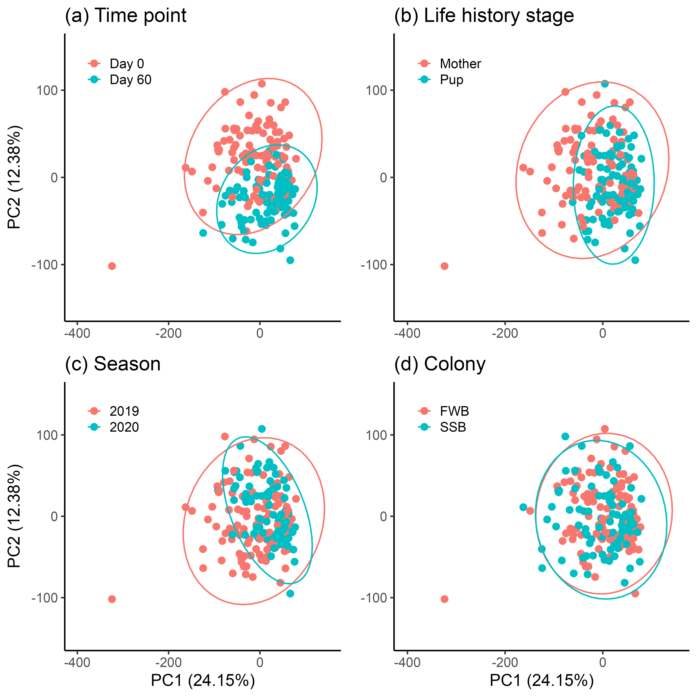
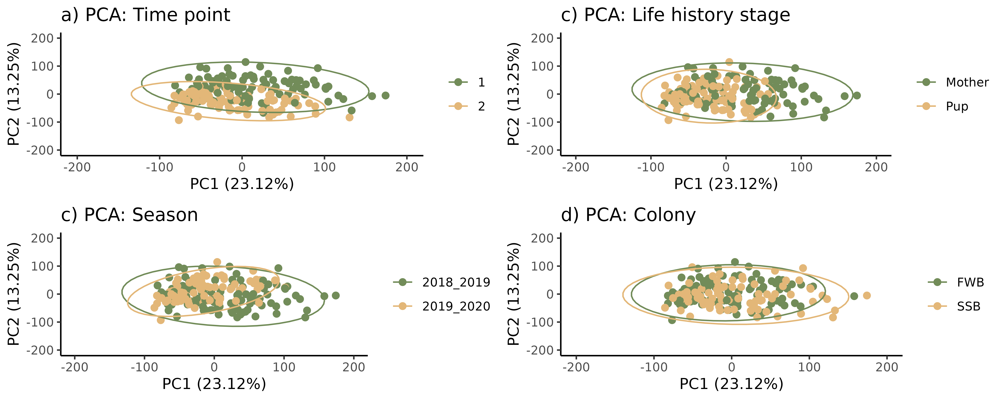
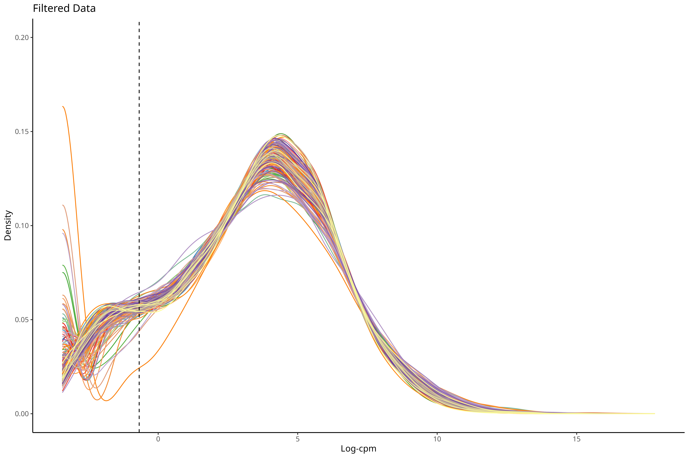
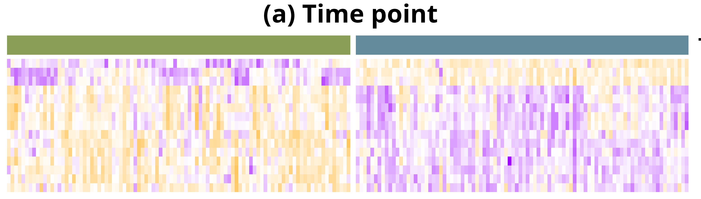
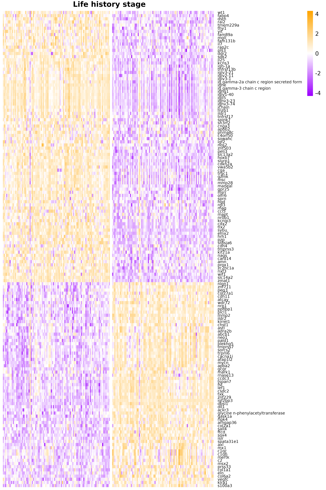
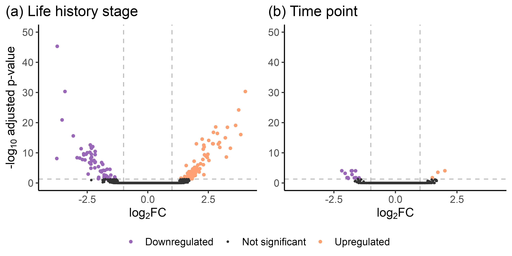
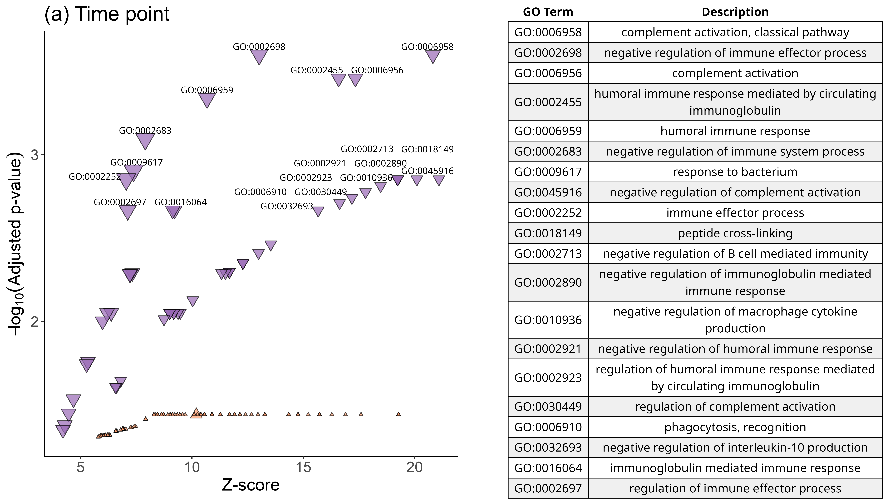
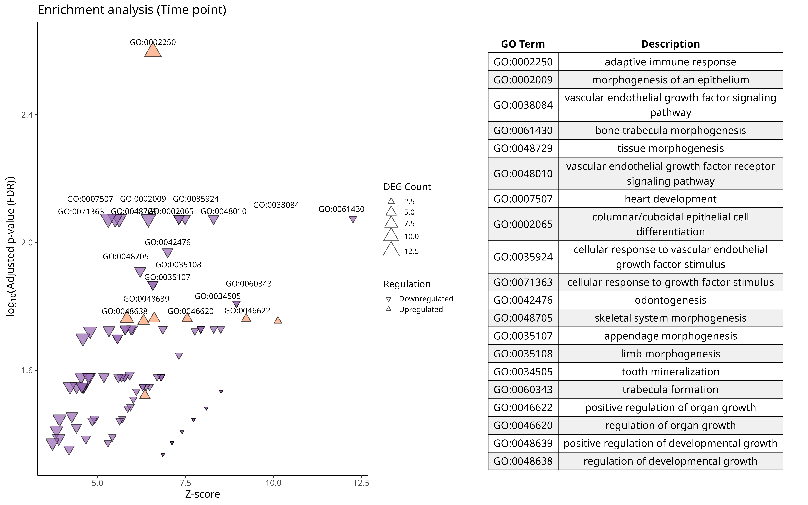
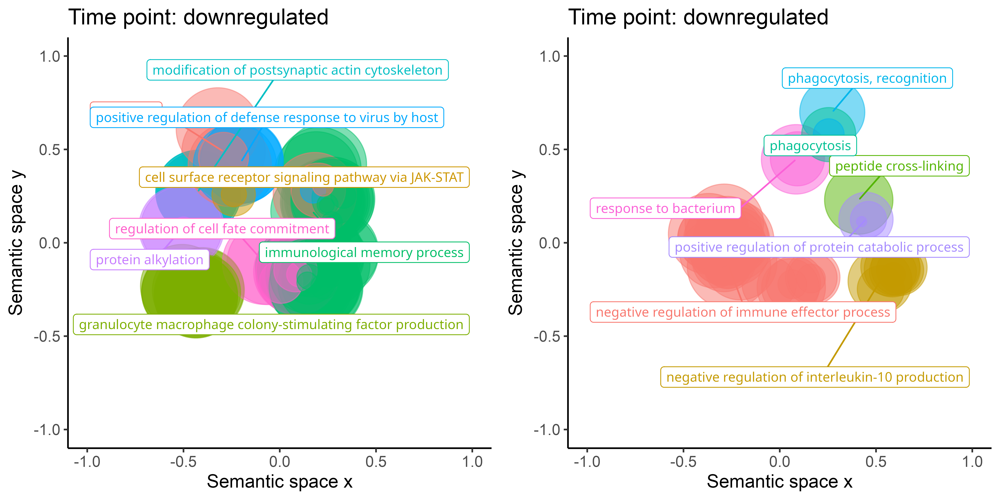
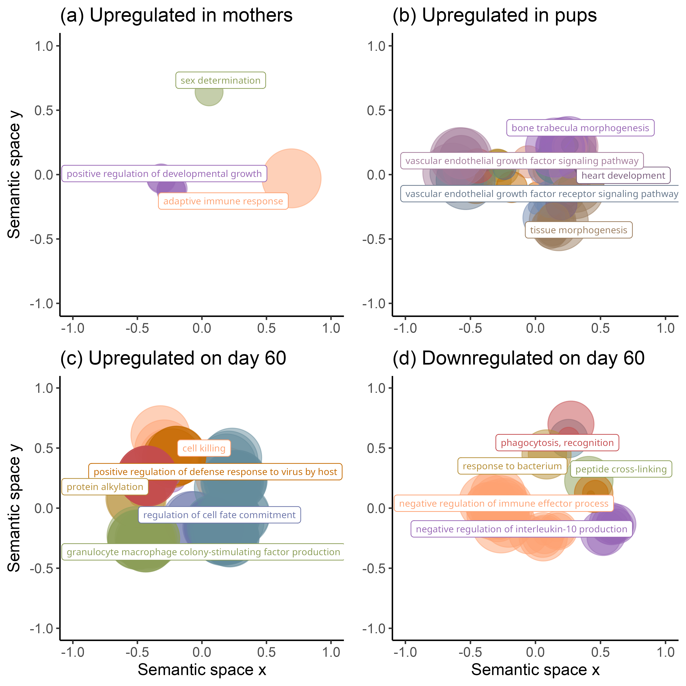

```{r}
#install.packages("here")
#install.packages("pacman")
library(here)
here::here()
```

```{r}
#| label: packages
#| echo: FALSE
#here::here()
invisible(pacman::p_load(dplyr, readxl, tidyverse, cowplot, edgeR, DESeq2, RColorBrewer, ggplot2, reshape2, ggpubr, extrafont, pheatmap))

#font_import()
#fonts()
#cowplot for toggling with plots
#edgeR  loads limma as a dependency, limma for analysing microassay and RNA seq data
#DESeq2 needed for rowCounts
#reshape2 needed for the first plot
#ggpubr need to bind plots together
#extrafont for arial font
#pheatmap needed for heatmaps
```

# Data

```{r}
#| label: load_data
#| echo: FALSE
#Load in the filtered data
#Mutate all needed predictors into factors
d_n<-readRDS("rnaseq_filtered_Liv.Rdata")  
#dim(d_n) 12639 rows
## White blood counts
WBC <- read_excel("WBCcounts_GEP.xlsx")

##Combined
d_n$samples <- left_join(d_n$samples, WBC, by = "Sample")
head(d_n$samples)
d_n$samples$Diff_Neutro <- as.numeric(d_n$samples$Diff_Neutro)
d_n$samples$Diff_Eo <- as.numeric(d_n$samples$Diff_Eo)
d_n$samples$Diff_Baso <- as.numeric(d_n$samples$Diff_Baso)
d_n$samples$Diff_Mono <- as.numeric(d_n$samples$Diff_Mono)
d_n$samples$Diff_Lympho <- as.numeric(d_n$samples$Diff_Lympho)
rm(WBC)

d_n$samples$WBC_ratio <- ((d_n$samples$Diff_Neutro + d_n$samples$Diff_Eo + d_n$samples$Diff_Baso + d_n$samples$Diff_Mono)/d_n$samples$Diff_Lympho)
d_n$samples$WBC_ratio_log <- log(d_n$samples$WBC_ratio)

#Remove incomplete 
complete <- complete.cases(d_n$samples[, "WBC_ratio_log"])
d_n_WBC <- d_n[, complete]
rm(complete)

d_n_WBC$samples$life_history_stage <- as.factor(d_n_WBC$samples$life_history_stage)
d_n_WBC$samples$colony <- as.factor(d_n_WBC$samples$colony)
d_n_WBC$samples$ID <- as.factor(d_n_WBC$samples$ID)
d_n_WBC$samples$year <- as.factor(d_n_WBC$samples$year)
d_n_WBC$samples$group <- as.factor(d_n_WBC$samples$group)
d_n_WBC$samples$pair <- as.factor(d_n_WBC$samples$pair)
rm(d_n)
dim(d_n_WBC)
table(d_n_WBC$samples$pair)
```

# PCA

Create a PCA plot to identify outliers.

```{r}
#| label: PCA_outlier
#| echo: FALSE
#| message: false
#Use PCA to identify outliers. F24_FWB_mum_start_2018B was already removed at an earlier state
cpm_mat <- cpm(d_n_WBC, log=TRUE)  #we need the log values
exprs_mat <- cpm_mat
exprs_t <- t(exprs_mat) #transpose
pca_result <- prcomp(exprs_t, center = TRUE, scale. = TRUE)

pca_var <- pca_result$sdev^2                  
pca_var_explained <- pca_var / sum(pca_var)   
round(pca_var_explained[1:2] * 100, 2)

pc_scores <- as.data.frame(pca_result$x[, 1:2])  #keep PC1 and PC2
pc_scores$Sample <- rownames(pc_scores)
pc_scores <- left_join(pc_scores, d_n_WBC$samples, by = "Sample")

PCA_LHS <- ggplot(pc_scores, aes(x = PC1, y = PC2, color = life_history_stage)) +
  geom_point(size = 2) +
  theme_classic() +
  stat_ellipse(type = "norm", size = 0.5) +
  xlim(-400, 150) +
  ylim(-150, 150) +
  labs(title = "(c) Life history stage", x = "PC1 (23 %)", y = "PC2 (13 %)", color = NULL)

#levels(pc_scores$year)
levels(pc_scores$year) <- c("2019", "2020")
PCA_Y <- ggplot(pc_scores, aes(x = PC1, y = PC2, color = year)) +
  geom_point(size = 2) +
  theme_classic() +
  stat_ellipse(type = "norm", size = 0.5) +
  xlim(-400, 150) +
  ylim(-150, 150) +
  labs(title = "(b) Season", x = "PC1 (23 %)", y = "PC2 (13 %)", color = NULL)

#levels(pc_scores$group)
levels(pc_scores$group) <- c("Day 0", "Day 60")
PCA_TP <- ggplot(pc_scores, aes(x = PC1, y = PC2, color = group)) +
  geom_point(size = 2) +
  theme_classic() +
  stat_ellipse(type = "norm", size = 0.5) +
  xlim(-400, 150) +
  ylim(-150, 150) +
  labs(title = "(d) Time point", x = "PC1 (23 %)", y = "PC2 (13 %)", color = NULL)

PCA_C <- ggplot(pc_scores, aes(x = PC1, y = PC2, color = colony)) +
  geom_point(size = 2) +
  theme_classic() +
  stat_ellipse(type = "norm", size = 0.5) +
  xlim(-400, 150) +
  ylim(-150, 150) +
  labs(title = "(a) Colony", x = "PC1 (23 %)", y = "PC2 (13 %)", color = NULL)

legend_theme_outlier <- theme(
    legend.position = c(0.05, 0.95), 
    legend.justification = c("left", "top"),  
    legend.background = element_rect(fill = alpha('white', 0.7), color = NA),  
    legend.key.size = unit(0.8, "lines"),
    text = element_text(family = "Arial", size = 12))

PCA_plots_outlier <- plot_grid(PCA_C + legend_theme_outlier + theme(axis.title.x = element_blank()), 
                               PCA_Y + legend_theme_outlier + theme(axis.title.x = element_blank(),
                                                                      axis.title.y = element_blank()), 
                               PCA_LHS + legend_theme_outlier, 
                               PCA_TP + legend_theme_outlier + theme(axis.title.y = element_blank()), 
                               ncol = 2)
ggsave(here::here("Plots","PCA_plots_outlier_adj.png"), plot = PCA_plots_outlier, dpi = 600)

write.csv(pc_scores, file = here::here("GenesGO", "pc_scores_adj.csv"))
rm(exprs_mat, exprs_t, cpm_mat)
```

 The PCA identified **one** outlier, which was removed from the dataset for further analysis.

```{r}
#| label: PCA
#| echo: FALSE
#| message: false
#Plot in accordance to LHS and TP
PCA_LHS <- ggplot(pc_scores, aes(x = PC1, y = PC2, color = life_history_stage)) +
  geom_point(size = 2) +
  theme_classic() +
  stat_ellipse(type = "norm", size = 0.5) +
  scale_color_manual(values = c("#E69F00", "#56B4E9")) +
  xlim(-200, 200) +
  ylim(-200, 200) +
  labs(title = "(c) Life history stage", x = "PC1 (23 %)", y = "PC2 (13 %)", color = NULL)

#levels(pc_scores$group)
levels(pc_scores$group) <- c("Day 0", "Day 60")
PCA_TP <- ggplot(pc_scores, aes(x = PC1, y = PC2, color = group)) +
  geom_point(size = 2) +
  theme_classic() +
  stat_ellipse(type = "norm", size = 0.5) +
  scale_color_manual(values = c("#E69F00", "#56B4E9")) +
  xlim(-200, 200) +
  ylim(-200, 200) +
  labs(title = "(d) Time point", x = "PC1 (23 %)", y = "PC2 (13 %)", color = NULL)

#levels(pc_scores$year)
levels(pc_scores$year) <- c("2019", "2020")
PCA_Y <- ggplot(pc_scores, aes(x = PC1, y = PC2, color = year)) +
  geom_point(size = 2) +
  theme_classic() +
  stat_ellipse(type = "norm", size = 0.5) +
  scale_color_manual(values = c("#E69F00", "#56B4E9")) +
  xlim(-200, 200) +
  ylim(-200, 200) +
  labs(title = "(b) Season", x = "PC1 (23 %)", y = "PC2 (13 %)", color = NULL)

PCA_C <- ggplot(pc_scores, aes(x = PC1, y = PC2, color = colony)) +
  geom_point(size = 2) +
  theme_classic() +
  stat_ellipse(type = "norm", size = 0.5) +
  scale_color_manual(values = c("#E69F00", "#56B4E9")) +
  xlim(-200, 200) +
  ylim(-200, 200) +  
  labs(title = "(a) Colony", x = "PC1 (23 %)", y = "PC2 (13 %)", color = NULL)

legend_theme <- theme(
    legend.position = c(0.95, 0.95), 
    legend.justification = c("right", "top"), 
    legend.background = element_rect(fill = alpha('white', 0.7), color = NA), 
    legend.key.size = unit(0.8, "lines"), 
    text = element_text(family = "Arial", size = 12))

PCA_plots <- plot_grid(PCA_C + legend_theme + theme(axis.title.x = element_blank()),
                       PCA_Y + legend_theme + theme(axis.title.x = element_blank(),
                                                      axis.title.y = element_blank()), 
                       PCA_LHS + legend_theme, 
   
                       
                                           PCA_TP + legend_theme + theme(axis.title.y = element_blank()),
                       ncol = 2)

ggsave(here::here("Plots","PCA_plots_adj.png"), plot = PCA_plots, dpi = 600)
rm(PCA_LHS, PCA_TP, PCA_Y, PCA_C)
```



```{r}
#Test PCA
install.packages("vegan")
library(vegan)

adonis2(as.matrix(pc_scores[, 1:2]) ~ group + year + colony + life_history_stage,
        data = pc_scores, permutations = 1000,
        method = "euclidean", by = "margin")

#Test for within group variance
#https://www.rdocumentation.org/packages/vegan/versions/2.7-1/topics/permutest.betadisper
dist_mat <- dist(pc_scores[, 1:2])
bd_colony <- betadisper(dist_mat, pc_scores$colony)
anova(bd_colony)
(mod.HSD <- TukeyHSD(bd_colony))
plot(mod.HSD)
permutest(bd_colony, permutations = 1000)

bd_year <- betadisper(dist_mat, pc_scores$year)
anova(bd_year)
(mod.HSD.y <- TukeyHSD(bd_year))
plot(mod.HSD.y)
permutest(bd_year, permutations = 1000)

bd_lhs <- betadisper(dist_mat, pc_scores$life_history_stage)
anova(bd_lhs)
(mod.HSD.lhs <- TukeyHSD(bd_lhs))
plot(mod.HSD.lhs)
permutest(bd_lhs, permutations = 1000)

bd_tp <- betadisper(dist_mat, pc_scores$group)
anova(bd_tp)
(mod.HSD.tp <- TukeyHSD(bd_tp))
plot(mod.HSD.tp)
permutest(bd_tp, permutations = 1000)

par(mfrow = c(2, 2))
boxplot(bd_colony, main = "Dispersion by colony")
boxplot(bd_year, main = "Dispersion by year")
boxplot(bd_lhs, main = "Dispersion by life-history stage")
boxplot(bd_tp, main = "Dispersion by developmental time point")


```


```{r}
#| label: Nice_tables
#| echo: FALSE
#| warning: false

# summary_table <- subset(pc_scores, select = c("ID", "SampleID", "year", "colony", "life_history_stage", "group"))
# colnames(summary_table) <- c("ID", "SampleID", "Season", "Colony", "Life history stage", "Time point")
# rownames(summary_table) <- NULL
# summary_table <- kable(summary_table) %>% kable_styling("striped")
# kableExtra::save_kable(summary_table, file = "table.pdf")
# 
summary_short <- subset(pc_scores, select = c("year", "colony", "life_history_stage", "group"))
colnames(summary_short) <- c("Season", "Colony", "Life history stage", "Time point")
names(summary_short) <- make.names(names(summary_short))
summary_short<- summary_short %>%
  group_by(across(everything())) %>%
  summarise(count= n(), .groups = "drop")
rownames(summary_short) <- NULL
summary_short <- kable(summary_short) %>% kable_styling("striped")
kableExtra::save_kable(summary_short, file = "table_short_adj.pdf")
summary_short
```

# Visualize data

```{r}
#| label: visualize_data
#| echo: FALSE
counts_per_million <- cpm(d_n_WBC)
log_counts_per_million <- cpm(d_n_WBC, log = T)
#Calculate mean and median value
L <- mean(d_n_WBC$samples$lib.size) * 1e-6 #average library size in millions
M <- median(d_n_WBC$samples$lib.size) * 1e-6 
#c(L, M) #19.72712, 19.11033
lcpm.cutoff <- log2(10/M + 2/L) #-0.678856

df_long <- data.frame(log_counts_per_million)
df_long$Gene <- rownames(df_long)
df_melted <- melt(df_long, id.vars = "Gene", variable.name = "Sample", value.name = "LogCPM")

#costum color palette
palette_200 <- colorRampPalette(brewer.pal(12, "Paired"))(200)

density_plot <- ggplot(df_melted, aes(x = LogCPM, color = Sample)) +
  geom_density(size = 0.5) + 
  scale_color_manual(values = palette_200) + 
  geom_vline(xintercept = lcpm.cutoff, linetype = "dashed", color = "black") +  # Add cutoff line
  labs(title = "Filtered Data", x = "Log-cpm", y = "Density") +
  theme_classic() +
  theme(legend.position = "none") +
  ylim(0,0.20)

#density_plot

# Save the density plot as a PNG file
ggsave(here::here("Plots","density_plot_adj.png"), plot = density_plot, width = 12, height = 8, dpi = 600)

#Remove elements not used in the rest of the script
rm(counts_per_million, density_plot, df_long, df_melted, log_counts_per_million, L, M, lcpm.cutoff, palette_200)
```



# Differential gene expression analysis

In this section, we will perform differential gene expression analysis to identify genes that are differentially expressed between the four main contasts: Time point, Life hisotry stage, Colony and Season.

```{r}
#| label: color_scheme
#| echo: FALSE
clrs <- c("Upregulated" = "#FDA172", "Downregulated" = "#9867B5", "Not significant" = "grey20")
lfc <- 1 
adj.P.value <- 0.05
fig_theme <- theme(text = element_text(family = "Arial", size = 12),
                   legend.title = element_blank(),
                   legend.text=element_text(size=10),
                   axis.text.x = element_text(size =10),
                   axis.text.y = element_text(size = 10))

ann_colors <- list(
  TP = c("Day 0" = "#8B9E58", "Day 60" = "#638B9B"),
  LHS = c(Mother = "#C44B4E", Pup = "#C46A00")
)
```

## Time point: Analysis by Bernice

BS assessed differential expression per gene between the two time points (start vs end).

```{r}
#| label: DEG_Time_point
#| echo: FALSE
#-------------- ANALYSIS OF TIME POINT --------------##
design <- model.matrix(~ -1 + group, data = d_n_WBC$samples) #setting up model contrasts is more straight forward in the absence of an intercept for timepoint
contr.matrix <- makeContrasts(
 end_vs_start = group2-group1,
 levels = colnames(design)) #create matrix for contrasts
# Use voom to remove variance dependency on mean, see https://bioconductor.org/packages/release/workflows/vignettes/RNAseq123/inst/doc/limmaWorkflow.html
# voom converts raw counts to log-CPM values by automatically extracting library sizes and normalisation factors from d itself.
#  If filtering of lowly-expressed genes is insufficient, a drop in variance levels can be observed at the low end of the expression scale due to very small counts.
#voom() converts the read counts to log2-cpm, with associated weights, ready for linear modelling
vobj_tp <- voom(d_n_WBC, design, plot=TRUE)
# 
# # Fit a random effect
dupcor_tp <- duplicateCorrelation(vobj_tp, design, block = d_n_WBC$samples$ID)
dupcor_tp$consensus #the estimated intra individual correlation (0.3077411)
# #the intra individual correlation will change the voom weights slightly
# #run voom again considering the duplicateCorrelation results in order to compute more accurate precision weights
vobj = voom(d_n_WBC, design, plot=TRUE,
            block=d_n_WBC$samples$ID, correlation=dupcor_tp$consensus)
#update the correlation for the new voom weights
dupcor_tp <- duplicateCorrelation(vobj, design, block = d_n_WBC$samples$ID)
dupcor_tp$consensus #the estimated intra individual correlation (0.3076259)
# # 
# #Fit the model
# # analyzing repeated measures data using duplicateCorrelation.
# # The model forces the magnitude of the random effect to be the same across all genes.
# # Estimate linear mixed model with a single variance component
# # Fit the model for each gene
# # But this step uses only the genome-wide average for the random effect
vfit_tp <- lmFit(vobj, design, block=d_n_WBC$samples$ID, correlation=dupcor_tp$consensus)
vfit_tp <- contrasts.fit(vfit_tp, contrasts=contr.matrix)
# 
# Save the model to avoid recomputing everything
# save vfit_tp
saveRDS(vfit_tp, file = here::here("Models","vfit_tp_WBC.rds"))

#Load vfit_tp
vfit_tp <- readRDS(here::here("Models","vfit_tp_WBC.rds"))

# Fit Empirical Bayes for moderated t-statistics, empirical Bayes moderation is carried out by borrowing information across all the genes to obtain more precise estimates of gene-wise variability
efit <- eBayes(vfit_tp)
topTable(efit, n=20)
plotSA(efit, main="Final model: Mean-variance trend")
plotMD(efit)
abline(h=0,col="darkgrey")

#adjusted p-value cutoff that is set at 5% by default.
efit$F
head(efit$F.p.value) #pval of the moderated F-statistics (equivalent to one-way ANOVA), it combines all contrast, so in this case it is the same as the t-statistic
head(efit$p.value) #same
summary(decideTests(efit, adjust.method="fdr"))
#set log-fold-changes (log-FCs) to be above a minimum value. The treat method (McCarthy and Smyth 2009) used to calculate p-values from empirical Bayes moderated t-statistics with a minimum log-FC requirement. 
#no need to use the ebayes output for this
#lfc<-0.14 #threshold set by Bernice to differentiate between differentially expressed genes

tfit <- treat(vfit_tp, lfc=lfc) #lfc = 1, lfc_half = 0.5
topTreat(tfit)
nrow(tfit)
dt <- decideTests(tfit, adjust.method="fdr")
summary(dt) 

#Test for significance
Allgenes_tp_WBC <- as.data.frame(topTreat(tfit, n=nrow(tfit)))
Filteredgenes_tp_WBC <- subset(Allgenes_tp_WBC, abs(logFC) >= lfc & adj.P.Val < adj.P.value)
Upregulated_tp_WBC <-subset(Filteredgenes_tp_WBC, Filteredgenes_tp_WBC$logFC >= lfc)
Downregulated_tp_WBC <-subset(Filteredgenes_tp_WBC, Filteredgenes_tp_WBC$logFC <= -lfc)
nrow(subset(Filteredgenes_tp_WBC, Filteredgenes_tp_WBC$logFC > 0))
nrow(subset(Filteredgenes_tp_WBC, Filteredgenes_tp_WBC$logFC < 0))

# Create a list to save the up and down regulated genes and the df containing all genes evaluated for GO analysis
tp_list <- list(All_tp_WBC = Allgenes_tp_WBC, Upregulated_tp_WBC = Upregulated_tp_WBC, Downregulated_tp_WBC = Downregulated_tp_WBC)

# Loop through and save each data frame using `here()`
for (name in names(tp_list)) {
  write.csv(tp_list[[name]], file = here::here("GenesGO", paste0(name, ".csv")), row.names = TRUE)
}

#Significance
Allgenes_tp_WBC$Significance <- "Not significant"
Allgenes_tp_WBC$Significance[Allgenes_tp_WBC$adj.P.Val < adj.P.value & Allgenes_tp_WBC$logFC >= lfc] <- "Upregulated"
Allgenes_tp_WBC$Significance[Allgenes_tp_WBC$adj.P.Val < adj.P.value & Allgenes_tp_WBC$logFC <= -lfc] <- "Downregulated"
Allgenes_tp_WBC

#Plot volcano plot
tp_plot <- ggplot(Allgenes_tp_WBC, aes(x = logFC, y = -log10(adj.P.Val), color = Significance, size = Significance)) +
  geom_hline(yintercept = -log10(0.05), col = "gray", linetype = 'dashed') +
  geom_vline(xintercept = c(-1, 1), col = "gray", linetype = 'dashed') +
  geom_point() +
  scale_color_manual(values = clrs) +  
  scale_size_manual(values = c(1, 0.5, 1)) +
  labs(title = "(b) Time point", x = expression("log"[2]*"FC"), y = expression("-log"[10]*" adjusted p-value")) +
  theme_classic() +
  ylim(0,50) +
  xlim(-4.1,4.1) +
  theme(
    legend.position = "bottom",
    plot.title.position = "plot")
```

### Adjusted TP

```{r}
#| label: DEG_Time_point
#| echo: FALSE
#-------------- ANALYSIS OF TIME POINT --------------##
design_adj <- model.matrix(~ -1 + group + WBC_ratio_log, data = d_n_WBC$samples) 
nrow(design_adj)


contr.matrix_adj <- makeContrasts(
 end_vs_start = group2-group1,
 levels = colnames(design_adj)) #create matrix for contrasts
# Use voom to remove variance dependency on mean,
#voom() converts the read counts to log2-cpm, with associated weights, ready for linear modelling
vobj_tp_adj <- voom(d_n_WBC, design_adj, plot=TRUE)
# 
# # Fit a random effect
dupcor_tp_adj <- duplicateCorrelation(vobj_tp_adj, design_adj, block = d_n_WBC$samples$ID)
dupcor_tp_adj$consensus #the estimated intra individual correlation (0.2974413)
# #run voom again considering the duplicateCorrelation results in order to compute more accurate precision weights
vobj_adj = voom(d_n_WBC, design_adj, plot=TRUE,
            block=d_n_WBC$samples$ID, correlation=dupcor_tp_adj$consensus)
#update the correlation for the new voom weights
dupcor_tp_adj <- duplicateCorrelation(vobj_adj, design_adj, block = d_n_WBC$samples$ID)
dupcor_tp_adj$consensus #the estimated intra individual correlation (0.2973111)
# # 
# #Fit the model
# # analyzing repeated measures data using duplicateCorrelation.
# # The model forces the magnitude of the random effect to be the same across all genes.
# # Estimate linear mixed model with a single variance component
# # Fit the model for each gene
# # But this step uses only the genome-wide average for the random effect
vfit_tp_adj <- lmFit(vobj_adj, design_adj, block=d_n_WBC$samples$ID, correlation=dupcor_tp_adj$consensus)
vfit_tp_adj <- contrasts.fit(vfit_tp_adj, contrasts=contr.matrix_adj)
# 
# Save the model to avoid recomputing everything
# save vfit_tp
saveRDS(vfit_tp_adj, file = here::here("Models","vfit_tp_adj.rds"))

#Load vfit_tp
vfit_tp_adj <- readRDS(here::here("Models","vfit_tp_adj.rds"))

efit_adj <- eBayes(vfit_tp_adj)
topTable(efit_adj, n=20)
plotSA(efit_adj, main="Final model: Mean-variance trend")
plotMD(efit_adj)
abline(h=0,col="darkgrey")

#adjusted p-value cutoff that is set at 5% by default.
efit_adj$F
head(efit_adj$F.p.value) 
head(efit_adj$p.value) 
summary(decideTests(efit_adj, adjust.method="fdr"))

tfit_adj <- treat(vfit_tp_adj, lfc=lfc) #lfc = 1, lfc_half = 0.5
topTreat(tfit_adj)
nrow(tfit_adj)
dt_adj <- decideTests(tfit_adj, adjust.method="fdr")
summary(dt_adj) 

#Test for significance
Allgenes_tp_adj <- as.data.frame(topTreat(tfit_adj, n=nrow(tfit_adj)))
Filteredgenes_tp_adj <- subset(Allgenes_tp_adj, abs(logFC) >= lfc & adj.P.Val < adj.P.value)
Upregulated_tp_adj <-subset(Filteredgenes_tp_adj, Filteredgenes_tp_adj$logFC >= lfc)
Downregulated_tp_adj <-subset(Filteredgenes_tp_adj, Filteredgenes_tp_adj$logFC <= -lfc)
nrow(subset(Filteredgenes_tp_adj, Filteredgenes_tp_adj$logFC > 0))
nrow(subset(Filteredgenes_tp_adj, Filteredgenes_tp_adj$logFC < 0))

# Create a list to save the up and down regulated genes and the df containing all genes evaluated for GO analysis
tp_list_adj <- list(All_tp_adj = Allgenes_tp_adj, Upregulated_tp_adj = Upregulated_tp_adj, Downregulated_tp_adj = Downregulated_tp_adj)

# Loop through and save each data frame using `here()`
for (name in names(tp_list_adj)) {
  write.csv(tp_list_adj[[name]], file = here::here("GenesGO", paste0(name, ".csv")), row.names = TRUE)
}

#Significance
Allgenes_tp_adj$Significance <- "Not significant"
Allgenes_tp_adj$Significance[Allgenes_tp_adj$adj.P.Val < adj.P.value & Allgenes_tp_adj$logFC >= lfc] <- "Upregulated"
Allgenes_tp_adj$Significance[Allgenes_tp_adj$adj.P.Val < adj.P.value & Allgenes_tp_adj$logFC <= -lfc] <- "Downregulated"
Allgenes_tp_adj

#Plot volcano plot
tp_plot_adj <- ggplot(Allgenes_tp_adj, aes(x = logFC, y = -log10(adj.P.Val), color = Significance, size = Significance)) +
  geom_hline(yintercept = -log10(0.05), col = "gray", linetype = 'dashed') +
  geom_vline(xintercept = c(-1, 1), col = "gray", linetype = 'dashed') +
  geom_point() +
  scale_color_manual(values = clrs) +  
  scale_size_manual(values = c(1, 0.5, 1)) +
  labs(title = "(b) Time point", x = expression("log"[2]*"FC"), y = expression("-log"[10]*" adjusted p-value")) +
  theme_classic() +
  ylim(0,45) +
  xlim(-4.2,4.2) +
  theme(
    legend.position = "bottom",
    plot.title.position = "plot")
```
Correcting for the white blood cell ratio does slightly change the differentially expressed genes, so we'll retain both and compare them moving forward. 
### Heatmap

Creating a heatmap to visualise the differentially expressed genes between the two start points.

```{r}
#| label: Heatmap_tp
#| echo: FALSE
#Create heatmap for differentially expressed genes between time points
DEG_tp <- rownames(Filteredgenes_tp_WBC)

#Extract the expression values for the differentially expressed genes
expression_tp <- vobj$E[DEG_tp, ]

#get labels
annotation <- data.frame(TP = as.factor(d_n_WBC$samples$group))
rownames(annotation) <- d_n_WBC$samples$Sample
annotation$TP <- ifelse(annotation$TP == 1, "Day 0", "Day 60")
annotation$TP <- factor(annotation$TP, levels = c("Day 0", "Day 60"))

matrix_tp <- expression_tp[, order(annotation$TP)]
annotation_tp <- annotation[order(annotation$TP), , drop = FALSE]

heatmap_tp <- pheatmap(matrix_tp,
                       scale = "row",  # normalize rows (genes)
                       color = colorRampPalette(c("#9D00FF", "white", "#FFA500"))(100),
                       annotation_colors = ann_colors,
                       annotation_col = annotation_tp,
                       cluster_rows = TRUE,
                       treeheight_row = 0,
                       cluster_cols = FALSE,
                       gaps_col = cumsum(table(annotation_tp$TP)),
                       show_rownames = F,
                       show_colnames = FALSE,
                       annotation_legend = FALSE,
                       legend = F,
                       fontsize = 12,
                       fontsize_col = 7,
                       fontsize_row = 6,
                       main = NA)

ggsave(here::here("Plots","heatmap_tp_WBC.png"), plot = heatmap_tp, width = 3.5, height = 5, dpi = 600)


###Adjusted
DEG_tp_adj <- rownames(Filteredgenes_tp_adj)

#Extract the expression values for the differentially expressed genes
expression_tp_adj <- vobj$E[DEG_tp_adj, ]

#get labels
annotation_adj <- data.frame(TP = as.factor(d_n_WBC$samples$group))
rownames(annotation_adj) <- d_n_WBC$samples$Sample
annotation_adj$TP <- ifelse(annotation_adj$TP == 1, "Day 0", "Day 60")
annotation_adj$TP <- factor(annotation_adj$TP, levels = c("Day 0", "Day 60"))

matrix_tp_adj <- expression_tp_adj[, order(annotation_adj$TP)]
annotation_tp_adj <- annotation_adj[order(annotation_adj$TP), , drop = FALSE]

heatmap_tp_adj <- pheatmap(matrix_tp_adj,
                       scale = "row",  # normalize rows (genes)
                       color = colorRampPalette(c("#9D00FF", "white", "#FFA500"))(100),
                       annotation_colors = ann_colors,
                       annotation_col = annotation_tp_adj,
                       cluster_rows = TRUE,
                       treeheight_row = 0,
                       cluster_cols = FALSE,
                       gaps_col = cumsum(table(annotation_tp_adj$TP)),
                       show_rownames = F,
                       show_colnames = FALSE,
                       annotation_legend = FALSE,
                       legend = F,
                       fontsize = 12,
                       fontsize_col = 7,
                       fontsize_row = 6,
                       main = NA)

ggsave(here::here("Plots","heatmap_tp_adj.png"), plot = heatmap_tp_adj, width = 3.5, height = 5, dpi = 600)
```



## Life stages

Analysis performed by ALB using the framework outlined by BS.

```{r}
#| label: DEG_LHS
#| echo: FALSE
#Tagged out to not run dupcor again (the saved outcome can be called from the dupcor folder)
#Create a design matrix
design_lhs <- model.matrix(~ -1 + life_history_stage, data = d_n_WBC$samples) #model contrasts without intercept is easier
colnames(design_lhs) <- gsub("life_history_stage", "", colnames(design_lhs)) #clean group names

#create matrix for contrasts
contr.matrix.lhs <- makeContrasts(
 adultvspup = Mother-Pup,
 levels = colnames(design_lhs))

#voom() converts the read counts to log2-cpm, with associated weights, ready for linear modelling
vobj_lhs <- voom(d_n_WBC, design_lhs, plot=TRUE)
# 
# Fit a random effect
dupcor_lhs <- duplicateCorrelation(vobj_lhs, design_lhs, block = d_n_WBC$samples$ID)
dupcor_lhs$consensus #the estimated intra individual correlation (0.1362346)
# 
vobj_lhs = voom(d_n_WBC, design_lhs, plot=TRUE,
         block=d_n_WBC$samples$ID, correlation=dupcor_lhs$consensus)
#update the correlation for the new voom weights
dupcor_lhs <- duplicateCorrelation(vobj_lhs, design_lhs, block = d_n_WBC$samples$ID)
dupcor_lhs$consensus #the estimated intra individual correlation (0.1362741)
#Analyzing repeated measures data using duplicateCorrelation.
#The model forces the magnitude of the random effect to be the same across all genes.


#Estimate linear mixed model with a single variance component
vfit_lhs <- lmFit(vobj_lhs, design_lhs, block=d_n_WBC$samples$ID, correlation=dupcor_lhs$consensus)
vfit_lhs <- contrasts.fit(vfit_lhs, contrasts=contr.matrix.lhs)

#Save the model to avoid recomputing everything
# #save vfit_lhs
saveRDS(vfit_lhs, file = here::here("Models","vfit_lhs_WBC.rds"))

#Load vfit_lhs
vfit_lhs <- readRDS(here::here("Models","vfit_lhs_WBC.rds"))

# Fit Empirical Bayes for moderated t-statistics, empirical Bayes moderation is carried out by borrowing information across all the genes to obtain more precise estimates of gene-wise variability
efit_lhs <- eBayes(vfit_lhs)
topTable(efit_lhs, n=20)
plotSA(efit_lhs, main="Final model: Mean-variance trend")
plotMD(efit_lhs)
abline(h=0,col="darkgrey")

#adjusted p-value cutoff that is set at 5% by default.
efit_lhs$F
#head(efit_lhs$F.p.value) #pval of the moderated F-statistics (equivalent to one-way ANOVA), it combines all contrast, so in this case it is the same as the t-statistic
#head(efit_lhs$p.value) #same
summary(decideTests(efit_lhs, adjust.method="fdr"))
#set log-fold-changes (log-FCs) to be above a minimum value. The treat method (McCarthy and Smyth 2009) used to calculate p-values from empirical Bayes moderated t-statistics with a minimum log-FC requirement. 
#no need to use the ebayes output for this

#Positive values means the gene is more expressed
tfit_lhs <- treat(vfit_lhs, lfc=lfc) 
topTreat(tfit_lhs)
nrow(tfit_lhs)
dt_lhs <- decideTests(tfit_lhs, adjust.method="fdr")
summary(dt_lhs) 

#Test for significance
Allgenes_lhs_WBC <- as.data.frame(topTreat(tfit_lhs, n=nrow(tfit_lhs)))
Filteredgenes_lhs_WBC <- subset(Allgenes_lhs_WBC, abs(logFC) >= lfc & adj.P.Val < adj.P.value)
Upregulated_lhs_WBC <-subset(Filteredgenes_lhs_WBC, Filteredgenes_lhs_WBC$logFC >= lfc)
Downregulated_lhs_WBC <-subset(Filteredgenes_lhs_WBC, Filteredgenes_lhs_WBC$logFC <= -lfc)
nrow(subset(Filteredgenes_lhs_WBC, Filteredgenes_lhs_WBC$logFC > 0))
nrow(subset(Filteredgenes_lhs_WBC, Filteredgenes_lhs_WBC$logFC < 0))

# Create a list to save the up and down regulated genes and the df containing all genes evaluated for GO analysis
lhs_list <- list(All_lhs_WBC = Allgenes_lhs_WBC, Upregulated_lhs_WBC = Upregulated_lhs_WBC, Downregulated_lhs_WBC = Downregulated_lhs_WBC)

# Loop through and save each data frame using `here()`
for (name in names(lhs_list)) {
  write.csv(lhs_list[[name]], file = here::here("GenesGO", paste0(name, ".csv")), row.names = TRUE)
}


#Significance
Allgenes_lhs_WBC$Significance <- "Not significant"
Allgenes_lhs_WBC$Significance[Allgenes_lhs_WBC$adj.P.Val < adj.P.value & Allgenes_lhs_WBC$logFC >= lfc] <- "Upregulated"
Allgenes_lhs_WBC$Significance[Allgenes_lhs_WBC$adj.P.Val < adj.P.value & Allgenes_lhs_WBC$logFC <= -lfc] <- "Downregulated"

#Plot DEG volcano plot
lhs_plot <- ggplot(Allgenes_lhs_WBC, aes(x = logFC, y = -log10(adj.P.Val), color = Significance, size = Significance)) +
  geom_hline(yintercept = -log10(0.05), col = "gray", linetype = 'dashed') +
  geom_vline(xintercept = c(-1, 1), col = "gray", linetype = 'dashed') +
  geom_point() +
  scale_color_manual(values = clrs) +  
  scale_size_manual(values = c(1, 0.5, 1)) +
  labs(title = "(a) Life history stage", x = expression("log"[2]*"FC"), y = expression("-log"[10]*" adjusted p-value")) +
  theme_classic() +
  ylim(0,50) +
  xlim(-4.1,4.1) +
  theme(
    legend.position = "bottom",
    plot.title.position = "plot")
```

### Adjusted LHS

```{r}
#| label: DEG_LHS
#| echo: FALSE
#Tagged out to not run dupcor again (the saved outcome can be called from the dupcor folder)
#Create a design matrix
design_lhs_adj <- model.matrix(~ -1 + life_history_stage + WBC_ratio_log, data = d_n_WBC$samples) #model contrasts without intercept is easier
colnames(design_lhs_adj) <- gsub("life_history_stage", "", colnames(design_lhs_adj)) #clean group names

#create matrix for contrasts
contr.matrix.lhs_adj <- makeContrasts(
 adultvspup = Mother-Pup,
 levels = colnames(design_lhs_adj))

#voom() converts the read counts to log2-cpm, with associated weights, ready for linear modelling
vobj_lhs_adj <- voom(d_n_WBC, design_lhs_adj, plot=TRUE)
# 
# Fit a random effect
dupcor_lhs_adj <- duplicateCorrelation(vobj_lhs_adj, design_lhs_adj, block = d_n_WBC$samples$ID)
dupcor_lhs_adj$consensus #the estimated intra individual correlation (0.1304513)
# 
vobj_lhs_adj = voom(d_n_WBC, design_lhs_adj, plot=TRUE,
         block=d_n_WBC$samples$ID, correlation=dupcor_lhs_adj$consensus)
#update the correlation for the new voom weights
dupcor_lhs_adj <- duplicateCorrelation(vobj_lhs_adj, design_lhs_adj, block = d_n_WBC$samples$ID)
dupcor_lhs_adj$consensus #the estimated intra individual correlation (0.1305059)
#Analyzing repeated measures data using duplicateCorrelation.
#The model forces the magnitude of the random effect to be the same across all genes.


#Estimate linear mixed model with a single variance component
vfit_lhs_adj <- lmFit(vobj_lhs_adj, design_lhs_adj, block=d_n_WBC$samples$ID, correlation=dupcor_lhs_adj$consensus)
vfit_lhs_adj <- contrasts.fit(vfit_lhs_adj, contrasts=contr.matrix.lhs_adj)

#Save the model to avoid recomputing everything
# #save vfit_lhs
saveRDS(vfit_lhs_adj, file = here::here("Models","vfit_lhs_adj.rds"))

#Load vfit_lhs
vfit_lhs_adj <- readRDS(here::here("Models","vfit_lhs_adj.rds"))

# Fit Empirical Bayes for moderated t-statistics, empirical Bayes moderation is carried out by borrowing information across all the genes to obtain more precise estimates of gene-wise variability
efit_lhs_adj <- eBayes(vfit_lhs_adj)
topTable(efit_lhs_adj, n=20)
plotSA(efit_lhs_adj, main="Final model: Mean-variance trend")
plotMD(efit_lhs_adj)
abline(h=0,col="darkgrey")

#adjusted p-value cutoff that is set at 5% by default.
efit_lhs_adj$F
#head(efit_lhs$F.p.value) #pval of the moderated F-statistics (equivalent to one-way ANOVA), it combines all contrast, so in this case it is the same as the t-statistic
#head(efit_lhs$p.value) #same
summary(decideTests(efit_lhs_adj, adjust.method="fdr"))
#set log-fold-changes (log-FCs) to be above a minimum value. The treat method (McCarthy and Smyth 2009) used to calculate p-values from empirical Bayes moderated t-statistics with a minimum log-FC requirement. 
#no need to use the ebayes output for this

#Positive values means the gene is more expressed
tfit_lhs_adj <- treat(vfit_lhs_adj, lfc=lfc) 
topTreat(tfit_lhs_adj)
nrow(tfit_lhs_adj)
dt_lhs_adj <- decideTests(tfit_lhs_adj, adjust.method="fdr")
summary(dt_lhs_adj) 

#Test for significance
Allgenes_lhs_adj <- as.data.frame(topTreat(tfit_lhs_adj, n=nrow(tfit_lhs)))
Filteredgenes_lhs_adj <- subset(Allgenes_lhs_adj, abs(logFC) >= lfc & adj.P.Val < adj.P.value)
Upregulated_lhs_adj <-subset(Filteredgenes_lhs_adj, Filteredgenes_lhs_adj$logFC >= lfc)
Downregulated_lhs_adj <-subset(Filteredgenes_lhs_adj, Filteredgenes_lhs_adj$logFC <= -lfc)
nrow(subset(Filteredgenes_lhs_adj, Filteredgenes_lhs_adj$logFC > 0))
nrow(subset(Filteredgenes_lhs_adj, Filteredgenes_lhs_adj$logFC < 0))

# Create a list to save the up and down regulated genes and the df containing all genes evaluated for GO analysis
lhs_list_adj <- list(All_lhs_adj = Allgenes_lhs_adj, Upregulated_lhs_adj = Upregulated_lhs_adj, Downregulated_lhs_adj = Downregulated_lhs_adj)

# Loop through and save each data frame using `here()`
for (name in names(lhs_list_adj)) {
  write.csv(lhs_list_adj[[name]], file = here::here("GenesGO", paste0(name, ".csv")), row.names = TRUE)
}


#Significance
Allgenes_lhs_adj$Significance <- "Not significant"
Allgenes_lhs_adj$Significance[Allgenes_lhs_adj$adj.P.Val < adj.P.value & Allgenes_lhs_adj$logFC >= lfc] <- "Upregulated"
Allgenes_lhs_adj$Significance[Allgenes_lhs_adj$adj.P.Val < adj.P.value & Allgenes_lhs_adj$logFC <= -lfc] <- "Downregulated"

#Plot DEG volcano plot
lhs_plot_adj <- ggplot(Allgenes_lhs_adj, aes(x = logFC, y = -log10(adj.P.Val), color = Significance, size = Significance)) +
  geom_hline(yintercept = -log10(0.05), col = "gray", linetype = 'dashed') +
  geom_vline(xintercept = c(-1, 1), col = "gray", linetype = 'dashed') +
  geom_point() +
  scale_color_manual(values = clrs) +  
  scale_size_manual(values = c(1, 0.5, 1)) +
  labs(title = "(a) Life history stage", x = expression("log"[2]*"FC"), y = expression("-log"[10]*" adjusted p-value")) +
  theme_classic() +
  ylim(0,45) +
  xlim(-4.2,4.2) +
  theme(
    legend.position = "bottom",
    plot.title.position = "plot")
```

### Heatmap

Creating a heatmap to visualise the differentially expressed genes between the two life history stages.

```{r}
#| label: heatmap_lhs
#| echo: FALSE
#Create heatmap for differentially expressed genes between time points
DEG_lhs <- rownames(Filteredgenes_lhs_WBC)

#Extract the expression values for the differentially expressed genes
expression_lhs <- vobj_lhs$E[DEG_lhs, ]

#get labels
annotation_lhs <- data.frame(LHS = as.factor(d_n_WBC$samples$life_history_stage))
rownames(annotation_lhs) <- d_n_WBC$samples$Sample
annotation_lhs$LHS <- factor(annotation_lhs$LHS, levels = c("Mother", "Pup"))

#order the expression values
matrix_lhs <- expression_lhs[, order(annotation_lhs$LHS)]
annotation_lhs <- annotation_lhs[order(annotation_lhs$LHS), , drop = FALSE]

heatmap_lhs <- pheatmap(matrix_lhs,
                       scale = "row",  # normalize rows (genes)
                       color = colorRampPalette(c("#9D00FF", "white", "#FFA500"))(100),
                       annotation_colors = ann_colors,
                       annotation_col = annotation_lhs,
                       cluster_rows = TRUE,
                       treeheight_row = 0,
                       cluster_cols = FALSE,
                       gaps_col = cumsum(table(annotation_lhs$LHS)),
                       show_rownames = F,
                       show_colnames = F,
                       annotation_legend = FALSE,
                       legend = F,
                       fontsize = 12,
                       fontsize_col = 7,
                       fontsize_row = 6,
                       main = NA)


ggsave(here::here("Plots","heatmap_lhs_WBC.png"), plot = heatmap_lhs, width = 3.5, height = 6, dpi = 600)
```



## Colony

Analysis performed by ALB using the framework outlined by BS.

```{r}
#| label: DEG_colony
#| echo: FALSE
#Tagged out to not run dupcor again (the saved outcome can be called from the dupcor folder)
# #Create a design matrix
design_c <- model.matrix(~ -1 + colony, data = d_n_WBC$samples) #model contrasts without intercept is easier
colnames(design_c) <- gsub("colony", "", colnames(design_c)) #clean group names
#
#create matrix for contrasts
contr.matrix.c <- makeContrasts(
 SSBvsFWB = SSB-FWB,
 levels = colnames(design_c)) 
#
# #voom() converts the read counts to log2-cpm, with associated weights, ready for linear modelling
vobj_c <- voom(d_n_WBC, design_c, plot=TRUE)
#
# # Fit a random effect
dupcor_c <- duplicateCorrelation(vobj_c, design_c, block = d_n_WBC$samples$ID)
dupcor_c$consensus #the estimated intra individual correlation (0.1965244)
# #the intra individual correlation will change the voom weights slightly
# #run voom again considering the duplicateCorrelation results in order to compute more accurate precision weights
vobj_c = voom(d_n_WBC, design_c, plot=TRUE, 
          block=d_n_WBC$samples$ID, correlation=dupcor_c$consensus)
# #update the correlation for the new voom weights
dupcor_c <- duplicateCorrelation(vobj_c, design_c, block = d_n_WBC$samples$ID)
dupcor_c$consensus #the estimated intra individual correlation (0.1965529)
#
# #Analyzing repeated measures data using duplicateCorrelation.
# #The model forces the magnitude of the random effect to be the same across all genes.
# #Estimate linear mixed model with a single variance component
vfit_c <- lmFit(vobj_c, design_c, block=d_n_WBC$samples$ID, correlation=dupcor_c$consensus)
vfit_c <- contrasts.fit(vfit_c, contrasts=contr.matrix.c)
#
# #Save the model to avoid recomputing everything
# #save vfit_c
#saveRDS(vfit_c, file = here::here("Models","vfit_c.rds"))
#
#Load vfit_c
# vfit_c <- readRDS(here::here("Models","vfit_c.rds"))
# 
# # Fit Empirical Bayes for moderated t-statistics, empirical Bayes moderation is carried out by borrowing information across all the genes to obtain more precise estimates of gene-wise variability
efit_c <- eBayes(vfit_c)
topTable(efit_c, n=20)
plotSA(efit_c, main="Final model: Mean-variance trend")
plotMD(efit_c)
abline(h=0,col="darkgrey")
# 
# #adjusted p-value cutoff that is set at 5% by default.
efit_c$F
# #head(efit_c$F.p.value) #pval of the moderated F-statistics (equivalent to one-way ANOVA), it combines all contrast, so in this case it is the same as the t-statistic
# #head(efit_c$p.value) #same
# summary(decideTests(efit_c, adjust.method="fdr"))
# #set log-fold-changes (log-FCs) to be above a minimum value. The treat method (McCarthy and Smyth 2009) used to calculate p-values from empirical Bayes moderated t-statistics with a minimum log-FC requirement. 
# #no need to use the ebayes output for this
# 
# #Positive values means the gene is more expressed
tfit_c <- treat(vfit_c, lfc=lfc) 
topTreat(tfit_c)
nrow(tfit_c)
dt_c <- decideTests(tfit_c, adjust.method="fdr")
summary(dt_c) 
# 
# #Test for significance
# Allgenes_c <- as.data.frame(topTreat(tfit_c, n=nrow(tfit_c)))
# Filteredgenes_c <- subset(Allgenes_c, abs(logFC) >= lfc & adj.P.Val, 2 < adj.P.value)
# nrow(subset(Filteredgenes_c, Filteredgenes_c$logFC > 0))
# nrow(subset(Filteredgenes_c, Filteredgenes_c$logFC < 0))
# 
# #Significance
# Allgenes_c$Significance <- "'Not significant'"
# Allgenes_c$Significance[Allgenes_c$adj.P.Val < adj.P.value & Allgenes_c$logFC >= lfc] <- "Upregulated"
# Allgenes_c$Significance[Allgenes_c$adj.P.Val < adj.P.value & Allgenes_c$logFC <= -lfc] <- "Downregulated"
# 
# #Plot DEG Volcano plot
# c_plot <- ggplot(Allgenes_c, aes(x = logFC, y = -log10(P.Value), color = Significance, size = Significance)) +
#   geom_point() +
#   scale_color_manual(values = clrs) +  
#   scale_size_manual(values = 0.5) +
#   labs(title = "(d) Colony", x = "Log2 fold change", y = "-Log10 P-value") +
#   theme_classic() +
#   ylim(0,50) +
#   xlim(-4,4) +
#     theme(
#     legend.position = "top",
#     plot.title.position = "plot")
```

## Season

Analysis performed by ALB using the framework outlined by BS.

```{r}
#| label: DEG_season
#| echo: FALSE
#Tagged out to not run dupcor again (the saved outcome can be called from the dupcor folder)
# #Create a design matrix
design_y <- model.matrix(~ -1 + year, data = d_n_WBC$samples) #model contrasts without intercept is easier
colnames(design_y) <- c("Season1", "Season2") #clean group names
# #create matrix for contrasts
contr.matrix.y <- makeContrasts(
  Season1vsSeason2 = Season1-Season2,
  levels = colnames(design_y)) 
#
# #voom() converts the read counts to log2-cpm, with associated weights, ready for linear modelling
vobj_y <- voom(d_n_WBC, design_y, plot=TRUE)
# 
# #Fit a random effect
dupcor_y <- duplicateCorrelation(vobj_y, design_y, block = d_n_WBC$samples$ID)
dupcor_y$consensus #the estimated intra individual correlation (0.1705068)
# #the intra individual correlation will change the voom weights slightly
# #run voom again considering the duplicateCorrelation results in order to compute more accurate precision weights
vobj_y = voom(d_n_WBC, design_y, plot=TRUE, 
            block=d_n_WBC$samples$ID, correlation=dupcor_y$consensus)
# #update the correlation for the new voom weights
dupcor_y <- duplicateCorrelation(vobj_y, design_y, block = d_n_WBC$samples$ID)
dupcor_y$consensus #the estimated intra individual correlation (0.1705545)
#
# #Analyzing repeated measures data using duplicateCorrelation.
# #The model forces the magnitude of the random effect to be the same across all genes.
#
# #Estimate linear mixed model with a single variance component
vfit_y <- lmFit(vobj_y, design_y, block=d_n_WBC$samples$ID, correlation=dupcor_y$consensus)
vfit_y <- contrasts.fit(vfit_y, contrasts=contr.matrix.y)
#
# #Save the model to avoid recomputing everything
# saveRDS(vfit_y, file = here::here("Models","vfit_y.rds"))
#
# #Load vfit_y
# vfit_y <- readRDS(here::here("Models","vfit_y.rds"))
# #ebayes model
efit_y <- eBayes(vfit_y)
topTable(efit_y, n=20)
plotSA(efit_y, main="Final model: Mean-variance trend")
plotMD(efit_y)
abline(h=0,col="darkgrey")
# 
# #adjusted p-value cutoff that is set at 5% by default.
# efit_y$F
# #head(efit_y$F.p.value) #pval of the moderated F-statistics (equivalent to one-way ANOVA), it combines all contrast, so in this case it is the same as the t-statistic
# #head(efit_y$p.value) #same
summary(decideTests(efit_y, adjust.method="fdr"))
# #set lfc 
tfit_y <- treat(vfit_y, lfc=lfc) 
topTreat(tfit_y)
nrow(tfit_y)
dt_y <- decideTests(tfit_y, adjust.method="fdr")
summary(dt_y) 
# 
# #Test for significance
# Allgenes_y <- as.data.frame(topTreat(tfit_y, n=nrow(tfit_y)))
# Filteredgenes_y <- subset(Allgenes_y, abs(logFC) >= lfc & adj.P.Val < adj.P.value)
# nrow(subset(Filteredgenes_y, Filteredgenes_y$logFC > 0))
# nrow(subset(Filteredgenes_y, Filteredgenes_y$logFC < 0))
# 
# #Plot the outcome
# Allgenes_y$Significance <- "'Not significant'"
# Allgenes_y$Significance[Allgenes_y$adj.P.Val < adj.P.value & Allgenes_y$logFC >= lfc] <- "Upregulated"
# Allgenes_y$Significance[Allgenes_y$adj.P.Val < adj.P.value & Allgenes_y$logFC <= -lfc] <- "Downregulated"
# 
# #Plot DEG
# y_plot <- ggplot(Allgenes_y, aes(x = logFC, y = -log10(P.Value), color = Significance, size = Significance)) +
#   geom_point() +
#   scale_color_manual(values = clrs) +  
#   scale_size_manual(values = 0.5) +
#   labs(title = "(c) Season", x = "Log2 fold change", y = "-Log10 P-value") +
#   theme_classic() +
#   ylim(0,50) +
#   xlim(-4,4) +
#     theme(
#     legend.position = "top",
#     plot.title.position = "plot")
```

```{r}
#Bind plots together
# # Apply theme to make similar
# y_plot <- y_plot + fig_theme
# lhs_plot <- lhs_plot + fig_theme + theme(axis.title.x = element_blank(),
#                                          axis.title.y = element_blank())
# c_plot <- c_plot + fig_theme + theme(axis.title.y = element_blank())
# tp_plot <- tp_plot + fig_theme + theme(axis.title.x = element_blank())
# 
# # Combine plots
# DEG_all <- ggarrange(tp_plot, lhs_plot, y_plot, c_plot, common.legend = T, legend = "bottom")
# 
# ggsave(here::here("Plots","DEG_all.png"), plot = DEG_all, width = 7, height = 7, dpi = 600)

#Plot for only time point and life history stage
DEG_TPLHS <- ggarrange(lhs_plot_adj + fig_theme, tp_plot_adj + fig_theme + theme(axis.title.y = element_blank()), common.legend = T, legend = "bottom", widths = c(1, 0.95))
ggsave(here::here("Plots","DEG_TPLHS_adj.png"), plot = DEG_TPLHS, width = 7, height = 3.5, dpi = 600)
```



 # GOterms using clusterProfiler

In this section, we are conducting a gene ontology (GO) enrichment using Clusterprofiler to identify biological processes significantly associated with differentially expressed genes.

```{r}
#| label: load_packages_for_GO
#| echo: FALSE
if (!requireNamespace("BiocManager", quietly = TRUE))
  install.packages("BiocManager")

BiocManager::install("enrichplot")
BiocManager::install("org.Hs.eg.db")
BiocManager::install("clusterProfiler")

invisible(pacman::p_load(dplyr, clusterProfiler, org.Hs.eg.db, enrichplot, ggplot2, VennDiagram, ggrepel))
```

## Call in DEG

```{r}
#| label: load_data_for_GO
#| echo: FALSE
#Call up or down regulated genes from differential expression analysis
file_paths <- list.files(path = "GenesGO", pattern = "^(Upregulated|Downregulated).*\\.csv$", full.names = TRUE)

# Loop through and create data frames
for (file in file_paths) {
  name <- tools::file_path_sans_ext(basename(file))      
  df <- read.csv(file) %>%
    mutate(X = toupper(X))
  colnames(df)[1] <- "GeneSymbol"
  assign(name, df, envir = .GlobalEnv)
}

Background_tp <- read.csv("GenesGO/All_tp_adj.csv") %>%
  mutate(X = toupper(X))
colnames(Background_tp)[1] <- "GeneSymbol"

Background_lhs <- read.csv("GenesGO/All_lhs_adj.csv") %>%
  mutate(X = toupper(X))
colnames(Background_lhs)[1] <- "GeneSymbol"

rm(df, file, file_paths, name)
```

## Gene ontology: enrichment analysis

```{r}
#| label: Enrichment_analysis
#| echo: FALSE
#Go enrichment analysis for up and down regulated genes
#Time point
GO_TP_DOWN <- enrichGO(Downregulated_tp_WBC$GeneSymbol,
                       OrgDb = org.Hs.eg.db,
                       universe = Background_tp$GeneSymbol,  #WBC and ADJ have the same background set of genes
                       keyType = "SYMBOL",
                       ont = "BP",
                       pvalueCutoff = 0.05,
                       pAdjustMethod = "BH") 
GO_TP_DOWN <- GO_TP_DOWN %>%
  mutate(Regulation = "Downregulated") 

GO_TP_UP <- enrichGO(Upregulated_tp_WBC$GeneSymbol,
                       OrgDb = org.Hs.eg.db,
                       universe = Background_tp$GeneSymbol,
                       keyType = "SYMBOL",
                       ont = "BP",
                       pvalueCutoff = 0.05,
                       pAdjustMethod = "BH") 
GO_TP_UP <- GO_TP_UP %>%
  mutate(Regulation = "Upregulated") 

#Life history stage
#Downregulated_lhs <- Downregulated_lhs[,-1]  #If the code doesn't run as it's supposed to
GO_LHS_DOWN <- enrichGO(Downregulated_lhs_WBC$GeneSymbol,
                       OrgDb = org.Hs.eg.db,
                       universe = Background_lhs$GeneSymbol,
                       keyType = "SYMBOL",
                       ont = "BP",
                       pvalueCutoff = 0.05,
                       pAdjustMethod = "BH") 
GO_LHS_DOWN <- GO_LHS_DOWN %>%
  mutate(Regulation = "Downregulated") 

GO_LHS_UP <- enrichGO(Upregulated_lhs_WBC$GeneSymbol,
                       OrgDb = org.Hs.eg.db,
                       universe = Background_lhs$GeneSymbol,
                       keyType = "SYMBOL",
                       ont = "BP",
                       pvalueCutoff = 0.05,
                       pAdjustMethod = "BH") 
GO_LHS_UP <- GO_LHS_UP %>%
  mutate(Regulation = "Upregulated")
```

## Gene ontology: Adjusted
```{r}
#| label: Enrichment_analysis
#| echo: FALSE
#Go enrichment analysis for up and down regulated genes
#Time point
GO_TP_DOWN_adj <- enrichGO(Downregulated_tp_adj$GeneSymbol,
                       OrgDb = org.Hs.eg.db,
                       universe = Background_tp$GeneSymbol,
                       keyType = "SYMBOL",
                       ont = "BP",
                       pvalueCutoff = 0.05,
                       pAdjustMethod = "BH") 
GO_TP_DOWN_adj <- GO_TP_DOWN_adj %>%
  mutate(Regulation = "Downregulated") 

GO_TP_UP_adj <- enrichGO(Upregulated_tp_adj$GeneSymbol,
                       OrgDb = org.Hs.eg.db,
                       universe = Background_tp$GeneSymbol,
                       keyType = "SYMBOL",
                       ont = "BP",
                       pvalueCutoff = 0.05,
                       pAdjustMethod = "BH") 
GO_TP_UP_adj <- GO_TP_UP_adj %>%
  mutate(Regulation = "Upregulated") 

#Life history stage
#Downregulated_lhs <- Downregulated_lhs[,-1]  #If the code doesn't run as it's supposed to
GO_LHS_DOWN_adj <- enrichGO(Downregulated_lhs_adj$GeneSymbol,
                       OrgDb = org.Hs.eg.db,
                       universe = Background_lhs$GeneSymbol,
                       keyType = "SYMBOL",
                       ont = "BP",
                       pvalueCutoff = 0.05,
                       pAdjustMethod = "BH") 
GO_LHS_DOWN_adj <- GO_LHS_DOWN_adj %>%
  mutate(Regulation = "Downregulated") 

GO_LHS_UP_adj <- enrichGO(Upregulated_lhs_adj$GeneSymbol,
                       OrgDb = org.Hs.eg.db,
                       universe = Background_lhs$GeneSymbol,
                       keyType = "SYMBOL",
                       ont = "BP",
                       pvalueCutoff = 0.05,
                       pAdjustMethod = "BH") 
GO_LHS_UP_adj <- GO_LHS_UP_adj %>%
  mutate(Regulation = "Upregulated")
```

## Top 20 enriched GOterms (biological process)

### Time point
```{r}
#| label: Top20_TP
#| echo: FALSE
#Combine
GO_TP <- rbind(as.data.frame(GO_TP_DOWN), as.data.frame(GO_TP_UP)) %>%
  arrange(p.adjust) 

GO_TP_adj <- rbind(as.data.frame(GO_TP_DOWN_adj), as.data.frame(GO_TP_UP_adj)) %>%
  arrange(p.adjust) 

write.csv(GO_TP_adj, here::here("GenesGO", "GO_TP_adj.csv"), row.names = F)
#Identify top20
GO_TP_Top20 <- GO_TP %>%
  arrange(p.adjust) %>%
  slice_head(n = 20) 

#Fancy smancy bubble plot
plot_TP <- ggplot(GO_TP, aes(x = zScore, y = -log10(p.adjust))) +
  geom_point(aes(size = Count, shape = Regulation, fill = Regulation), color = "black", alpha = 0.5) +

  scale_shape_manual(values = c("Upregulated" = 24, "Downregulated" = 25)) +  
  scale_fill_manual(values = c("Upregulated" = "#FDA172", "Downregulated" = "#9867B5")) +
  scale_size_continuous(name = "DEG Count") +
  #Add the top terms to the plot
  geom_text_repel(
  data = GO_TP_Top20,  
  aes(label = ID),
  nudge_y = 0.03,         #moves label up
  size = 2.5,
  segment.color = NA,
  force = 2, 
  max.overlaps = Inf
) +
  labs(
    title = "(b) Time point",
    x = "Z-score",
    y = expression(-log[10]("Adjusted p-value")),
    shape = "Regulation"
  ) +
  theme_classic() +
  theme(legend.position = "right",
        legend.title = element_text(size = 14),   
        legend.text = element_text(size = 12),     
        legend.key.size = unit(0.4, "cm")) +
  guides(
  size = guide_legend(
    override.aes = list(shape = 24)  # use triangle in size legend
  ),
  fill = "none" 
)

#Top 20 GO terms and description
GO_TP_Top20_table <- GO_TP_Top20[, c("ID", "Description")]
colnames(GO_TP_Top20_table) <- c("GO Term", "Description")
rownames(GO_TP_Top20_table) <- NULL

#Force line break
GO_TP_Top20_table$Description <- str_wrap(GO_TP_Top20_table$Description, width = 50)

# Create alternating row colors
row_colors <- rep(c("white", "#f0f0f0"), length.out = nrow(GO_TP_Top20_table))

#Table
p_table_tp <- ggtexttable(
  GO_TP_Top20_table,
  rows = NULL,
  theme = ttheme(
    "light",
    tbody = list(bg_params = list(fill = row_colors))))

EA_TP <- plot_grid(
 plot_TP + fig_theme + theme(legend.position = "none"),
 NULL,
 p_table_tp,
 ncol = 3,
 rel_widths = c(1.1, 0.1, 0.90))

#ggsave(here::here("Plots","EA_TP.png"), plot = EA_TP, width = 7, height = 5, dpi = 600)

ggsave(here::here("Plots","Bubble_TP.png"), plot = plot_TP + fig_theme + theme(legend.position = "none"), width = 4, height = 4, dpi = 600)
```

### Time point (adjusted)
```{r}
#| label: Top20_TP
#| echo: FALSE
#Combine
GO_TP_adj <- rbind(as.data.frame(GO_TP_DOWN_adj), as.data.frame(GO_TP_UP_adj)) %>%
  arrange(p.adjust) 

#Identify top20
GO_TP_Top20_adj <- GO_TP_adj %>%
  arrange(p.adjust) %>%
  slice_head(n = 20) 

#Fancy smancy bubble plot
plot_TP_adj <- ggplot(GO_TP_adj, aes(x = zScore, y = -log10(p.adjust))) +
  geom_point(aes(size = Count, shape = Regulation, fill = Regulation), color = "black", alpha = 0.5) +

  scale_shape_manual(values = c("Upregulated" = 24, "Downregulated" = 25)) +  
  scale_fill_manual(values = c("Upregulated" = "#FDA172", "Downregulated" = "#9867B5")) +
  scale_size_continuous(name = "DEG Count") +
  #Add the top terms to the plot
  labs(
    title = "(b) Time point",
    x = "Z-score",
    y = expression(-log[10]("Adjusted p-value")),
    shape = "Regulation"
  ) +
    geom_text_repel(
  data = GO_TP_Top20_adj,  
  aes(label = ID),
  nudge_y = 0.03,         #moves label up
  size = 2.5,
  segment.color = NA,
  force = 1, 
  max.overlaps = Inf
) +
  theme_classic() +
  theme(legend.position = "right",
        legend.title = element_text(size = 14),   
        legend.text = element_text(size = 12),     
        legend.key.size = unit(0.4, "cm")) +
  guides(
  size = guide_legend(
    override.aes = list(shape = 24)  # use triangle in size legend
  ),
  fill = "none" 
)

#Top 20 GO terms and description
GO_TP_Top20_table_adj <- GO_TP_Top20_adj[, c("ID", "Description")]
colnames(GO_TP_Top20_table_adj) <- c("GO Term", "Description")
rownames(GO_TP_Top20_table_adj) <- NULL

#Force line break
GO_TP_Top20_table_adj$Description <- str_wrap(GO_TP_Top20_table_adj$Description, width = 50)

# Create alternating row colors
row_colors <- rep(c("white", "#f0f0f0"), length.out = nrow(GO_TP_Top20_table_adj))

#Table
p_table_tp_adj <- ggtexttable(
  GO_TP_Top20_table_adj,
  rows = NULL,
  theme = ttheme(
    "light",
    tbody = list(bg_params = list(fill = row_colors))))

EA_TP_adj <- plot_grid(
 plot_TP_adj + fig_theme,
 NULL,
 p_table_tp_adj,
 ncol = 3,
 rel_widths = c(1.1, 0.1, 0.90))

ggsave(here::here("Plots","EA_TP_adj.png"), plot = EA_TP_adj, width = 12, height = 8, dpi = 600)
ggsave(here::here("Plots","Bubble_TP_adj.png"), plot = plot_TP_adj + fig_theme + theme(legend.position = "none"), width = 4, height = 4, dpi = 600)
```



### Life history stage

```{r}
#| label: Top20_LHS
#| echo: FALSE
#Combine
GO_LHS <- rbind(as.data.frame(GO_LHS_DOWN), as.data.frame(GO_LHS_UP)) %>%
  arrange(p.adjust) 

#Identify top20
GO_LHS_Top20 <- GO_LHS %>%
  arrange(p.adjust) %>%
  slice_head(n = 20) 

#Fancy smancy bubble plot
plot_LHS <- ggplot(GO_LHS, aes(x = zScore, y = -log10(p.adjust))) +
  geom_point(aes(size = Count, shape = Regulation, fill = Regulation), color = "black", alpha = 0.5) +

  scale_shape_manual(values = c("Upregulated" = 24, "Downregulated" = 25)) +  
  scale_fill_manual(values = c("Upregulated" = "#FDA172", "Downregulated" = "#9867B5")) +
  scale_size_continuous(name = "DEG Count") +
  #Add the top terms to the plot
  geom_text_repel(
  data = GO_LHS_Top20,  
  aes(label = ID),
  nudge_y = 0.03,         #moves label up
  size = 2.5,
  segment.color = NA,
  force = 3,
  max.overlaps = Inf) +
  labs(
    title = "(a) Life history stage",
    x = "Z-score",
    y = expression(-log[10]("Adjusted p-value")),
    shape = "Regulation"
  ) +
  
  theme_classic() +
  theme(legend.position = "right",
        legend.title = element_text(size = 14),   
        legend.text = element_text(size = 12),     
        legend.key.size = unit(0.4, "cm")) +
  guides(
  size = guide_legend(
    override.aes = list(shape = 24)  # use triangle in size legend
  ),
  fill = "none" 
)

#Top 20 GO terms and description
GO_LHS_Top20_table <- GO_LHS_Top20[, c("ID", "Description")]
colnames(GO_LHS_Top20_table) <- c("GO Term", "Description")
rownames(GO_LHS_Top20_table) <- NULL
#Force line break
GO_LHS_Top20_table$Description <- str_wrap(GO_LHS_Top20_table$Description, width = 50)

#Create alternating row colors
row_colors <- rep(c("white", "#f0f0f0"), length.out = nrow(GO_LHS_Top20_table))

#Table
p_table_lhs <- ggtexttable(
  GO_LHS_Top20_table,
  rows = NULL,
  theme = ttheme(
    "light",
    tbody = list(bg_params = list(fill = row_colors))))

EA_LHS <- plot_grid(
 plot_LHS + fig_theme + theme(legend.position = "none"),
 NULL,
 p_table_lhs,
 ncol = 3,
 rel_widths = c(1.1,0.1,0.9))

ggsave(here::here("Plots","EA_LHS_WBC.png"), plot = EA_LHS, width = 11.5, height = 6.5, dpi = 600)
  
ggsave(here::here("Plots","Bubble_LHS_WBC.png"), plot = plot_LHS + fig_theme + theme(legend.position = "none", axis.title.x = element_blank()), width = 4, height = 4, dpi = 600)  
  
  
Bubble_together <- plot_grid(plot_LHS + fig_theme + theme(legend.position = "none", axis.title.x = element_blank()),
  plot_TP + fig_theme + theme(legend.position = "none"), ncol = 1, align = "v", rel_heights = c(1, 1.1))  
ggsave(here::here("Plots","Bubble_LHSTP_WBC.png"), plot = Bubble_together, width = 4, height = 10, dpi = 600)  
```



### Life history stage (Adjusted)

```{r}
#| label: Top20_LHS
#| echo: FALSE
#Combine
GO_LHS_adj <- rbind(as.data.frame(GO_LHS_DOWN_adj), as.data.frame(GO_LHS_UP_adj)) %>%
  arrange(p.adjust) 

write.csv(GO_LHS_adj, here::here("GenesGO", "GO_LHS_adj.csv"), row.names = F)
#Identify top20
GO_LHS_Top20_adj <- GO_LHS_adj %>%
  arrange(p.adjust) %>%
  slice_head(n = 20) 

#Fancy smancy bubble plot
plot_LHS_adj <- ggplot(GO_LHS_adj, aes(x = zScore, y = -log10(p.adjust))) +
  geom_point(aes(size = Count, shape = Regulation, fill = Regulation), color = "black", alpha = 0.5) +
  scale_shape_manual(values = c("Upregulated" = 24, "Downregulated" = 25)) +  
  scale_fill_manual(values = c("Upregulated" = "#FDA172", "Downregulated" = "#9867B5")) +
  scale_size_continuous(name = "DEG Count") +
  #Add the top terms to the plot
    geom_text_repel(
  data = GO_LHS_Top20_adj,  
  aes(label = ID),
  nudge_y = 0.03,         #moves label up
  size = 2.5,
  segment.color = NA,
  force = 1,
  max.overlaps = Inf) +
    labs(
    title = "(a) Life history stage",
    x = "Z-score",
    y = expression(-log[10]("Adjusted p-value")),
    shape = "Regulation"
  ) +
  theme_classic() +
  theme(legend.position = "right",
        legend.title = element_text(size = 14),   
        legend.text = element_text(size = 12),     
        legend.key.size = unit(0.4, "cm")) +
  guides(
  size = guide_legend(
    override.aes = list(shape = 24)  # use triangle in size legend
  ),
  fill = "none" 
)

#Top 20 GO terms and description
GO_LHS_Top20_table_adj <- GO_LHS_Top20_adj[, c("ID", "Description")]
colnames(GO_LHS_Top20_table_adj) <- c("GO Term", "Description")
rownames(GO_LHS_Top20_table_adj) <- NULL
#Force line break
GO_LHS_Top20_table_adj$Description <- str_wrap(GO_LHS_Top20_table_adj$Description, width = 50)

#Create alternating row colors
row_colors <- rep(c("white", "#f0f0f0"), length.out = nrow(GO_LHS_Top20_table_adj))

#Table
p_table_lhs_adj <- ggtexttable(
  GO_LHS_Top20_table_adj,
  rows = NULL,
  theme = ttheme(
    "light",
    tbody = list(bg_params = list(fill = row_colors))))

EA_LHS_adj <- plot_grid(
 plot_LHS_adj + fig_theme,
 NULL,
 p_table_lhs_adj,
 ncol = 3,
 rel_widths = c(1.1,0.1,0.9))

ggsave(here::here("Plots","EA_LHS_adj.png"), plot = EA_LHS_adj, width = 12, height = 7, dpi = 600)
  
ggsave(here::here("Plots","Bubble_LHS_adj.png"), plot = plot_LHS + fig_theme + theme(legend.position = "none", axis.title.x = element_blank()), width = 4, height = 4, dpi = 600)  
  
  
Bubble_together <- plot_grid(plot_LHS_adj + fig_theme + theme(legend.position = "none", axis.title.x = element_blank()),
  plot_TP_adj + fig_theme + theme(legend.position = "none"), ncol = 1, align = "v", rel_heights = c(1, 1.1))  
ggsave(here::here("Plots","Bubble_LHSTP_adj.png"), plot = Bubble_together, width = 4, height = 10, dpi = 600)  
```

## Revigo in R

REduce and VIsualise Gene Ontology - a tool to reduce redundant GO terms and group the terms based on semantic similarity.

```{r}
#| label: load_revigo
#| echo: FALSE
remotes::install_github("ssayols/rrvgo")
library(rrvgo)
```

### Similarity matrices

```{r}
#| label: Similarity_matrices
#| echo: FALSE
#calculate similarity matrices for all contrasts
SM_GO_TP_DOWN <- calculateSimMatrix(GO_TP_DOWN$ID, orgdb = "org.Hs.eg.db", ont = "BP", method = "Rel")
SM_GO_TP_UP <- calculateSimMatrix(GO_TP_UP$ID, orgdb = "org.Hs.eg.db", ont = "BP", method = "Rel")
SM_GO_LHS_DOWN <- calculateSimMatrix(GO_LHS_DOWN$ID, orgdb = "org.Hs.eg.db", ont = "BP", method = "Rel")
SM_GO_LHS_UP <- calculateSimMatrix(GO_LHS_UP$ID, orgdb = "org.Hs.eg.db", ont = "BP", method = "Rel")
```

#### Adjusted
```{r}
#| label: Similarity_matrices
#| echo: FALSE
#calculate similarity matrices for all contrasts
SM_GO_TP_DOWN_adj <- calculateSimMatrix(GO_TP_DOWN_adj$ID, orgdb = "org.Hs.eg.db", ont = "BP", method = "Rel")
SM_GO_TP_UP_adj <- calculateSimMatrix(GO_TP_UP_adj$ID, orgdb = "org.Hs.eg.db", ont = "BP", method = "Rel")
SM_GO_LHS_DOWN_adj <- calculateSimMatrix(GO_LHS_DOWN_adj$ID, orgdb = "org.Hs.eg.db", ont = "BP", method = "Rel")
SM_GO_LHS_UP_adj <- calculateSimMatrix(GO_LHS_UP_adj$ID, orgdb = "org.Hs.eg.db", ont = "BP", method = "Rel")
```

### Reduce terms

```{r}
#| label: Reduce_terms
#| echo: FALSE
## Time point
# Compute scores TP_DOwn
scores_TP_DOWN <- -log10(as.numeric(GO_TP_DOWN$p.adjust))
names(scores_TP_DOWN) <- GO_TP_DOWN$ID

#Reduce terms
reduced_TP_DOWN <- reduceSimMatrix(
    simMatrix = SM_GO_TP_DOWN,
    scores = scores_TP_DOWN,
    threshold = 0.7,
    orgdb = "org.Hs.eg.db")

# Compute scores TP_UP
scores_TP_UP <- -log10(as.numeric(GO_TP_UP$p.adjust))
names(scores_TP_UP) <- GO_TP_UP$ID

#Reduce terms
reduced_TP_UP <- reduceSimMatrix(
    simMatrix = SM_GO_TP_UP,
    scores = scores_TP_UP,
    threshold = 0.7,
    orgdb = "org.Hs.eg.db")

## Life hisotry stage
# Compute scores LHS_UP
scores_LHS_UP <- -log10(as.numeric(GO_LHS_UP$p.adjust))
names(scores_LHS_UP) <- GO_LHS_UP$ID

#Reduce terms
reduced_LHS_UP <- reduceSimMatrix(
    simMatrix = SM_GO_LHS_UP,
    scores = scores_LHS_UP,
    threshold = 0.7,
    orgdb = "org.Hs.eg.db")

# Compute scores LHS_DOWN
scores_LHS_DOWN <- -log10(as.numeric(GO_LHS_DOWN$p.adjust))
names(scores_LHS_DOWN) <- GO_LHS_DOWN$ID

#Reduce terms
reduced_LHS_DOWN <- reduceSimMatrix(
    simMatrix = SM_GO_LHS_DOWN,
    scores = scores_LHS_DOWN,
    threshold = 0.7,
    orgdb = "org.Hs.eg.db")
```
#### Adjusted 
```{r}
#| label: Reduce_terms
#| echo: FALSE
## Time point
# Compute scores TP_DOwn
scores_TP_DOWN_adj <- -log10(as.numeric(GO_TP_DOWN_adj$p.adjust))
names(scores_TP_DOWN_adj) <- GO_TP_DOWN_adj$ID

#Reduce terms
reduced_TP_DOWN_adj <- reduceSimMatrix(
    simMatrix = SM_GO_TP_DOWN_adj,
    scores = scores_TP_DOWN_adj,
    threshold = 0.7,
    orgdb = "org.Hs.eg.db")

# Compute scores TP_UP
scores_TP_UP_adj <- -log10(as.numeric(GO_TP_UP_adj$p.adjust))
names(scores_TP_UP_adj) <- GO_TP_UP_adj$ID

#Reduce terms
reduced_TP_UP_adj <- reduceSimMatrix(
    simMatrix = SM_GO_TP_UP_adj,
    scores = scores_TP_UP_adj,
    threshold = 0.7,
    orgdb = "org.Hs.eg.db")

## Life hisotry stage
# Compute scores LHS_UP
scores_LHS_UP_adj <- -log10(as.numeric(GO_LHS_UP_adj$p.adjust))
names(scores_LHS_UP_adj) <- GO_LHS_UP_adj$ID

#Reduce terms
reduced_LHS_UP_adj <- reduceSimMatrix(
    simMatrix = SM_GO_LHS_UP_adj,
    scores = scores_LHS_UP_adj,
    threshold = 0.7,
    orgdb = "org.Hs.eg.db")

# Compute scores LHS_DOWN
scores_LHS_DOWN_adj <- -log10(as.numeric(GO_LHS_DOWN_adj$p.adjust))
names(scores_LHS_DOWN_adj) <- GO_LHS_DOWN_adj$ID

#Reduce terms
reduced_LHS_DOWN_adj <- reduceSimMatrix(
    simMatrix = SM_GO_LHS_DOWN_adj,
    scores = scores_LHS_DOWN_adj,
    threshold = 0.7,
    orgdb = "org.Hs.eg.db")
```

## Scatterplots

### Time point

```{r}
#| label: scatterplot_time_point
#| echo: FALSE
SP_GO_TP_UP <- scatterPlot(SM_GO_TP_UP, reduced_TP_UP, size = "score", addLabel = T, labelSize = 3) + 
  theme_classic() + 
  xlim(c(-1,1)) + 
  ylim(c(-1,1)) +
  xlab("Semantic space x") +
  ylab("Semantic space y") +
  ggtitle("Time point: downregulated") 

SP_GO_TP_DOWN <- scatterPlot(SM_GO_TP_DOWN, reduced_TP_DOWN, size = "score", addLabel = T, labelSize = 3) + 
  theme_classic() + 
  xlim(c(-1,1)) + 
  ylim(c(-1,1)) +
  xlab("Semantic space x") +
  ylab("Semantic space y") +
  ggtitle("Time point: downregulated") 

SP_TP_GO <- plot_grid(SP_GO_TP_UP + fig_theme, SP_GO_TP_DOWN+fig_theme)
ggsave(here::here("Plots","SP_TP_GO_WBC.png"), plot = SP_TP_GO, width = 9, height = 4.5, dpi = 600)
```

 \### Life history stage

#### TP: Adjusted
```{r}
#| label: scatterplot_time_point
#| echo: FALSE
SP_GO_TP_UP_adj <- scatterPlot(SM_GO_TP_UP_adj, reduced_TP_UP_adj, size = "score", addLabel = T, labelSize = 3) + 
  theme_classic() + 
  xlim(c(-1,1)) + 
  ylim(c(-1,1)) +
  xlab("Semantic space x") +
  ylab("Semantic space y") +
  ggtitle("Time point: downregulated") 

SP_GO_TP_DOWN_adj <- scatterPlot(SM_GO_TP_DOWN_adj, reduced_TP_DOWN_adj, size = "score", addLabel = T, labelSize = 3) + 
  theme_classic() + 
  xlim(c(-1,1)) + 
  ylim(c(-1,1)) +
  xlab("Semantic space x") +
  ylab("Semantic space y") +
  ggtitle("Time point: downregulated") 

SP_TP_GO_adj <- plot_grid(SP_GO_TP_UP_adj + fig_theme, SP_GO_TP_DOWN_adj + fig_theme)
ggsave(here::here("Plots","SP_TP_GO_adj.png"), plot = SP_TP_GO_adj, width = 9, height = 4.5, dpi = 600)
```

```{r}
#| label: scatterplot_life_history_stage
#| echo: FALSE

SP_GO_LHS_UP <- scatterPlot(SM_GO_LHS_UP, reduced_LHS_UP, size = "score", addLabel = T, labelSize = 3) + 
  theme_classic() + 
  xlim(c(-1,1)) + 
  ylim(c(-1,1)) +
  xlab("Semantic space x") +
  ylab("Semantic space y") +
  ggtitle("Life history stage: upregulated") 

SP_GO_LHS_DOWN <- scatterPlot(SM_GO_LHS_DOWN, reduced_LHS_DOWN, size = "score", addLabel = T, labelSize = 3) + 
  theme_classic() +
  xlim(c(-1,1)) + 
  ylim(c(-1,1)) +
  xlab("Semantic space x") +
  ylab("Semantic space y") +
  ggtitle("Life history stage: downregulated") 

SP_LHS_GO <- plot_grid(SP_GO_LHS_UP, SP_GO_LHS_DOWN)
ggsave(here::here("Plots","SP_LHS_GO.png"), plot = SP_LHS_GO, width = 9, height = 4.5, dpi = 600)

fig_theme <- theme(text = element_text(family = "Arial", size = 12),
                   legend.title = element_blank(),
                   legend.text=element_text(size=10),
                   axis.text.x = element_text(size =10),
                   axis.text.y = element_text(size = 10))

SP_TP_GO <- plot_grid(SP_GO_TP_UP + 
                        theme(axis.title.x = element_blank()) + fig_theme, 
                      SP_GO_TP_DOWN +fig_theme +
                        theme(axis.title.x = element_blank(),
                              axis.title.y = element_blank()))
SP_LHS_GO <- plot_grid(SP_GO_LHS_UP + fig_theme, 
                       SP_GO_LHS_DOWN + fig_theme + theme(axis.title.y = element_blank()))
combined_SP <- plot_grid(SP_TP_GO, SP_LHS_GO, ncol = 1)
ggsave(here::here("Plots","combined_SP.png"), plot = combined_SP, width = 7, height = 7, dpi = 600)
```

#### Adjusted 
```{r}
#| label: scatterplot_life_history_stage
#| echo: FALSE

SP_GO_LHS_UP_adj <- scatterPlot(SM_GO_LHS_UP_adj, reduced_LHS_UP_adj, size = "score", addLabel = T, labelSize = 3) + 
  theme_classic() + 
  xlim(c(-1,1)) + 
  ylim(c(-1,1)) +
  xlab("Semantic space x") +
  ylab("Semantic space y") +
  ggtitle("Life history stage: upregulated") 

SP_GO_LHS_DOWN_adj <- scatterPlot(SM_GO_LHS_DOWN_adj, reduced_LHS_DOWN_adj, size = "score", addLabel = T, labelSize = 3) + 
  theme_classic() +
  xlim(c(-1,1)) + 
  ylim(c(-1,1)) +
  xlab("Semantic space x") +
  ylab("Semantic space y") +
  ggtitle("Life history stage: downregulated") 

SP_LHS_GO_adj <- plot_grid(SP_GO_LHS_UP_adj, SP_GO_LHS_DOWN_adj)
ggsave(here::here("Plots","SP_LHS_GO_adj.png"), plot = SP_LHS_GO_adj, width = 9, height = 4.5, dpi = 600)

fig_theme <- theme(text = element_text(family = "Arial", size = 14),
                   legend.title = element_blank(),
                   legend.text=element_text(size=12),
                   axis.text.x = element_text(size =12),
                   axis.text.y = element_text(size = 12))

SP_TP_GO_adj <- plot_grid(SP_GO_TP_UP_adj + 
                        theme(axis.title.x = element_blank()) + fig_theme, 
                      SP_GO_TP_DOWN_adj +fig_theme +
                        theme(axis.title.x = element_blank(),
                              axis.title.y = element_blank()))
SP_LHS_GO_adj <- plot_grid(SP_GO_LHS_UP_adj + fig_theme, 
                       SP_GO_LHS_DOWN_adj + fig_theme + theme(axis.title.y = element_blank()))
combined_SP_adj <- plot_grid(SP_TP_GO_adj, SP_LHS_GO_adj, ncol = 1)
ggsave(here::here("Plots","combined_SP_adj.png"), plot = combined_SP_adj, width = 7, height = 7, dpi = 600)
```

#### scatterplot with more flexibility

```{r}
#| label: scatterplot_manual
#| echo: FALSE
parent_colors <- c(
  "#FDA172",  # orange
  "#9867B5",  # purple
  "#8B9E58",  # olive green
  "#638B9B",  # teal
  "#C44B4E",  # deep red
  "#C46A00",  # rusty orange
  "#B58E36",  # golden brown
  "#6C75A9"   # muted blue-grey
)

# Function to generate semantic similarity scatter plot
plot_semantic_similarity <- function(simMatrix, reducedTerms, title_text, 
                                     parent_colors, xlim_val = c(-1, 1), ylim_val = c(-1, 1),
                                     point_alpha = 0.5, point_range = c(0, 20), label_size = 2.45,
                                     top_n = NULL, min_score = NULL, box_padding = 0.09) {
  
  # 1. Distance matrix
  dist_mat <- as.dist(1 - simMatrix)
  
  # 2. MDS
  mds <- cmdscale(dist_mat, eig = TRUE, k = 2)
  
  # 3. Build dataframe with metadata
  df <- as.data.frame(mds$points)
  df$go <- rownames(df)
  df <- merge(df, reducedTerms[, c("go", "term", "parent", "parentTerm", "score")],
              by = "go", all.x = TRUE)
  
  # 4.select top 5 most important parent terms
top_per_parent <- df %>%
  group_by(parent) %>%
  slice_max(score, n = 1, with_ties = FALSE) %>%
  ungroup()

top_parents <- top_per_parent %>%
  arrange(desc(score)) %>%
  slice(1:5) %>%   # top 5 parents
  pull(parent) 

label_data <- df %>%
  filter(parent %in% top_parents) %>%
  group_by(parentTerm) %>%
  summarise(
    V1 = mean(V1),
    V2 = mean(V2),
    score = max(score)
  ) %>%
  ungroup()
  
  # 5. Filter top N or by minimum score if requested
  if(!is.null(top_n)) {
    label_data <- label_data %>% arrange(desc(score)) %>% slice(1:top_n)
  }
  if(!is.null(min_score)) {
    label_data <- label_data %>% filter(score >= min_score)
  }
  
  # 6. Plot
  p <- ggplot(df, aes(x = V1, y = V2, color = parentTerm)) +
    geom_point(aes(size = score), alpha = point_alpha) +
    scale_color_manual(values = parent_colors, guide = "none") +
    scale_size_continuous(range = point_range, guide = "none") +
    theme_classic() +
    xlim(xlim_val) +
    ylim(ylim_val) +
    xlab("Semantic space x") +
    ylab("Semantic space y") +
    ggtitle(title_text) +
    geom_label_repel(aes(label = parentTerm),
                     data = label_data,
                     force = 1,
                     box.padding = unit(box_padding, "lines"),
                     point.padding = unit(0.2, "lines"),
                     size = label_size,
                     max.overlaps = Inf)
  
  return(p)
}

# -------------------------------
# Example usage for your four datasets

SP_GO_TP_UP   <- plot_semantic_similarity(SM_GO_TP_UP, reduced_TP_UP, 
                                          "(d) Upregulated on day 60", parent_colors)
SP_GO_TP_DOWN <- plot_semantic_similarity(SM_GO_TP_DOWN, reduced_TP_DOWN, 
                                          "(c) Downregulated on day 60", parent_colors)
SP_GO_LHS_UP  <- plot_semantic_similarity(SM_GO_LHS_UP, reduced_LHS_UP, 
                                          "(a) Upregulated in mothers", parent_colors)

parent_colors <- c(
 "#FDA172", "#9867B5", "#8B9E58", "#4C6A92",
 "#C44B4E", "#C46A00", "#B58E36", "#6C75A9",
 "#A67C52", "#7A5E7E", "#5C8C6B", "#7289B0",
 "#D98C6D", "#8B6D92", "#B5A04C", "#587085",
 "#C4889F", "#74935E", "#9A7C5D", "#66778B", "#A37B9A")

SP_GO_LHS_DOWN <- plot_semantic_similarity(SM_GO_LHS_DOWN, reduced_LHS_DOWN, 
                                        "(b) Upregulated in pups", parent_colors, box_padding = 0.42)

  
SP_LHS_GO <- plot_grid(SP_GO_LHS_UP + 
                        theme(axis.title.x = element_blank()) + fig_theme, 
                      SP_GO_LHS_DOWN + fig_theme + theme(axis.title = element_blank()), rel_widths = c(1.05, 1))
SP_TP_GO <- plot_grid(SP_GO_TP_DOWN + fig_theme, 
                       SP_GO_TP_UP + fig_theme + coord_cartesian(clip = "off") + theme(axis.title.y = element_blank(),
  plot.margin = margin(5, 10, 5, 5)), ncol = 2, rel_widths = c(1.05, 1))  
  
combined_SP <- plot_grid(SP_LHS_GO, SP_TP_GO, ncol = 1)
ggsave(here::here("Plots","combined_SP.png"), plot = combined_SP, width = 7, height = 7, dpi = 600)
```


#### Adjusted
```{r}
#| label: scatterplot_manual
#| echo: FALSE
parent_colors <- c(
  "#FDA172",  # orange
  "#9867B5",  # purple
  "#8B9E58",  # olive green
  "#638B9B",  # teal
  "#C44B4E",  # deep red
  "#C46A00",  # rusty orange
  "#B58E36",  # golden brown
  "#6C75A9"   # muted blue-grey
)

# Function to generate semantic similarity scatter plot
plot_semantic_similarity <- function(simMatrix, reducedTerms, title_text, 
                                     parent_colors, xlim_val = c(-1, 1), ylim_val = c(-1, 1),
                                     point_alpha = 0.5, point_range = c(0, 20), label_size = 2.5,
                                     top_n = NULL, min_score = NULL, box_padding = 0.05) {
  
  # 1. Distance matrix
  dist_mat <- as.dist(1 - simMatrix)
  
  # 2. MDS
  mds <- cmdscale(dist_mat, eig = TRUE, k = 2)
  
  # 3. Build dataframe with metadata
  df <- as.data.frame(mds$points)
  df$go <- rownames(df)
  df <- merge(df, reducedTerms[, c("go", "term", "parent", "parentTerm", "score")],
              by = "go", all.x = TRUE)
  
  # 4.select top 5 most important parent terms
top_per_parent <- df %>%
  group_by(parent) %>%
  slice_max(score, n = 1, with_ties = FALSE) %>%
  ungroup()

top_parents <- top_per_parent %>%
  arrange(desc(score)) %>%
  slice(1:5) %>%   # top 5 parents
  pull(parent) 

label_data <- df %>%
  filter(parent %in% top_parents) %>%
  group_by(parentTerm) %>%
  summarise(
    V1 = mean(V1),
    V2 = mean(V2),
    score = max(score)
  ) %>%
  ungroup()
  
  # 5. Filter top N or by minimum score if requested
  if(!is.null(top_n)) {
    label_data <- label_data %>% arrange(desc(score)) %>% slice(1:top_n)
  }
  if(!is.null(min_score)) {
    label_data <- label_data %>% filter(score >= min_score)
  }
  
  # 6. Plot
  p <- ggplot(df, aes(x = V1, y = V2, color = parentTerm)) +
    geom_point(aes(size = score), alpha = point_alpha) +
    scale_color_manual(values = parent_colors, guide = "none") +
    scale_size_continuous(range = point_range, guide = "none") +
    theme_classic() +
    xlim(xlim_val) +
    ylim(ylim_val) +
    xlab("Semantic space x") +
    ylab("Semantic space y") +
    ggtitle(title_text) +
    geom_label_repel(aes(label = parentTerm),
                     data = label_data,
                     force = 1,
                     box.padding = unit(box_padding, "lines"),
                     point.padding = unit(0.3, "lines"),
                     size = label_size,
                     max.overlaps = Inf)
  
  return(p)
}

# -------------------------------
# Example usage for your four datasets

SP_GO_TP_UP_adj   <- plot_semantic_similarity(SM_GO_TP_UP_adj, reduced_TP_UP_adj, 
                                          "(d) Upregulated on day 60", parent_colors)
SP_GO_TP_DOWN_adj <- plot_semantic_similarity(SM_GO_TP_DOWN_adj, reduced_TP_DOWN_adj, 
                                          "(c) Downregulated on day 60", parent_colors)

scores_LHS_UP <- -log10(as.numeric(GO_LHS_UP$p.adjust))
names(scores_LHS_UP) <- GO_LHS_UP$ID
SS_LHS_adj <- as.data.frame(cbind(GO_LHS_UP$ID, -log10(as.numeric(GO_LHS_UP$p.adjust)), GO_LHS_UP$Description, 0, 0))
colnames(SS_LHS_adj) <- c("ID", "score", "Description", "V1", "V2")
SS_LHS_adj$V1 <- as.numeric(SS_LHS_adj$V1)
SS_LHS_adj$V2 <- as.numeric(SS_LHS_adj$V2)
SS_LHS_adj$score <- as.numeric(SS_LHS_adj$score)

xlim_val = c(-1, 1)
ylim_val = c(-1, 1)
SP_GO_LHS_UP_adj <- ggplot(SS_LHS_adj, aes(x = V1, y = V2, color = Description)) +
    geom_point(aes(size = score), alpha = 0.5) +
    scale_color_manual(values = parent_colors, guide = "none") +
    scale_size_continuous(range = c(0, 20), guide = "none") +
    theme_classic() +
    xlim(xlim_val) +
    ylim(ylim_val) +
    xlab("Semantic space x") +
    ylab("Semantic space y") +
    ggtitle("(a) Upregulated in mothers") +
    geom_label_repel(aes(label = Description),
                     data = SS_LHS_adj,
                     force = 1,
                     box.padding = unit(0.09, "lines"),
                     point.padding = unit(0.2, "lines"),
                     size = 2.5,
                     max.overlaps = Inf)


parent_colors <- c(
 "#FDA172", "#9867B5", "#8B9E58", "#4C6A92",
 "#C44B4E", "#C46A00", "#B58E36", "#6C75A9",
 "#A67C52", "#7A5E7E", "#5C8C6B", "#7289B0",
 "#D98C6D", "#8B6D92", "#B5A04C", "#587085",
 "#C4889F", "#74935E", "#9A7C5D", "#66778B", "#A37B9A")

SP_GO_LHS_DOWN_adj <- plot_semantic_similarity(SM_GO_LHS_DOWN_adj, reduced_LHS_DOWN_adj, 
                                        "(b) Upregulated in pups", parent_colors, box_padding = 0.27, label_size = 2.43)

  
SP_LHS_GO_adj <- plot_grid(SP_GO_LHS_UP_adj + 
                        theme(axis.title.x = element_blank()) + fig_theme,  
                      SP_GO_LHS_DOWN_adj + fig_theme + theme(axis.title = element_blank()), rel_widths = c(1.05, 1))
SP_TP_GO_adj <- plot_grid(SP_GO_TP_DOWN_adj + fig_theme, 
                       SP_GO_TP_UP_adj + fig_theme + coord_cartesian(clip = "off") + theme(axis.title.y = element_blank(),
  plot.margin = margin(5, 10, 5, 5)), ncol = 2, rel_widths = c(1.05, 1))  
  
combined_SP_adj <- plot_grid(SP_LHS_GO_adj, SP_TP_GO_adj, ncol = 1)
ggsave(here::here("Plots","combined_SP_adj.png"), plot = combined_SP_adj, width = 7, height = 7, dpi = 600)
```


#Sex differences in pups
##Data
```{r}
#| label: load_data
#| echo: FALSE
#Load in the filtered data
#Mutate all needed predictors into factors
d_n_pups <- readRDS("rnaseq_filtered_sex_Liv_pups.Rdata")  
#dim(d_n) 12639 rows
```


## Time point: Analysis by Bernice

BS assessed differential expression per gene between the two time points (start vs end).

```{r}
#| label: DEG_Time_point
#| echo: FALSE
#-------------- ANALYSIS OF SEX DIFFERENCES --------------##
#fix individual with missing sex
d_n_pups$samples["T21_SSB_pup_start_2019B", "sex"] <- "F"
#factor
d_n_pups$samples$sex <- factor(d_n_pups$samples$sex)
design_pup <- model.matrix(~ -1 + sex, data = d_n_pups$samples) 
colnames(design_pup) <- gsub("sex", "", colnames(design_pup)) #clean group names

contr.matrix_pup <- makeContrasts(
 M_vs_F = M-F,
 levels = colnames(design_pup)) #create matrix for contrasts

#voom() converts the read counts to log2-cpm, with associated weights, ready for linear modelling
vobj_pup <- voom(d_n_pups, design_pup, plot=TRUE)

# # Fit a random effect
dupcor_pup <- duplicateCorrelation(vobj_pup, design_pup, block = d_n_pups$samples$ID)
dupcor_pup$consensus #the estimated intra individual correlation (0.1801072)
# #the intra individual correlation will change the voom weights slightly
# #run voom again considering the duplicateCorrelation results in order to compute more accurate precision weights
vobj_pup = voom(d_n_pups, design_pup, plot=TRUE,
            block=d_n_pups$samples$ID, correlation=dupcor_pup$consensus)
#update the correlation for the new voom weights
dupcor_pup <- duplicateCorrelation(vobj_pup, design_pup, block = d_n_pups$samples$ID)
dupcor_pup$consensus #the estimated intra individual correlation (0.1801236)
# #Fit the model
# # But this step uses only the genome-wide average for the random effect
vfit_pup <- lmFit(vobj_pup, design_pup, block=d_n_pups$samples$ID, correlation=dupcor_pup$consensus)
vfit_pup <- contrasts.fit(vfit_pup, contrasts=contr.matrix_pup)

# Fit Empirical Bayes for moderated t-statistics, empirical Bayes moderation is carried out by borrowing information across all the genes to obtain more precise estimates of gene-wise variability
efit_pup <- eBayes(vfit_pup)
topTable(efit_pup, n=20)
plotSA(efit_pup, main="Final model: Mean-variance trend")
plotMD(efit_pup)
abline(h=0,col="darkgrey")

#adjusted p-value cutoff that is set at 5% by default.
efit_pup$F
head(efit_pup$F.p.value) #pval of the moderated F-statistics (equivalent to one-way ANOVA), it combines all contrast, so in this case it is the same as the t-statistic
head(efit_pup$p.value) #same
summary(decideTests(efit_pup, adjust.method="fdr"))

tfit_pup <- treat(vfit_pup, lfc=lfc) #lfc = 1, lfc_half = 0.5
topTreat(tfit_pup)
nrow(tfit_pup)
dt_pup <- decideTests(tfit_pup, adjust.method="fdr")
summary(dt_pup) 
```